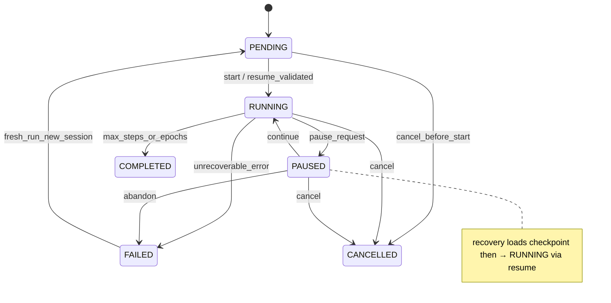
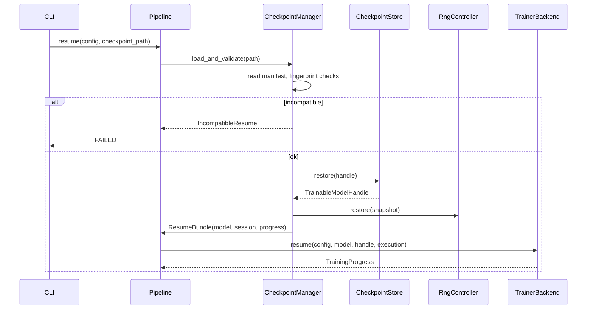
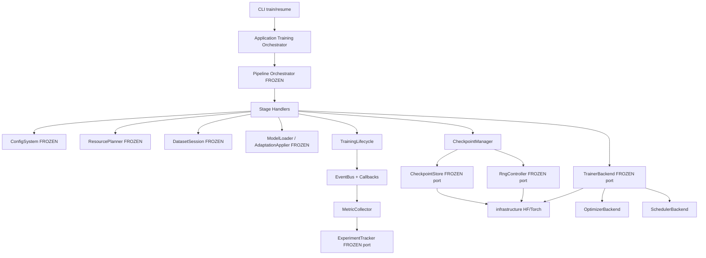
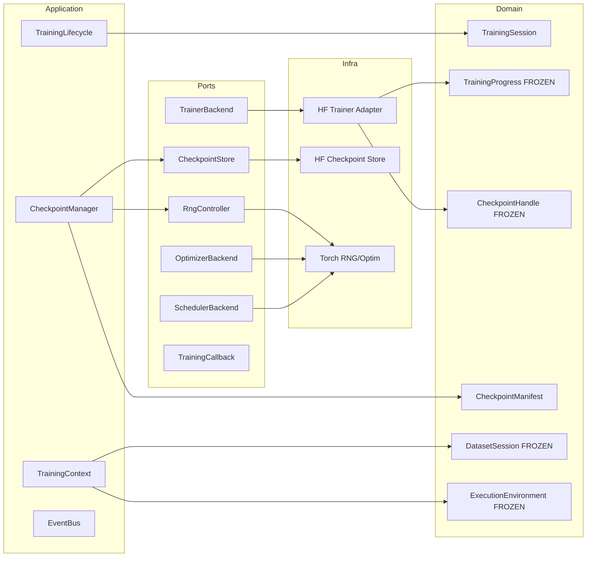

> **Historical document.** Written when Git tags / release identity existed.
> Git tags and GitHub Releases were later removed ecosystem-wide.
> **Current source of truth:** branch `main` only. See `docs/STATUS.md`.
> Do not treat tag or release recommendations in this file as current instructions.

# Phase 3 — Training Engine Architecture

**Status:** Permanently frozen (ADR-0013 architecture · ADR-0014 phase freeze)  
**Date:** 2026-07-14  
**Binding inputs:** [Frozen Public Contracts](frozen_public_contracts.md), ADRs 0001–0014  
**Related ADR:** [0013 (Accepted)](adr/0013-phase3-training-engine.md) · [0014 Freeze (Accepted)](adr/0014-phase3-freeze.md)

> Phases 0–3 are permanently frozen. This document is the Phase 3 architecture
> of record. If implementation appears to require changing any frozen contract,
> stop and explain why — do not redesign automatically.

---

## 0. Design goals and non-goals

### Goals (priority order)

1. **Correctness** — training and resume produce expected parameter/state updates.
2. **Determinism & reproducibility** — same portable inputs → same ExperimentId and comparable runs.
3. **Correct resume** — full restoration of weights, optimizer, scheduler, RNG, data cursor, execution plan, adapter state.
4. **Clean architecture** — frozen ports remain the public surface; frameworks stay in infrastructure.
5. **Extensibility** — HF Trainer first; custom loop, DeepSpeed, FSDP, Accelerate later without redesign.

### Non-goals (this phase)

- Evaluation productization (Phase 4) and export packaging (Phase 4) — only train-path hooks.
- Packing / curriculum sophistication (Phase 5).
- Rich experiment tracking backends (Phase 6).
- Multi-GPU / multi-node execution (Phase 7) — **extension points only**.
- Performance optimization ahead of correctness.

### Frozen contracts consumed (do not redesign)

| Frozen surface | Phase 3 usage |
|----------------|---------------|
| `TrainerBackend` | Implement `train` / `resume` |
| `CheckpointStore` | Implement atomic save / restore / list / prune |
| `RngController` | Implement seed / snapshot / restore |
| `ExperimentConfig`, `OptimizationSpec`, `CheckpointingSpec`, `PrecisionSpec`, `ExecutionSpec` | Compose training policies |
| `TrainingProgress`, `MetricSnapshot`, `CheckpointHandle`, `TrainingStatus` | Progress & checkpoint identity |
| `TrainableModelHandle`, `ExecutionEnvironment`, `DatasetSession` | Model, hardware, data cursor |
| `Pipeline` / `PipelineStage` | Wire stages; do not redesign orchestrator |
| `FingerprintService` + model/adapter fingerprints | Checkpoint & resume compatibility |

---

## 1. Training Session

### 1.1 Types

| Type | Layer | Role |
|------|-------|------|
| **TrainingSession** | Domain (additive) | Immutable identity + lifecycle cursor for a single run. Analogous to `DatasetSession`, not a ModelSession. |
| **TrainingContext** | Application | Resolved runtime bag: config, handles, sessions, policies, collaborators. Built by builders; consumed by pipeline stages. |
| **TrainingState** | Domain (additive) | Machine-readable lifecycle state snapshot (maps to `TrainingStatus`). |
| **TrainingProgress** | Domain (**frozen**) | Immutable progress snapshot (step, epoch, metrics, status). |
| **TrainingLifecycle** | Application | Owner of allowed transitions; never mutates domain snapshots in place. |

### 1.2 TrainingSession (proposed domain)

```text
TrainingSession
  session_id: str
  experiment_id: ExperimentId
  run_id: RunId
  status: TrainingStatus          # frozen enum
  global_step: int
  epoch: float
  max_steps: int | None
  dataset_session: DatasetSession | None   # embedded snapshot or fingerprint + resume_token
  execution_digest: str
  model_fingerprint: str
  adapter_fingerprint: str
  checkpoint_fingerprint: str | None
  resume_from: Path | None
  created_at / updated_at
  metadata: Mapping[str, str]
```

Copy-on-write helpers: `with_status`, `advance_step`, `with_dataset_session`, `with_checkpoint`.

**Ownership:** Application `TrainingLifecycle` owns transitions; domain objects remain immutable.

### 1.3 TrainingContext (application)

Resolved collaborators (never framework types):

- `ExperimentConfig`
- `ExecutionEnvironment` (from frozen `ResourcePlanner`)
- `TrainableModelHandle`
- `DatasetSession` (+ tokenized batches / iterable façade)
- `TrainingSession`
- Ports: `TrainerBackend`, `CheckpointStore`, `RngController`, tracker (null ok)
- Policies: optimizer, scheduler, gradient, checkpoint, mixed precision
- Callback list (AIODOO callback ABCs)

Built by `TrainingContextBuilder` (extends Phase 0 skeleton purpose; Phase 0 stubs remain).

### 1.4 State transitions



Recovery is **not** a separate domain enum value: recovery is an application procedure that ends in `RUNNING` or `FAILED` using `TrainingStatus` as frozen.

### 1.5 Extension points

- Additional metadata keys for distributed ranks (Phase 7).
- Nested sub-sessions for evaluation loops (Phase 4) without changing TrainingSession identity fields.

### 1.6 Architecture review

| | |
|--|--|
| **Why** | Single owned lifecycle for train/resume; mirrors DatasetSession pattern. |
| **Deps** | Domain identifiers, frozen progress/status, DatasetSession, fingerprints. |
| **Layer** | Domain DTOs + application lifecycle owner. |
| **Risks** | Duplicating `TrainingProgress` fields — mitigate by deriving progress *from* session + metrics, storing progress as emission artifact. |
| **Evolution** | Distributed rank fields additive in metadata / Digests. |

---

## 2. Trainer Backend

### 2.1 Frozen port (consume as-is)

```text
TrainerBackend.train(config, model, execution) -> TrainingProgress
TrainerBackend.resume(config, model, checkpoint, execution) -> TrainingProgress
```

Phase 3 **implements** this port. Richer session data reaches the backend via:

1. Validated fields already on `ExperimentConfig`, and
2. An application-owned `TrainingContext` that the concrete infrastructure adapter receives through factory construction / binder — **not** by changing the frozen ABC signature.

### 2.2 Supporting types (additive)

| Type | Layer | Role |
|------|-------|------|
| **TrainerSession** | Application / domain DTO | Per-call session view derived from TrainingSession (read-only). |
| **TrainerResult** | Domain additive | Wraps `TrainingProgress` + final `CheckpointHandle | None` + fingerprints. |
| **TrainingMetrics** | Domain | Typed metric names + aggregation rules (builds on `MetricSnapshot`). |
| **TrainerEvents** | Domain enums / event DTOs | See §8. |
| **TrainingCallback** | Port (additive) | See §7. |

### 2.3 Backend variants (registration-driven)

| Key | Package | Notes |
|-----|---------|-------|
| `hf_trainer` | `infrastructure/huggingface/trainer.py` | First backend; uses Transformers Trainer internally. |
| `custom_loop` | `infrastructure/torch/loop.py` (future) | Explicit step loop; same ports. |
| `deepspeed` / `fsdp` / `accelerate` | infrastructure (Phase 7+) | Selected via `ExecutionEnvironment.accelerator` + trainer registry key. |

Factories: existing `TrainerBackendFactory` — implement `create()` for registered keys (same pattern as Phase 2 model factories).

### 2.4 Architecture review

| | |
|--|--|
| **Why** | Isolates training loop technology behind frozen port. |
| **Deps** | ExperimentConfig, TrainableModelHandle, ExecutionEnvironment, CheckpointHandle. |
| **Layer** | Port frozen; impl in infrastructure; orchestration in application. |
| **Risks** | Temptation to widen `TrainerBackend` signature — **forbidden**; use binders/context instead. |
| **Evolution** | New backends register; pipeline unchanged. |

---

## 3. Checkpoint System

### 3.1 Ownership split (Invariant 7)

| Component | Layer | Owns |
|-----------|-------|------|
| **CheckpointStore** (frozen port) | Port / infra impl | Atomic persistence & restore of **model (+ adapter) weight package** and opaque handle. |
| **CheckpointManager** | Application | Policy, indexing, manifest I/O, validation, compatibility, orchestration of store + RNG + DatasetSession sidecars. |
| **CheckpointManifest** | Domain | JSON-serializable inventory of what a checkpoint contains. |
| **CheckpointMetadata** | Domain | Human/machine metadata (step, fingerprints, versions, backend keys). |
| **CheckpointPolicy** | Domain / config | When to save (steps, epoch, best metric). |
| **CheckpointRetention** | Domain / config | `save_total_limit`, prune strategy. |
| **CheckpointFingerprint** | Determinism | Digest of manifest + key content hashes. |
| **CheckpointIndex** | Application / storage | Ordered index of checkpoints under `output_dir`. |

Trainer **must not** implement checkpoint filesystem logic; it requests saves through CheckpointManager.

### 3.2 Atomic write protocol

```text
1. Write to destination/.tmp-<uuid>/
2. Write weights via CheckpointStore.save(...) into tmp
3. Write manifest.json + rng.json + dataset_session.json + metrics.json
4. fsync files
5. Atomic rename tmp → checkpoint-<step> (or OS-equivalent)
6. Update index
7. Emit CheckpointCreated
8. Apply retention prune
```

On failure: delete tmp; leave previous checkpoints intact; emit failure event.

### 3.3 CheckpointManifest (conceptual)

```text
schema_version                 # manifest JSON shape version
training_protocol_version      # AIODOO training-engine resume protocol (see §3.3.1)
experiment_id, run_id, global_step, epoch
checkpoint_type: FULL_STATE | ADAPTER_ONLY | METRICS_ONLY
trainer_backend_key
adaptation_strategy_key / adapter fingerprints
model_fingerprint, adapter_fingerprint
execution_digest, quantization digest
config_fingerprint (portable)
dataset_session (serialized DatasetSession fields)
rng_snapshot_ref
optimizer_policy_key / scheduler_policy_key
software: python, aiodoo-training, optional torch/transformers/peft versions
artifact_paths: relative weight files
required_artifacts: tuple[str, ...]   # must exist for FULL_STATE resume
checkpoint_fingerprint
```

#### 3.3.1 `training_protocol_version` (required)

**Introduced in hardening.** Distinct from `schema_version` and package versions.

| Field | Answers |
|-------|---------|
| `schema_version` | Can we parse this manifest JSON? |
| `training_protocol_version` | Is this checkpoint **semantically** resume-compatible with this engine (sidecars, RNG format, DatasetSession fields, optimizer expectations)? |
| Software versions | Diagnostics / soft checks under ResumePolicy |

Initial value at Phase 3 implementation: `"1"`.

Bump `training_protocol_version` when resume semantics change in a breaking way
(even if JSON schema stays parseable). CheckpointManager **rejects** manifests
whose protocol is unsupported before attempting weight restore.

#### 3.3.2 Minimum fields to reject incompatible resumes

| Manifest field | Rejects |
|----------------|---------|
| `training_protocol_version` | Older/newer engine resume contract |
| `schema_version` | Unreadable manifest |
| `experiment_id` | Wrong experiment identity |
| `trainer_backend_key` | HF ↔ custom-loop (and future DeepSpeed) mismatches |
| `model_fingerprint` | Base model / revision / quant identity drift |
| `adapter_fingerprint` | Adaptation config drift |
| `config_fingerprint` | Portable experiment config drift |
| `checkpoint_type` + `required_artifacts` | Missing optimizer/RNG/session sidecars for FULL_STATE |
| `execution_digest` | Device/precision plan drift (severity via ResumePolicy) |
| `checkpoint_fingerprint` | Tamper / incomplete package |

### 3.4 Validation & compatibility

Validation is governed by **ResumePolicy** (§4.4). Outcomes:

| Outcome | Meaning |
|---------|---------|
| `IncompatibleResume` | Hard reject; no weight load |
| `ResumeWarning` | Proceed after logging; recorded on TrainingSession metadata |
| `CheckpointCorruption` | Unreadable/missing required artifacts |

Partial `.tmp-*` directories are never indexed; `doctor` may clean them.

### 3.5 Architecture review

| | |
|--|--|
| **Why** | Durable, auditable training state; enables correct resume. |
| **Deps** | Frozen CheckpointStore + CheckpointHandle; Domain fingerprints; RngController; DatasetSession. |
| **Layer** | Domain manifests; application manager; infrastructure store. |
| **Risks** | Putting optimizer tensors only inside opaque Torch files without manifest — mitigate with required manifest fields. |
| **Evolution** | New checkpoint_type values additive; DeepSpeed sharded layouts behind same manager. |

---

## 4. Resume Architecture

### 4.1 Resume must restore

| Artifact | Owner restoring it | Source |
|----------|-------------------|--------|
| Weights / adapter | CheckpointStore.restore → TrainableModelHandle | Weight files |
| Optimizer state | Infrastructure trainer/store sidecar (opaque in infra; referenced by manifest) | `optimizer.pt` / HF trainer state |
| Scheduler state | Same | trainer state |
| RNG | `RngController.restore` | `rng.json` / blob |
| DatasetSession | CheckpointManager | `dataset_session.json` (immutable snapshot fields) |
| TrainingState / Progress | Derived into new TrainingSession | manifest global_step / epoch / status |
| ExecutionEnvironment | Re-resolved via ResourcePlanner from config; compared to `execution_digest` | config + planner |
| Adapter state | Included in trainable handle restore | PEFT adapter files (infra) |
| Resource assignment | ExecutionEnvironment.selected_device + device_ids | planner |

### 4.2 Resume lifecycle



### 4.3 Ownership

- **CheckpointManager** — validation, compatibility, assembling ResumeBundle.
- **TrainerBackend.resume** — continues loop from restored opaque state carried by handle + checkpoint path.
- **Dataset pipeline stages** — reopen iterators positioned by restored DatasetSession (epoch/index/shard).

### 4.4 ResumePolicy

**Introduced in hardening.** Replaces ad-hoc boolean flags with one domain enum
consumed by CheckpointManager. Improves clarity without new subsystems.

```text
ResumePolicy.STRICT   # default — production
ResumePolicy.WARN     # research / migration
ResumePolicy.RELAXED  # emergency / forensic only
```

| Check | STRICT | WARN | RELAXED |
|-------|--------|------|---------|
| `training_protocol_version` supported | reject | reject | reject* |
| `schema_version` parseable | reject | reject | reject |
| Required artifacts present (FULL_STATE) | reject | reject | reject |
| `checkpoint_fingerprint` match | reject | reject | warn |
| `experiment_id` match | reject | reject | warn |
| `trainer_backend_key` match | reject | warn | warn |
| `model_fingerprint` / `adapter_fingerprint` | reject | warn | warn |
| `config_fingerprint` | reject | warn | warn |
| `execution_digest` | reject | warn | ignore |
| Software package versions | ignore† | warn | ignore |

\* RELAXED still rejects unknown protocol / unreadable schema / missing weight
files — otherwise “resume” is undefined.  
† Package versions are diagnostic-only under STRICT to avoid blocking patch
upgrades that do not change `training_protocol_version`.

Config mapping (replaces loose booleans):

```yaml
resume:
  policy: strict   # strict | warn | relaxed
```

`strict_fingerprints: true` in earlier drafts maps to `ResumePolicy.STRICT`.

### 4.5 Incompatible resume detection

Hard reject always (all policies): unsupported protocol, unreadable schema,
missing required FULL_STATE artifacts (weights at minimum; optimizer/RNG/session
when checkpoint_type requires them).

Policy-scaled rejects/warns: fingerprints, backend key, execution digest
(see table above).

### 4.6 Architecture review

| | |
|--|--|
| **Why** | Training without correct resume is not production-grade. |
| **Risks** | Frozen `CheckpointStore.restore` returns only `TrainableModelHandle` — manager **must** own non-weight sidecars. |
| **Evolution** | Distributed resume adds shard manifests under same manager API. |

## 4A. Failure recovery (hardening decision)

### Decision: **do not introduce `FailureRecoveryStrategy` in Phase 3 design**

| Already covered | By |
|-----------------|-----|
| Mid-step crash leaving corrupt publish | Atomic tmp → rename; index ignores `.tmp-*` |
| Failed run status | `TrainingStatus.FAILED` + `TrainingFailed` event |
| Best-effort last checkpoint | CheckpointPolicy optional `save_on_failure` |
| Interrupted run | Resume via CheckpointManager + ResumePolicy |
| Disk-full during write | Fail save; previous checkpoints remain; FAILED |

### Why wait

1. **No consumer yet** — OOM, disk-full, and preemption behaviors differ by
   trainer backend (HF vs custom) and OS; an abstract strategy without observed
   failure modes invents APIs.
2. **Existing lifecycle is enough** — FAILED + durable checkpoints + STRICT
   resume already form the recovery path: restart process → resume last good
   checkpoint.
3. **Risk of premature abstraction** — a port that “handles OOM” would either
   no-op or grow backend-specific branches, violating single-owner clarity.

### When to revisit

Introduce a lightweight `FailureRecoveryStrategy` (or callback category) only
after Phase 3 stub/HF implementation surfaces repeated, cross-backend recovery
patterns — via ADR, not convenience. Until then: document failure modes in
tests (see §14) without a new port.

---

## 5. Optimizer Architecture

### 5.1 Additive ports / policies

| Type | Role |
|------|------|
| **OptimizerPolicy** | Domain: name (`adamw`), lr, weight_decay, betas, eps, … maps from `OptimizationSpec` + extras. |
| **OptimizerBackend** | Port: `build(model_handle, policy) -> OptimizerHandle` (opaque NewType). |
| **OptimizerFactory** | Registry-driven construction. |

### 5.2 Support matrix

| Key | Phase |
|-----|-------|
| `adamw` | Phase 3 (HF / Torch impl in infra) |
| `adafactor` / `sgd` / … | Later via registry |

**No redesign** when adding optimizers: register + policy fields in `extra` / schema additive keys.

HF Trainer may own optimizer internally; custom loop uses OptimizerBackend explicitly. Both produce optimizer state checkpoints consumable by CheckpointManager.

---

## 6. Scheduler Architecture

| Type | Role |
|------|------|
| **SchedulerPolicy** | Domain: kind (`cosine` \| `linear` \| `constant`), warmup_ratio, total_steps. |
| **SchedulerBackend** | Port: `build(optimizer_handle, policy) -> SchedulerHandle` (opaque). |
| **SchedulerFactory** | Registry-driven. |

Extension: new kinds register without changing TrainerBackend.

---

## 7. Callback System

### 7.1 Port (additive)

```text
TrainingCallback
  on_event(event: TrainingEvent, context: CallbackContext) -> None
```

Or split lifecycle methods — prefer **single event method** plus typed events to avoid ABC explosion.

### 7.2 Categories

| Category | Examples |
|----------|----------|
| Lifecycle | TrainingStarted, TrainingCompleted, TrainingFailed |
| Step/Epoch | EpochStarted, StepStarted, StepCompleted |
| Metrics | LossComputed, MetricsAggregated |
| Checkpoint | CheckpointCreated, CheckpointPruned |
| Evaluation | EvaluationCompleted (hook for Phase 4) |
| Logging | LogLine / TrackerFlush |

### 7.3 Ordering & safety

- Synchronous, single-threaded invocation on the training process loop (Phase 3).
- Order: registration order; checkpoint callbacks after durable rename succeeds.
- Callbacks **must not** mutate TrainingSession in place; they may request manager actions via context APIs.
- Thread safety: Phase 3 does not share callback state across DataLoader workers; worker RNG seeded separately (§12).

### 7.4 Plugins

Register callbacks via config list + registry (`callback_registry`). Null / logging / checkpoint-trigger plugins ship first.

---

## 8. Training Events

### 8.1 Event catalog (domain DTOs)

```text
TrainingStarted
EpochStarted { epoch }
StepStarted { global_step }
LossComputed { loss, global_step }
MetricsAggregated { metrics: tuple[MetricSnapshot, ...] }
CheckpointCreated { handle: CheckpointHandle }
CheckpointPruned { removed: tuple[CheckpointHandle, ...] }
EvaluationCompleted { report_id? }   # stub until Phase 4
TrainingCompleted { progress }
TrainingFailed { error, progress }
```

All events: `experiment_id`, `run_id`, `timestamp`, `session_id`.

### 8.2 Ordering (happy path)

```text
TrainingStarted
  → (EpochStarted → (StepStarted → LossComputed → StepCompleted)* → EpochCompleted)*
  → CheckpointCreated (policy)
  → TrainingCompleted
```

Failure path: any state → `TrainingFailed` (after best-effort checkpoint if policy says so).

### 8.3 Event bus

Application `TrainingEventBus` (in-process): publish → ordered callback dispatch. Not a distributed message bus (Phase 7 may add).

---

## 9. Metrics System

| Type | Role |
|------|------|
| **MetricCollector** | Application: receives LossComputed / backend logs → MetricSnapshot |
| **MetricAggregator** | Window / epoch aggregates (mean loss, etc.) |
| **MetricSnapshot** | Frozen domain (**exists**) |
| **TrainingHistory** | Immutable append-only tuple/log of snapshots (+ optional JSONL sink) |

Visualization is Phase 6 / external — history serialization must be stable JSON.

Tracker port (`ExperimentTracker`) already exists — collector forwards snapshots there.

---

## 10. Gradient Management

Policies only (domain); enforcement in infrastructure trainer/loop.

| Policy | Fields (conceptual) |
|--------|---------------------|
| **GradientAccumulationPolicy** | `steps` ← `OptimizationSpec.gradient_accumulation_steps` |
| **GradientClippingPolicy** | `max_norm` (config additive) |
| **MixedPrecisionPolicy** | Maps from frozen `PrecisionSpec` + `QuantizationPolicy` / execution precision |
| **LossScalingPolicy** | For FP16 AMP; noop for BF16/FP32 |

Application configures; infrastructure applies. No public Torch GradScaler types.

---

## 11. Training Pipeline

### 11.1 Frozen stages (reuse names)

Do **not** redesign `Pipeline`. Register handlers for existing `PipelineStage` values:

| Stage | Phase 3 handler responsibility |
|-------|--------------------------------|
| `VALIDATE_CONFIG` | Validate train/optimizer/scheduler/checkpoint/resume fragments |
| `BOOTSTRAP_DETERMINISM` | `RngController.seed_all` |
| `RESOLVE_EXECUTION` | `ResourcePlanner.resolve_spec` |
| `ASSEMBLE_DATASETS` | DatasetSession open / restore from checkpoint |
| `TOKENIZE` | TokenBatch pipeline (Phase 1) |
| `LOAD_MODEL` | ModelLoader |
| `APPLY_ADAPTATION` | AdaptationApplier |
| `PLAN_PACKING` | No-op or Phase 1 NoPacking |
| `PLAN_CURRICULUM` | No-op / stub |
| `CREATE_TRAINER` | TrainerBackendFactory + bind context |
| `RESTORE_CHECKPOINT` | CheckpointManager validation + restore (skip if fresh train) |
| `TRAIN` | TrainerBackend.train / resume |
| `EVALUATE` | Skip / null until Phase 4 |
| `EXPORT` | Skip until Phase 4 |
| `FINALIZE` | Flush tracker, write TrainingHistory, emit TrainingCompleted |

### 11.2 PipelineContext values (keys)

Stable string keys (examples): `training_session`, `execution`, `trainable_model`, `dataset_session`, `checkpoint_handle`, `trainer`, `rng`, `event_bus`.

---

## 12. Determinism

| Source | Phase 3 guarantee |
|--------|-------------------|
| Python RNG | `RngController` / SeedManager |
| NumPy | Optional seed when NumPy present (infra RNG adapter) |
| Torch CPU | infra `seed_torch` implementing deferred SeedManager hooks |
| CUDA | Seed when device selected; document non-bit-exact across GPU SKUs |
| DataLoader workers | Fixed `worker_init_fn` from SeedManager; worker_id in DatasetSession |
| Resume | Restore RNG snapshot before first step |
| Distributed (future) | Per-rank seed derivation from global seed + rank; document in Phase 7 |

**Hard rule:** Experiment identity fingerprints remain portable (config/dataset/model/adapter). Environment/CUDA noise must not alter ExperimentId by default.

### 12.1 Architecture golden invariant — resume equivalence

> **Invariant (Phase 3):** A resumed training run must produce the same
> deterministic progression as an uninterrupted run when using the same
> configuration and the same resolved `ExecutionEnvironment` (and
> `ResumePolicy.STRICT` compatibility with the checkpoint).

**Scope:** Same portable config, same seed, same planner outcome, same
trainer backend, CPU stub (CI golden) or bit-exact-capable device class.

**Progression means:** equal sequences of `global_step`, epoch, and recorded
training metrics (e.g. loss) for steps after the resume point, matching the
uninterrupted run’s values at those same steps.

**Out of scope for bit-exact golden:** cross-GPU SKU differences; WARN/RELAXED
resumes; backend switches.

Golden test (see §14): train N steps uninterrupted → checkpoint at K →
fresh process resume from K → compare metrics for steps K+1…N against the
uninterrupted reference.

---

## 13. Configuration

### 13.1 Additive YAML fragments (validate via pydantic models)

```yaml
training:
  backend: hf_trainer
  max_steps: 100
  logging_steps: 10

optimizer:
  name: adamw
  learning_rate: 2.0e-4   # may mirror OptimizationSpec
  weight_decay: 0.0
  betas: [0.9, 0.999]

scheduler:
  name: cosine
  warmup_ratio: 0.03

checkpointing:            # already exists — extend fields
  output_dir: ...
  save_steps: 50
  save_total_limit: 3
  resume_from: null
  retention: keep_last
  validate_on_load: true

resume:
  policy: strict   # strict | warn | relaxed

callbacks:
  - logging
  - checkpoint

metrics:
  history_path: artifacts/metrics/run.jsonl

gradient:
  max_norm: 1.0
  # accumulation from OptimizationSpec
```

Existing `OptimizationSpec` / `CheckpointingSpec` / `PrecisionSpec` remain authoritative where they already define fields; new sections are additive and mapped into policies.

### 13.2 Validation

- Mutual exclusions (e.g. max_steps vs unbounded epochs policy).
- Resume path exists and manifests when `resume_from` set.
- Backend key registered.
- `resume.policy` defaults to `strict`.

---

## 14. Testing Strategy

| Layer | Focus |
|-------|-------|
| **Unit** | Lifecycle transitions; manifest serde; protocol version; ResumePolicy matrix; event ordering |
| **Integration** | Stub trainer + stub checkpoint store full train→resume→continue on CPU |
| **Golden** | Fixed seed stub loss curve; **resume equivalence** (§12.1) uninterrupted vs resume |
| **Resume** | Restore DatasetSession cursor; RNG continuity; step count continues; incompatible rejects |
| **Corruption** | Truncated checkpoint dir; missing manifest; tmp dir left behind |
| **Determinism** | Two uninterrupted runs same config → same metrics (stub) |
| **Failure** | Mid-train exception → FAILED; disk-full simulation leaves prior checkpoints intact |
| **CPU CI** | Default; no GPU required |
| **GPU** | Optional nightly / manual job later — not Phase 3 CI gate |

CI installs `requirements/dev.txt` only; train extras optional for local HF smoke.

---

## 15. Future Distributed Training (extension points only)

| Concern | How Phase 3 prepares without implementing |
|---------|------------------------------------------|
| DeepSpeed / FSDP / Accelerate | `AcceleratorKind` + `ExecutionEnvironment.accelerator` already frozen; trainer registry keys |
| Multi-GPU | `DevicePolicy.device_ids`; planner selects; DatasetSession rank/shard fields already exist |
| Multi-node | `DistributedSpec` exists; CheckpointManager will later write per-rank or consolidated manifests |
| Pipeline / Tensor parallel | Future model backend layouts behind ModelBackend — trainer consumes TrainableModelHandle only |

**No API redesign required** for Phase 7 if Phase 3 keeps all distributed facts in ExecutionEnvironment + DatasetSession + manifest metadata.

---

## 16. Subsystem architecture review (summary)

| Subsystem | Why | Responsibilities | Dependencies | Layer | Risks | Evolution |
|-----------|-----|------------------|--------------|-------|-------|-----------|
| TrainingSession / Lifecycle | Run identity & transitions | Status, steps, COW updates | Frozen status/progress, DatasetSession | Domain + App | Field drift vs TrainingProgress | Metadata for distributed |
| TrainerBackend | Swap training engines | train/resume | Frozen port | Port + Infra | Signature creep | Registry backends |
| CheckpointManager + Store | Durable state | Atomic save, validate | Frozen store port | App + Infra | Sidecar orphan files | Sharded layouts |
| Resume | Continuity | Compatibility + restore bundle | Manager, RNG, Session | App | Fingerprint false fails | Override policies |
| Optimizer / Scheduler | Extensible optimization | Policies + opaque handles | TrainableModelHandle | Port + Infra | HF dual ownership | New registry keys |
| Callbacks / Events | Observability | Ordered sync hooks | Event DTOs | Port + App | Blocking callbacks | Async bus later |
| Metrics | History & tracking | Collect/aggregate | MetricSnapshot, Tracker | App | Metric name chaos | Catalog registry |
| Gradient policies | Numerics controls | Declare only | PrecisionSpec | Domain | Silent FP16 issues | Documented policies |
| Pipeline stages | Ordered train path | Orchestration | Frozen Pipeline | App handlers | Fat stages | Keep thin |
| Determinism | Reproducibility | Seed & snapshot | RngController | Domain + Infra | GPU nondeterminism | Document limits |
| Config | Operator control | Validate train YAML | ConfigSystem | Config | Schema drift | Additive fields |

---

## Repository additions (planned — not created until implementation approval)

```text
aiodoo_training/
  domain/
    training_session.py      # TrainingSession, TrainingState DTOs
    training_events.py       # event DTOs
    checkpoint_manifest.py   # CheckpointManifest, Metadata, Fingerprint
    optimizer.py             # OptimizerPolicy
    scheduler.py             # SchedulerPolicy
    gradient.py              # Gradient*Policy
  ports/
    optimizer.py             # OptimizerBackend
    scheduler.py             # SchedulerBackend
    callback.py              # TrainingCallback
    # trainer.py             # FROZEN — implement only
  training/                  # application orchestration
    lifecycle.py
    context.py
    event_bus.py
    metrics.py
    checkpoint_manager.py
    resume.py
  checkpointing/             # app façades / builders
  infrastructure/
    huggingface/
      trainer.py             # HF TrainerBackend
      checkpoint_store.py
    torch/
      rng.py                 # RngController impl
      optimizer.py
      scheduler.py
  config/
    training_config.py       # pydantic fragments
docs/
  phase3-training-engine-architecture.md   # this file (permanently frozen)
  adr/0013-phase3-training-engine.md       # Accepted
  adr/0014-phase3-freeze.md                # Permanent freeze
  trainer_backend_contract.md              # Binding trainer checklist
tests/
  unit/...
  integration/test_train_resume_cpu.py
  golden/test_golden_resume_equivalence.py
```

Packages `training/` and `checkpointing/` are implemented as of ADR-0014.

---

## Dependency graph



---

## Public interfaces (additive summary)

```text
# Domain (additive DTOs only — do not alter frozen TrainingProgress/CheckpointHandle fields)
TrainingSession, TrainingState
CheckpointManifest, CheckpointMetadata, CheckpointFingerprint
ResumePolicy  # STRICT | WARN | RELAXED
OptimizerPolicy, SchedulerPolicy
GradientAccumulationPolicy, GradientClippingPolicy, MixedPrecisionPolicy, LossScalingPolicy
TrainingEvent (+ variants)
TrainerResult, TrainingHistory

# Ports (additive)
OptimizerBackend, SchedulerBackend, TrainingCallback
OptimizerHandle, SchedulerHandle  # NewType opaque

# Application
TrainingLifecycle, TrainingContext, TrainingEventBus
CheckpointManager, ResumeCoordinator
MetricCollector, MetricAggregator

# Explicitly NOT introduced in Phase 3
# FailureRecoveryStrategy — deferred (see §4A)

# Frozen ports implemented, not changed
TrainerBackend, CheckpointStore, RngController
```

---

## Component diagram



---

## Lifecycles (compact)

### Training lifecycle

`PENDING → RUNNING ⇄ PAUSED → COMPLETED | FAILED | CANCELLED`

### Resume lifecycle

`Locate → Validate manifest/fingerprints → Restore weights → Restore RNG → Restore DatasetSession → Rebuild TrainingSession → TrainerBackend.resume → RUNNING`

### Checkpoint lifecycle

`Policy trigger → Quiesce step boundary → Write tmp → Store weights → Write sidecars → fsync → Atomic publish → Index → Prune → Event`

### Event flow

`Trainer loop / Manager → EventBus → Callbacks (sync, registration order) → MetricCollector / Tracker / Logs`

---

## Extension points checklist

- [ ] New trainer backend via `trainer_registry`
- [ ] New optimizer/scheduler via registries
- [ ] New callback plugins via `callback_registry`
- [ ] New checkpoint layout version via manifest `schema_version`
- [ ] Accelerator backends via `AcceleratorKind` + infra planners (Phase 7)
- [ ] Evaluation callbacks without changing train port (Phase 4)

---

## Risk analysis

| Risk | Mitigation |
|------|------------|
| Frozen `CheckpointStore.restore` too narrow for full resume | CheckpointManager owns sidecars; store stays weight-focused |
| Frozen `TrainerBackend` signature too narrow | TrainingContext binder; no ABC change |
| HF Trainer opaque state vs custom loop | Manifest requires declared backend_key; incompatible across backends by default |
| Callback deadlocks / slow I/O | Sync Phase 3; document non-blocking expectations; file I/O async later |
| False fingerprint mismatches blocking resume | STRICT default; WARN/RELAXED escape hatch |
| Premature FailureRecoveryStrategy | Deferred until real cross-backend patterns (§4A) |
| GPU nondeterminism | CI CPU golden only; document GPU limits |
| Temptation to put Torch types in TrainingContext | Boundary tests; opaque handles only |
| Stage handlers becoming god-objects | Thin handlers; logic in Manager/Lifecycle services |

---

## Freeze gate (historical)

Phase 3 implementation required this architecture to be reviewed, accepted as
ADR-0013, implemented, and permanently frozen under ADR-0014. That process is
complete. See [frozen_public_contracts.md](frozen_public_contracts.md) and
[phase_completion_matrix.md](phase_completion_matrix.md).

---

## 17. Hardening completion — architecture status

### Review outcomes

| Question | Outcome |
|----------|---------|
| CheckpointManifest sufficient for incompatible resume? | **Yes**, after adding `training_protocol_version` + `required_artifacts` and an explicit reject-field matrix (§3.3) |
| ResumePolicy STRICT / WARN / RELAXED? | **Introduced** — replaces scattered booleans; no new subsystem (§4.4) |
| FailureRecoveryStrategy? | **Deferred** — existing FAILED + atomic checkpoint + resume path sufficient (§4A) |
| Resume-equivalence golden invariant? | **Documented** (§12.1) and required in testing (§14) |
| Further abstractions justified? | **No** |

### Verdict

**Phase 3 is permanently frozen (ADR-0014).**

This document remains the Phase 3 architecture of record. Future phases extend
by registration and infrastructure adapters; they do not redesign these
ownership splits without a new ADR.

---

**END OF PHASE 3 ARCHITECTURE OF RECORD — PERMANENTLY FROZEN.**
