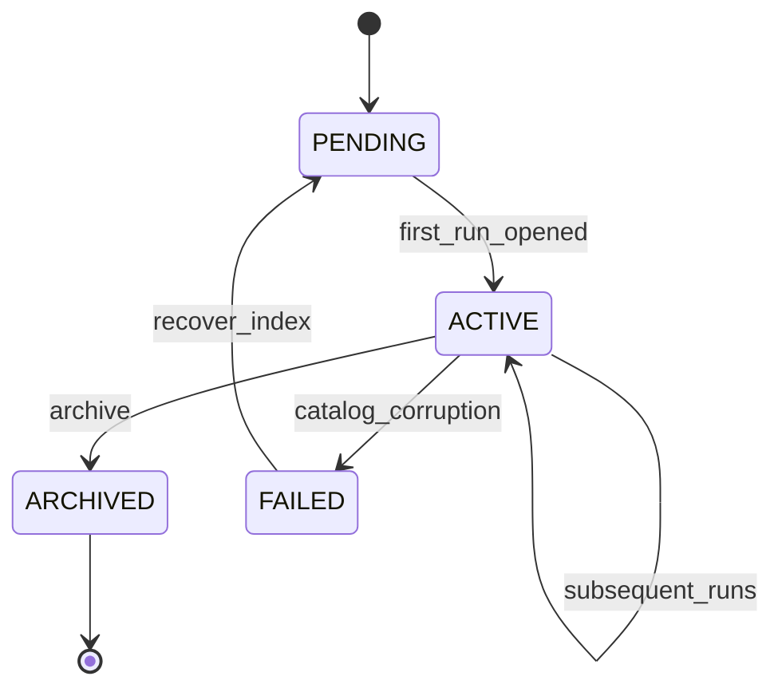
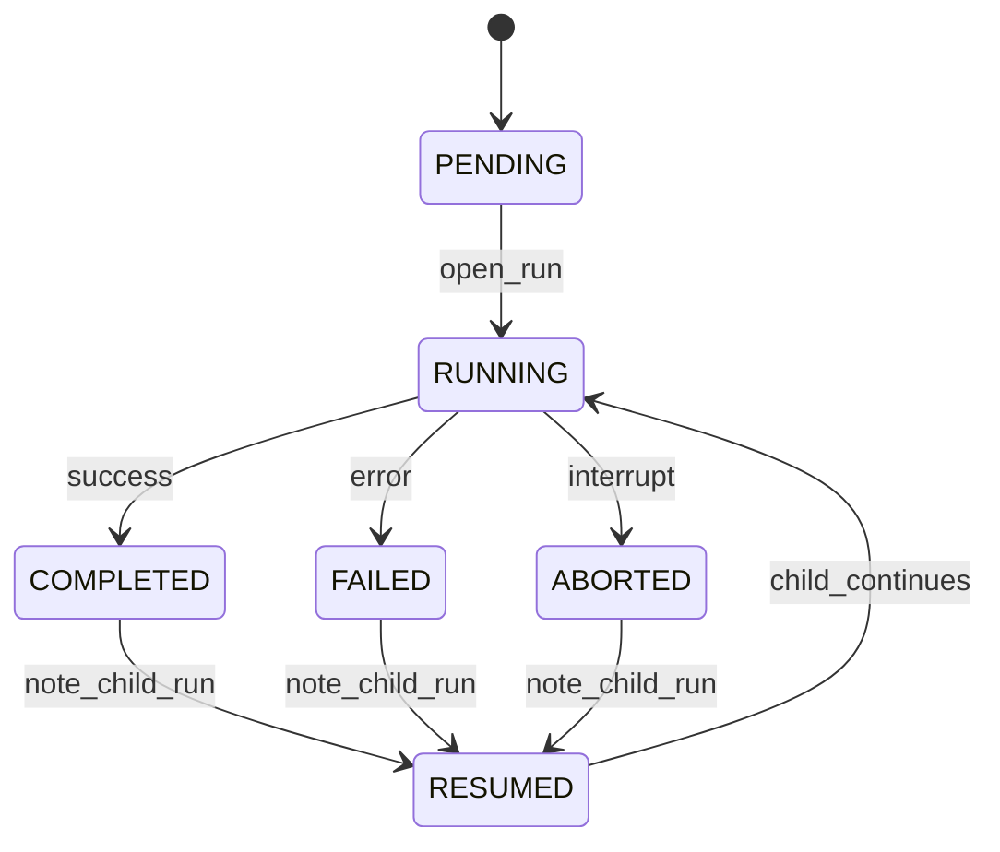
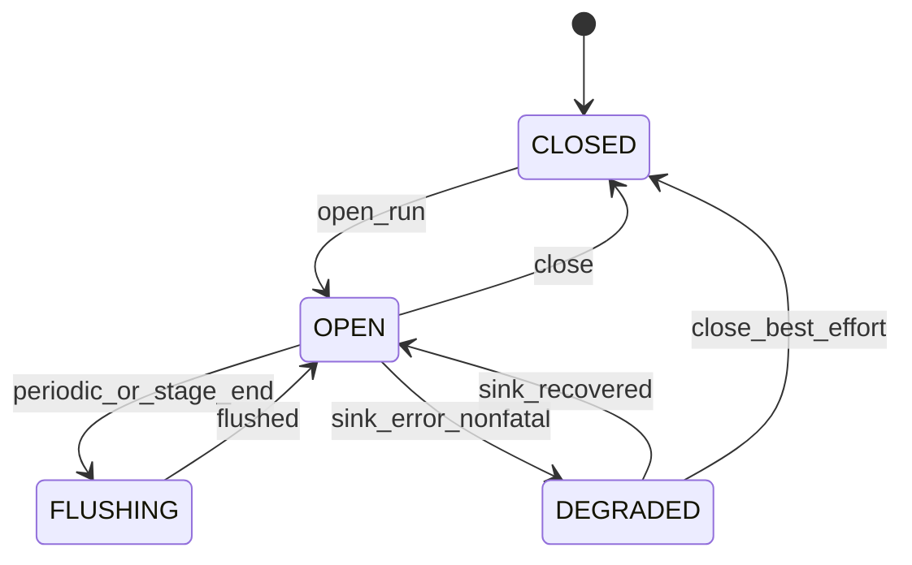
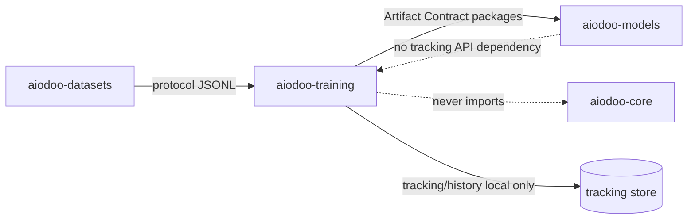
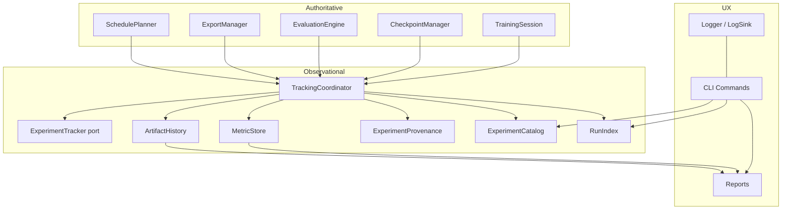
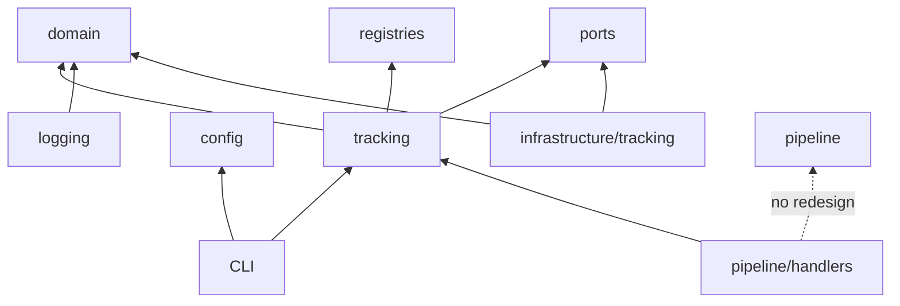
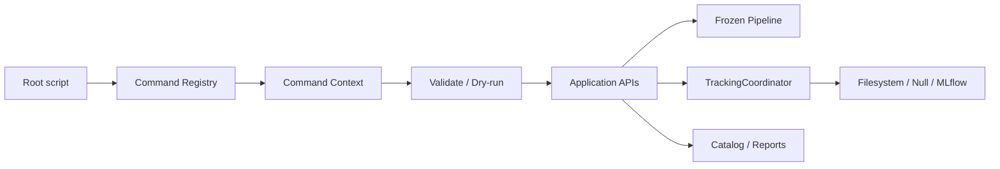
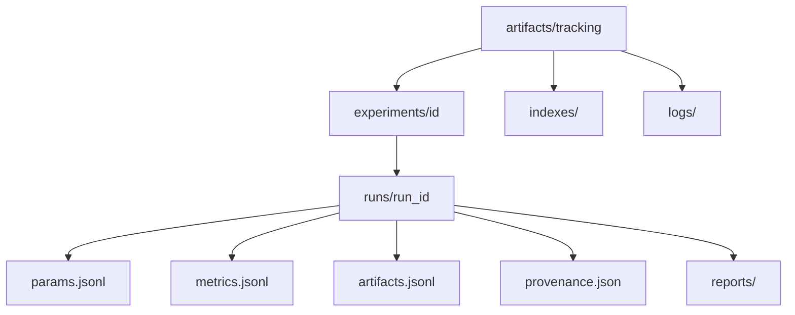
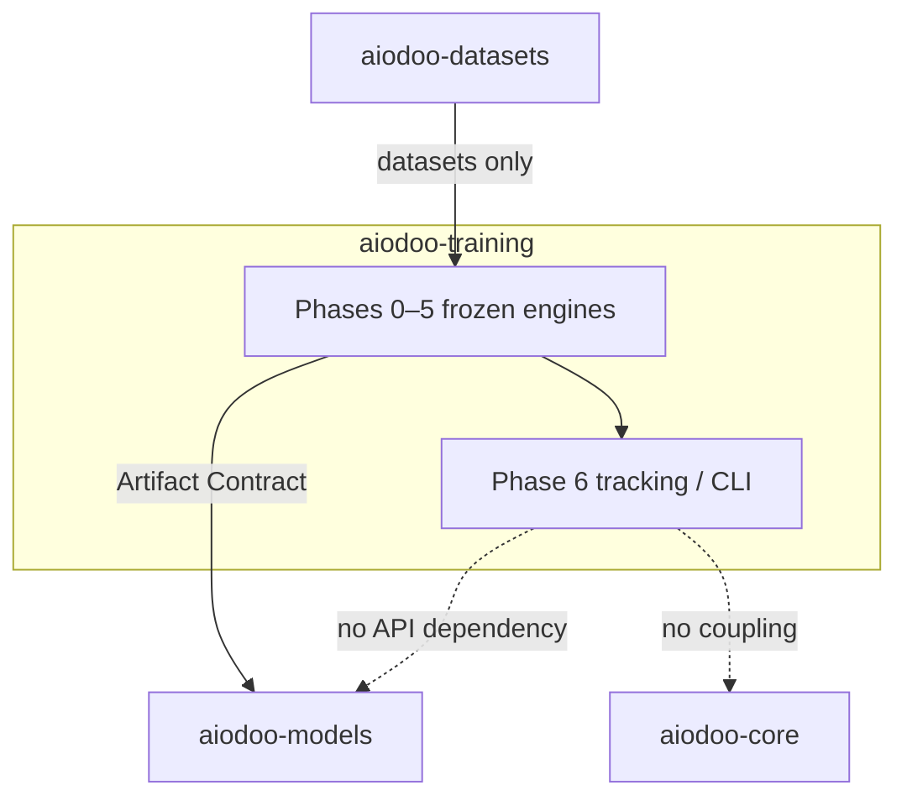

> **Historical document.** Written when Git tags / release identity existed.
> Git tags and GitHub Releases were later removed ecosystem-wide.
> **Current source of truth:** branch `main` only. See `docs/STATUS.md`.
> Do not treat tag or release recommendations in this file as current instructions.

# Phase 6 — Tracking, Experiment Management & CLI Architecture

**Status:** **Permanently frozen** (implementation complete; [ADR-0018](adr/0018-phase6-tracking-cli.md) Accepted; [ADR-0020](adr/0020-phase6-freeze.md) freeze)  
**Date:** 2026-07-14  
**Binding inputs:** [Frozen Public Contracts](frozen_public_contracts.md), ADRs 0001–0017, [Artifact Contract](artifact_contract.md), [Architecture Invariants](architecture_invariants.md)  
**Related ADR:** [0018 (Accepted)](adr/0018-phase6-tracking-cli.md) · [0020 Phase 6 Freeze (Accepted)](adr/0020-phase6-freeze.md)  
**Lifecycle clarification:** [ADR-0022](adr/0022-package-surfaces-lifecycle-alignment.md) · [Terminology](terminology.md)

> Phases **0–5** were already **permanently frozen** when this architecture was
> designed. Phase 6 is now itself permanently frozen under ADR-0020.
> If any later design conflicts with a frozen contract, the frozen contract wins unless
> the Section 9 change process in `frozen_public_contracts.md` is completed.
>
> **Hardening axiom:** Tracking is **observational only**. It never owns training,
> checkpoint, evaluation, export, packing, curriculum, or sampling authority.
>
> **Hardening (post-review):** immutable `TrackingCapability` /
> `TrackingHealth` for backend compatibility & diagnostics; additive
> `CLIProfile` for UX presets. No redesign of ExperimentTracker, Command
> Registry, or Phase 0–5 authorities.
>
> **Naming:** Historical `aiodoo-models` means frozen `aiodoo-model`.
> `TrackingCapability` is **not** a skill Capability (see terminology).

---

## 0. Design goals and non-goals

### Goals (priority order)

1. **Observability without authority** — record params, metrics, artifacts,
   provenance, and history without becoming a source of truth for run control.
2. **Reproducibility** — perfect experiment provenance snapshots (config,
   environment, software, hardware digests) so a run can be explained and
   re-created from frozen fingerprint inputs.
3. **Developer experience** — polished CLI commands, shared UX (help,
   validation, dry-run, progress), local filesystem tracking by default.
4. **Extensibility** — MLflow / W&B / TensorBoard / OpenTelemetry later via
   registration behind the frozen `ExperimentTracker` port.
5. **Clean boundaries** — tracking stays inside `aiodoo-training`; nothing
   leaks into Models / Datasets / Core.

### Non-goals (this phase)

- Redesigning TrainingSession, CheckpointManager, TrainerBackend, ExportManager,
  EvaluationEngine, SchedulePlanner, DatasetSession, or frozen port signatures.
- Owning metric **calculation** (TrainingHistory / MetricCollector / evaluators
  remain producers; tracking only records).
- Becoming a distributed job scheduler or Orchestrator (Phase 7).
- Replacing Artifact Contract with a tracking-specific export schema.
- Remote multi-tenant SaaS control plane.
- Changing the root execution model (`python3 <script>.py` from repo root).

### Frozen contracts consumed (do not redesign)

| Frozen surface | Phase 6 usage |
|----------------|---------------|
| `ExperimentTracker.log_params / log_metrics / log_artifact / close` | Implement backends via binder + registry — **do not widen** |
| `TrackingSpec`, `TrackerType` | Compose; additive enum / fragment fields only (`WANDB`, `TENSORBOARD`, …) |
| `ExperimentId`, `RunId`, `ExperimentConfig` | Identity / catalog keys — never mutate ExperimentConfig schema incompatibly |
| `TrainingSession` / `TrainingLifecycle` | Authoritative train status — tracking mirrors, does not drive |
| `CheckpointManager` / manifests | Authoritative durability — tracking indexes references only |
| `EvaluationEngine` / `EvaluationReport` | Authoritative eval outcomes — tracking records summaries |
| `ExportManager` / Artifact Contract | Authoritative export packages — tracking records lineage pointers |
| `SchedulePlanner` + PackingStatistics / CurriculumStatistics | Consumed as immutable completed-plan DTOs for logging |
| `MetricSnapshot`, `TrainingHistory`, `MetricCollector` | Metric producers — MetricStore records copies |
| `Pipeline` / stage enum order | Handlers only — orchestrator unchanged |
| Root scripts + `cli/` helpers | Polish / registry / shared UX — **not** PyPI packaging |
| Framework quarantine | MLflow/W&B clients stay in `infrastructure/` only |

### Authority matrix (non-negotiable)

| Concern | Authoritative owner | Tracking role |
|---------|---------------------|---------------|
| Train loop / step cursor | TrainingSession + TrainerBackend | Observe events / metrics |
| Checkpoint durability | CheckpointManager + CheckpointStore | Index paths + fingerprints |
| Evaluation outcomes | EvaluationEngine / Evaluator | Record EvaluationReport summaries |
| Export packages | ExportManager + Artifact Contract | Record ArtifactLineage pointers |
| Packing / curriculum plans | SchedulePlanner | Record PackingStatistics / CurriculumStatistics |
| Metric calculation | MetricCollector / Evaluator | Persist MetricSeries only |
| Run control (resume/abort) | Pipeline + ResumeCoordinator + TrainingLifecycle | Reflect RunState mirrors |

```text
Training / Eval / Export / Packing (authoritative)
                 │
                 ▼  (events / DTOs / fingerprints)
            Tracking layer (observational)
                 │
                 ▼
         Reports / History / CLI
```

---

## 1. Experiment Management

### 1.1 Types

| Type | Layer | Role |
|------|-------|------|
| **ExperimentSession** | Domain (additive) | Immutable identity + catalog cursor for one logical experiment |
| **ExperimentContext** | Application | Resolved tracking collaborators for an experiment |
| **ExperimentLifecycle** | Application | Allowed ExperimentStatus transitions (COW) |
| **ExperimentHistory** | Domain / store projection | Ordered runs belonging to an experiment |
| **ExperimentRegistry** | Application index | Local name → ExperimentId catalog (not ML model registry) |
| **ExperimentCatalog** | Application | Query / list / filter experiments from MetadataStore |

### 1.2 ExperimentSession (proposed)

```text
ExperimentSession
  session_id: str
  experiment_id: ExperimentId          # fingerprint-stable when portable inputs match
  name: str                            # human label from TrackingSpec / config.name
  status: PENDING | ACTIVE | ARCHIVED | FAILED
  created_at / updated_at
  config_fingerprint: str
  model_fingerprint: str
  adapter_fingerprint: str
  latest_run_id: RunId | None
  run_count: int
  tracking_protocol_version: str       # observational history layout only (default "1")
  metadata: Mapping[str, str]
```

`tracking_protocol_version` is **immutable metadata** for future migration of
tracking history indexes. It must **not** affect `ExperimentId`, fingerprints,
`ResumePolicy`, training, evaluation, export, or the Artifact Contract.

Relationship with **TrainingSession**:

- One ExperimentSession may have many Runs; each Run binds one TrainingSession
  (and optionally EvaluationSession / ExportSession).
- TrainingSession remains the train-path cursor. ExperimentSession never
  replaces TrainingStatus or step/epoch fields.

### 1.3 Lifecycle



| | |
|--|--|
| **Owner** | ExperimentLifecycle |
| **Failure** | Index I/O errors → FAILED with message; never affects TrainingSession |
| **Recovery** | Rebuild catalog from on-disk HistoryStore; do not invent authority |
| **Extension** | Remote ExperimentCatalog backends via MetadataStore port later |

### 1.4 Public interfaces (additive)

```text
ExperimentCatalog.list() -> Sequence[ExperimentSummary]
ExperimentCatalog.get(experiment_id) -> ExperimentSession | None
ExperimentRegistry.register(session) -> None
ExperimentHistory.for_experiment(experiment_id) -> Sequence[RunSummary]
```

---

## 2. Run Management

### 2.1 Types

| Type | Layer | Role |
|------|-------|------|
| **Run** / **RunRecord** | Domain | Immutable observational record of one pipeline execution |
| **RunMetadata** | Domain | Portable labels, tags, notes, parent run, resume-of |
| **RunState** | Domain | Mirror of high-level outcome (not TrainingStatus itself) |
| **RunHistory** | Domain / store | Chronological RunRecords |
| **RunRegistry** / **RunIndex** | Application | Fast lookup by RunId / experiment / status |

### 2.2 RunState (observational mirror)

```text
PENDING | RUNNING | COMPLETED | FAILED | ABORTED | RESUMED
```

Mapping guidance (mirror only):

| Authoritative signal | RunState |
|----------------------|----------|
| Pipeline start | RUNNING |
| TrainingStatus.COMPLETED + pipeline finalize OK | COMPLETED |
| TrainingStatus.FAILED / uncaught stage fail | FAILED |
| User interrupt / SKIPPED finalize policy | ABORTED |
| ResumeCoordinator success continuation | RESUMED then RUNNING |

**Forbidden:** RunState driving CheckpointManager, ResumePolicy, or trainer.

### 2.3 RunRecord (proposed)

```text
RunRecord
  run_id: RunId
  experiment_id: ExperimentId
  state: RunState
  training_session_id: str | None
  evaluation_session_id: str | None
  export_session_id: str | None
  packing_fingerprint: str | None
  curriculum_fingerprint: str | None
  checkpoint_refs: tuple[str, ...]      # paths / manifest digests only
  artifact_refs: tuple[str, ...]        # Artifact Contract pointers
  provenance_digest: str
  tracking_protocol_version: str        # observational history layout only (default "1")
  started_at / ended_at                 # wall clocks — excluded from golden digests
  metadata: RunMetadata
```

`TRACKING_PROTOCOL_VERSION` / `tracking_protocol_version` is **not**
`training_protocol_version` and **not** `artifact_protocol_version`. It is
never folded into provenance digests, `ExperimentId`, or resume gates.

### 2.4 Relationship with CheckpointManager

- CheckpointManager remains authoritative for atomic publish / validation /
  retention of weight packages.
- Tracking **indexes** checkpoint locations + fingerprints from manifests.
- Tracking must not delete, rewrite, or revalidate checkpoint packages.
- Resume decisions remain ResumeCoordinator + ResumePolicy.

### 2.5 Lifecycle



| | |
|--|--|
| **Owner** | RunLifecycle (application; thin) |
| **Failure** | Tracker sink failures must not fail the authoritative train path (see §13) |
| **Recovery** | Reconcile from TrainingSession + CheckpointManifest + PipelineResult |
| **Extension** | Parent/child run graphs for multi-stage workflows |

---

## 3. Tracking Framework

### 3.1 Frozen port (consume as-is)

```text
ExperimentTracker
  log_params(params: dict[str, object]) -> None
  log_metrics(metrics: Sequence[MetricSnapshot]) -> None
  log_artifact(path: Path, name: str | None = None) -> None
  close() -> None
```

**Forbidden:** widening this signature. Rich session / URIs / tags arrive via
`bind(TrackingContext)` on concrete backends (same Phase 3–5 binder pattern).

### 3.2 Components

| Component | Role |
|-----------|------|
| **TrackingBackend** | Alias for concrete `ExperimentTracker` implementations |
| **TrackingRegistry** | Existing `tracker_registry` (frozen registry infra) |
| **TrackingProfile** | Declarative defaults (uri, tags, flush policy) |
| **TrackingCapability** | Immutable declared feature flags for a backend (hardening) |
| **TrackingHealth** | Immutable backend health snapshot for diagnostics (hardening) |
| **TrackingBuilder** | Assembles TrackingPolicy / profile / capability → context |
| **TrackingFactory** | Existing `TrackerFactory` — `create(key) -> ExperimentTracker` |
| **TrackingContext** | Binder bag: ExperimentSession, RunRecord, TrackingPolicy, capabilities, health, stores |
| **TrackingCoordinator** | Application observer that fans TrainingEvents → tracker + MetricStore |

> Naming rule: prefer **Coordinator / Recorder** for Phase 6 application
> objects. Avoid introducing competing `*Manager` names that could be mistaken
> for CheckpointManager / ExportManager authority.

### 3.2.1 TrackingCapability (hardening — abstraction only)

Immutable domain DTO declaring what a concrete tracking backend **can** do.
Improves future compatibility for MLflow, W&B, TensorBoard, OpenTelemetry, and
custom trackers **without** widening `ExperimentTracker`.

```text
TrackingCapability   # frozen dataclass
  backend_key: str
  supports_metrics: bool = True
  supports_artifacts: bool = True
  supports_params: bool = True
  supports_lineage: bool = False
  supports_live_stream: bool = False
  supports_resume: bool = False      # resume *tracking run* continuity — not TrainingSession resume
  supports_remote: bool = False
  supports_tags: bool = True

  supports(feature: str) -> bool     # convenience; accepts "metrics" or "supports_metrics"
```

| Rule | Detail |
|------|--------|
| Who owns | Declared by backend registration / TrackingProfile; held on TrackingContext |
| Who reads | TrackingCoordinator (skip unsupported ops), doctor, CLI backends list |
| Forbidden | Using capability flags to change train/eval/export behaviour |
| Relation to port | Capabilities describe adapters; `log_*` methods remain the only write API |
| Convenience | `supports(feature)` is a non-behavioural helper over the same boolean fields |

Suggested defaults:

| Backend | metrics | artifacts | lineage | live_stream | resume | remote |
|---------|---------|-----------|---------|-------------|--------|--------|
| `null` | ✓ (no-op) | ✓ (no-op) | ✗ | ✗ | ✗ | ✗ |
| `local_jsonl` | ✓ | ✓ | ✓ | ✗ | ✓ (reopen files) | ✗ |
| `mlflow` | ✓ | ✓ | partial | ✗ | ✓ | ✓ |
| `wandb` (future) | ✓ | ✓ | partial | ✓ | ✓ | ✓ |
| `tensorboard` (future) | ✓ | limited | ✗ | ✓ | ✗ | ✗ |
| `otel` (future) | ✓ | limited | ✗ | ✓ | ✗ | ✓ |

Missing capability ⇒ coordinator **skips** that emission with a diagnostic log;
it does **not** fail training.

### 3.2.2 TrackingHealth (hardening — abstraction only)

Immutable snapshot of **backend sink health** for diagnostics and `doctor.py`.
This is **never** training health, EvaluationStatus, ExportStatus, or
TrainingStatus.

```text
TrackingHealthStatus = HEALTHY | DEGRADED | READ_ONLY | OFFLINE | FAILED

TrackingHealth   # frozen dataclass
  backend_key: str
  status: TrackingHealthStatus
  message: str | None = None
  last_success_at: datetime | None = None   # wall clock — diagnostic only; not golden
  consecutive_failures: int = 0
```

| Status | Meaning |
|--------|---------|
| HEALTHY | Sink accepting writes |
| DEGRADED | Partial failures; nonfatal path active |
| READ_ONLY | Can query history but not append |
| OFFLINE | Remote unreachable / not configured |
| FAILED | Hard sink failure (still must not abort train when `nonfatal_sink_errors`) |

| Rule | Detail |
|------|--------|
| Who produces | Concrete TrackingBackend / TrackingCoordinator probes |
| Who consumes | `doctor`, CLI `runs show`, optional RunMetadata diagnostics |
| Forbidden | Mapping TrackingHealth into TrainingSession status or ResumePolicy |
| Relation to §3.4 | Sink lifecycle `DEGRADED` is the open-run state; TrackingHealth is the
                     portable diagnostic DTO exposed outside the lifecycle object |

Doctor integration (design):

```text
doctor
  → list tracker_registry keys
  → for configured backend: report TrackingCapability + TrackingHealth
  → never probe CUDA / never open TrainerBackend
```

### 3.3 Backend catalog

| Key / TrackerType | Class | Phase 6 |
|-------------------|-------|---------|
| `null` | NullTracker | Required CI default (no I/O) |
| `local_jsonl` / filesystem | FilesystemTracker | Required local UX |
| `mlflow` | MLflowTracker | Optional — infrastructure only |
| `wandb` | WandbTracker | Future registration |
| `tensorboard` | TensorBoardTracker | Future registration |
| `otel` | OpenTelemetryTracker | Future registration |
| `custom` | User registry key | Always allowed |

Existing enum has `NULL | LOCAL_JSONL | MLFLOW` — additive values (`WANDB`,
`TENSORBOARD`, `OTEL`) are allowed via enum bump + registry without redesign.

### 3.4 Lifecycle



| | |
|--|--|
| **Owner** | TrackingCoordinator + concrete tracker |
| **Failure** | Sink errors → DEGRADED + warnings; train continues |
| **Recovery** | Best-effort flush; never rewind TrainingSession |
| **Public API** | Frozen ExperimentTracker + binder |

---

## 4. Metrics Recording

### 4.1 Principle

**Never own metric calculation.** Producers remain:

- Training: `MetricCollector` / `TrainingHistory` / event bus
- Evaluation: EvaluationEngine / Evaluator / EvaluationReport
- Packing / Curriculum: immutable PackingStatistics / CurriculumStatistics
- Export: ExportManager outcomes / ArtifactIndex entries (summary only)

### 4.2 Types

| Type | Role |
|------|------|
| **MetricStore** | Append-only persistence of MetricSeries |
| **MetricTimeline** | Ordered `(step|time) → MetricSnapshot` view |
| **MetricSeries** | Named contiguous values + tags |
| **MetricHistory** | Existing eval-side or unified read model (additive facade) |
| **TrainingMetrics** | Projection of training MetricSnapshots |
| **EvaluationMetrics** | Projection of EvaluationReport.metrics |
| **ExportStatistics** | Additive immutable summary DTO (completed export only) |

### 4.3 Integration of Phase 4–5 statistics

```text
on SchedulePlan READY:
  tracker.log_params({packing_fp, curriculum_fp, ...})
  MetricStore.record_blob("packing_statistics", PackingStatistics)
  MetricStore.record_blob("curriculum_statistics", CurriculumStatistics)

on EvaluationReport READY:
  tracker.log_metrics(report.metrics → MetricSnapshots)
  MetricStore.record_blob("evaluation_report_summary", ...)

on Export COMPLETE:
  tracker.log_artifact(bundle_root)
  MetricStore.record_blob("export_statistics", ExportStatistics)
```

Statistics DTOs remain immutable completed-plan summaries (Phase 5 invariant).
Tracking stores **copies / projections**, never turns them into live trackers.

### 4.4 Lifecycle / failure

- Append-only; corruption → quarantine file + continue train
- Retention via HistoryStore policy (§10)
- Extension: remote MetricStore behind same application API

---

## 5. Artifact History

### 5.1 Types

| Type | Role |
|------|------|
| **ArtifactHistory** | Chronological local index of observed artifacts |
| **ArtifactLineage** | Graph edges between runs, checkpoints, eval, export |
| **ArtifactRelationship** | Typed edge (`produced_by`, `evaluates`, `exports`, `resumes`) |
| **ArtifactVersion** | Local versioning label / digest pointer |

### 5.2 Relationships (examples)

```text
Run --produced--> CheckpointManifest ref
Run --produced--> EvaluationReport id
Run --produced--> ArtifactBundle (via ExportManifest)
EvaluationReport --evaluates--> Checkpoint ref
ArtifactBundle --exports--> TrainableModelHandle identity digests
```

### 5.3 Authority rule

- **ExportManager** + Artifact Contract remain authoritative for package
  content, validation, and Models handoff.
- ArtifactHistory **must not** modify ExportManager, rewrite manifests, or
  invent `artifact_protocol_version` semantics.
- History stores paths + digests + roles copied from frozen descriptors.

---

## 6. Provenance

### 6.1 Purpose

Perfect **explainability** and re-creation guidance. Provenance complements —
does not replace — experiment fingerprints.

### 6.2 Types

| Snapshot | Contents |
|----------|----------|
| **ConfigurationSnapshot** | Portable composed config digest + selected fragments |
| **EnvironmentSnapshot** | ExecutionEnvironment digest (no secrets; device class summary) |
| **DependencySnapshot** | Optional package versions present (training extras may be absent in CI) |
| **HardwareSnapshot** | HardwareCapabilities summary already resolved by ResourcePlanner |
| **SoftwareSnapshot** | aiodoo-training version + protocol versions |
| **ExperimentProvenance** | Aggregation of the above + dataset/model/adapter fingerprints |

### 6.3 Rules

- Snapshots are pure data; digests must be stable for identical portable inputs.
- Wall-clock timestamps may appear on RunRecord but **must not** enter golden
  provenance digests.
- Never probe CUDA ad-hoc — use frozen ResourcePlanner / ExecutionEnvironment.
- Never write provenance into aiodoo-models packages except via existing
  Artifact Contract metadata already allowed.

---

## 7. CLI Architecture

### 7.1 Constraints

- Keep repository-root scripts (`train.py`, `evaluate.py`, `export.py`, …).
- Do **not** change “not packaged / run from repo root” execution model.
- CLI remains thin wiring → factories / application APIs.

### 7.2 Components

| Component | Role |
|-----------|------|
| **Command Registry** | Name → command callable / metadata (**unchanged shape**) |
| **Command Context** | Shared resolved config, verbosity, dry_run, output format, CLIProfile |
| **Command Builder** | Assembles argparse / context consistently |
| **CLIProfile** | Immutable UX preset (hardening) — does not replace Command Registry |
| **Shared UX** | Help text, validation errors, progress, exit codes |

### 7.2.1 CLIProfile (hardening — abstraction only)

Immutable preset controlling presentation and noise for developer UX.
Does **not** redesign Command Registry, Command Context ownership, or root
script execution model.

```text
CLIProfile   # frozen dataclass / enum+policy pair
  name: default | minimal | verbose | json | ci
  progress: bool
  color: auto | always | never
  output: text | json
  verbosity: 0..2
  confirm_destructive: bool
```

| Profile | Intent |
|---------|--------|
| `default` | Human console; progress on; text output |
| `minimal` | Quiet; errors + final summaries only |
| `verbose` | Debug diagnostics; logger DEBUG |
| `json` | Machine-readable stdout for all commands |
| `ci` | Non-interactive; no color; json-friendly; NullTracker preference |

Resolution order (design): explicit `--profile` → `cli.profile` config →
environment hint (`CI=true` ⇒ `ci`) → `default`.

Flags such as `--verbose` / `--json` remain and **override** profile fields
without inventing a second command system.

### 7.3 Command catalog (Phase 6 polish)

| Command | Behaviour |
|---------|-----------|
| `doctor` | Env + versions + registry health (no CUDA probes) |
| `validate_config` | Existing + Phase 6 fragment validation |
| `fingerprint` | Existing fingerprints |
| `prepare_dataset` | Existing |
| `train` / `resume` | Wire TrackingCoordinator open/close around pipeline |
| `evaluate` / `export` / `merge` | Wire observational tracking |
| `experiments list/show` | Catalog queries |
| `runs list/show` | RunIndex queries |
| `history metrics` | MetricStore readers |
| `report train/eval/export` | Render reports to stdout / files |

### 7.4 Shared UX requirements

- **Help** — consistent flags (`--config`, `--verbose`, `--json`, `--dry-run`)
- **Validation** — ConfigError messages before side effects
- **Error reporting** — non-zero exit; structured JSON optional
- **Dry run** — compose + resolve + plan reports **without** train/eval/export
  mutation (tracking may write a “dry_run” provenance file only if opted in)
- **Progress** — console LogSink; never mixes into domain logic

### 7.5 Lifecycle

Commands are request-scoped: create CommandContext → validate → execute →
finalize logs → exit. No long-lived CLI daemon.

---

## 8. Logging

### 8.1 Types

| Type | Role |
|------|------|
| **Logger** | Application facade (levels, structured fields) |
| **LogSink** | Console / JSON-file / future remote |
| **LogRecord** | Immutable structured event |

### 8.2 Rules

- Logging ≠ business logic.
- Logging ≠ ExperimentTracker (tracker records experiment science; logger
  records operational diagnostics).
- Default: console + optional JSONL under tracking root.
- Framework quarantine: remote log SDKs in infrastructure only.
- Never log secrets (tokens, raw HF keys).

### 8.3 Failure modes

Logger sink failures are non-fatal by default (warn + degrade), identical
spirit to tracking sink isolation (§13).

---

## 9. Reporting

### 9.1 Types (human-readable + machine JSON)

| Report | Source |
|--------|--------|
| **TrainingReport** | TrainingSession + MetricTimeline + checkpoint index |
| **EvaluationReportSummary** | Projection of frozen EvaluationReport (not a redesign) |
| **ExportReport** | ExportSession + ArtifactHistory pointers |
| **ExperimentSummary** | ExperimentSession + run aggregates |
| **RunSummary** | RunRecord + key fingerprints |

Reports are **derived views**. They never mutate authoritative sessions.

### 9.2 Extension

HTML / Markdown renderers register behind a small `ReportRenderer` port
(additive). CPU golden tests compare JSON report digests with NullTracker.

---

## 10. Local Storage

### 10.1 Stores

| Store | Responsibility |
|-------|----------------|
| **TrackingStore** | Tracker sink files (JSONL params/metrics/artifacts) |
| **MetadataStore** | ExperimentCatalog + RunIndex documents |
| **HistoryStore** | MetricSeries blobs + ArtifactHistory + provenance snapshots |

### 10.2 Filesystem layout (default)

```text
artifacts/
  tracking/
    experiments/
      <experiment_id>/
        experiment.json
        runs/
          <run_id>/
            run.json
            params.jsonl
            metrics.jsonl
            artifacts.jsonl
            provenance.json
            reports/
              training.json
              evaluation.json
              export.json
        history/
          metrics/
          artifacts/
    indexes/
      experiments.json
      runs.json
    logs/
      console.jsonl
```

Paths are local to Training. They are **not** the Artifact Contract export
bundle. Export packages remain under ExportManager output dirs.

### 10.3 Retention / rotation / cleanup

| Policy field | Meaning |
|--------------|---------|
| `retention.max_runs_per_experiment` | Soft cap; oldest completed first |
| `retention.max_metric_files` | Rotate JSONL shards |
| `retention.keep_failed` | Prefer retaining FAILED/ABORTED for forensics |
| `cleanup.dry_run` | CLI preview deletions |

Cleanup never touches CheckpointStore packages or Export Artifact Contract
bundles unless the user explicitly points at a tracking-owned path.

### 10.4 Future remote stores

Same MetadataStore / HistoryStore / TrackingStore **application ports** with
S3 / DB / MLflow adapters in infrastructure — registration only.

---

## 11. Configuration

### 11.1 Additive fragments (pydantic → domain policies)

```yaml
tracking:
  backend: local_jsonl          # null | local_jsonl | mlflow | ...
  enabled: true
  experiment_name: null         # defaults to config.name
  tracking_uri: null
  tags: {}
  flush_every_n_steps: 50
  nonfatal_sink_errors: true    # hard requirement default: true

logging:
  level: INFO
  sinks: [console, jsonl]
  jsonl_path: null              # default under tracking/logs

reports:
  write_json: true
  write_markdown: false

retention:
  max_runs_per_experiment: 50
  max_metric_files: 100
  keep_failed: true

cli:
  profile: default              # default | minimal | verbose | json | ci
  progress: true
  color: auto
  default_output: text          # text | json
```

### 11.2 Mapping

| Fragment | Domain / policy |
|----------|-----------------|
| `tracking` | Extends frozen `TrackingSpec` additively + `TrackingPolicy` + capability/health binders |
| `logging` | `LoggingPolicy` |
| `reports` | `ReportPolicy` |
| `retention` | `RetentionPolicy` |
| `cli` | `CLIProfile` + UX overrides |

Frozen `TrackingSpec` fields (`tracker_type`, `experiment_name`, `tracking_uri`)
remain; extras live in additive policy DTOs / fragment models — same pattern as
Phase 3–5 packing/eval fragments.

---

## 12. Pipeline

Pipeline **orchestrator and stage enum order remain frozen**.

Phase 6 adds **handler behaviour only** (or binds TrackingCoordinator into
existing FINALIZE / CREATE_TRAINER / TRAIN / EVALUATE / EXPORT handlers):

| Stage | Observational action |
|-------|----------------------|
| VALIDATE_CONFIG | Optional dry provenance draft |
| BOOTSTRAP_DETERMINISM | Record seed + fingerprint digests |
| CREATE_TRAINER | `open_run` / bind tracker into TrainingContext |
| TRAIN | Forward MetricSnapshots / events to tracker (nonfatal) |
| EVALUATE | Record EvaluationReportSummary |
| EXPORT | Record ArtifactLineage + ExportStatistics |
| FINALIZE | Write reports, close tracker, update RunState / catalog |

**Forbidden:** new pipeline stages, stage reordering, pipeline owning storage
logic beyond delegation.

---

## 13. Determinism & isolation

### 13.1 Critical invariant

**Tracking must never affect** training, evaluation, packing, sampling, or
export outcomes.

Goldens still hold with `TrackerType.NULL` and with `local_jsonl` when comparing
authoritative surfaces (loss progression, TokenBatch, EvaluationReport metrics,
export fingerprints).

### 13.2 Implementation rules (design-time)

1. Default `nonfatal_sink_errors: true`.
2. Tracker I/O occurs after authoritative state transitions (observe → record).
3. No shared mutable buffers between trainer and tracker that can reorder RNG.
4. NullTracker is CI default.
5. Tracking fingerprints (if any) are **diagnostic** and excluded from
   ExperimentId derivation unless an ADR explicitly adds portable inputs.

### 13.3 Golden guarantee

```text
Same portable config + seed + ExecutionEnvironment
  + Tracking enabled or disabled
⇒ identical TrainingSession progression / TokenBatch / EvaluationReport metrics
  / export artifact digests
```

---

## 14. Repository Boundaries



| Boundary | Rule |
|----------|------|
| aiodoo-models | Consumes Artifact Contract only — never requires TrackingStore |
| aiodoo-datasets | Unchanged producer; tracking does not write datasets |
| aiodoo-core | No runtime coupling |
| Third-party trackers | `infrastructure/` only |

---

## 15. Future extension points

| Extension | Mechanism |
|-----------|-----------|
| MLflow | `tracker_registry` key `mlflow` + infra client |
| Weights & Biases | key `wandb` |
| TensorBoard | key `tensorboard` (scalar/writer infra) |
| OpenTelemetry | key `otel` + LogSink/Metric exporters |
| Remote dashboards | MetadataStore / HistoryStore remote adapters |
| Multi-run sweeps | ExperimentCatalog filters + parent RunMetadata |
| Distributed rank aggregation | Phase 7 — rank0 tracking coordinator only |

No redesign of frozen ExperimentTracker signatures for these.

---

## 16. Testing Strategy (CPU only)

| Suite | Asserts |
|-------|---------|
| Unit | Lifecycles, stores, policies, coordinators, NullTracker, TrackingCapability, TrackingHealth, CLIProfile |
| Golden tracking | Same inputs → identical MetricStore digests with FilesystemTracker (timestamps excluded) |
| History | Catalog/index rebuild from disk |
| CLI | Exit codes, dry-run, validate, list/show, profile resolution |
| Configuration | Fragment parse / policy maps / invalid backends |
| Logging | Sink fan-out; business code free of sink imports |
| Boundary | No framework imports outside infrastructure; no Models import |
| Determinism | Train/eval/packing goldens identical with tracking on/off |
| Doctor | Reports TrackingCapability + TrackingHealth without probing CUDA |
| Failure | Tracker raises → train still completes when nonfatal |

Coverage continues to omit infrastructure; fail_under policy unchanged.

---

## 17. Folder structure (proposed — not created until authorized)

```text
aiodoo_training/
  tracking/                    # application (exists as placeholder)
    __init__.py
    coordinator.py             # TrackingCoordinator
    context.py
    lifecycle.py               # Experiment/Run/Tracking lifecycles
    catalog.py
    run_index.py
    metric_store.py
    artifact_history.py
    provenance.py
    reports.py
    policies.py
  logging/
    __init__.py
    logger.py
    sinks.py
  cli/                         # polish existing
    commands.py
    registry.py
    context.py
    ux.py
  domain/
    experiment_session.py      # additive
    run_record.py              # additive
    provenance.py              # additive
    tracking_policies.py       # additive — TrackingPolicy, TrackingCapability, TrackingHealth
    cli_profile.py             # additive — CLIProfile
  config/
    tracking_config.py
    logging_config.py
    retention_config.py
  builders/
    tracking_builders.py
  ports/
    trainer.py                 # ExperimentTracker frozen — unchanged
  infrastructure/
    tracking/
      null.py
      filesystem.py
      mlflow.py                 # optional
```

---

## 18. Component diagram



---

## 19. Dependency graph



Outer → inward. Domain has no tracker SDK imports.

---

## 20. Lifecycles (summary)

### Experiment

`PENDING → ACTIVE → ARCHIVED` (see §1)

### Run

`PENDING → RUNNING → {COMPLETED|FAILED|ABORTED}` with optional child `RESUMED`
(see §2)

### Tracking sink

`CLOSED → OPEN → FLUSHING → CLOSED` with nonfatal `DEGRADED` (see §3)

### End-to-end flow

```text
Training (authoritative)
    ↓  events / DTOs / fingerprints
Tracking (observational record)
    ↓
Reports (derived views)
    ↓
History / Catalog (local indexes)
```

---

## 21. CLI architecture diagram



---

## 22. Storage layout diagram



---

## 23. Risk analysis

| Risk | Severity | Mitigation |
|------|----------|------------|
| Tracking becomes authoritative | High | Authority matrix + nonfatal sinks + NullTracker CI |
| Sink latency slows train | Medium | Async/batch flush; never block step on remote SDK by default |
| Fingerprint pollution from timestamps | High | Exclude wall clocks from digests / ExperimentId |
| Duplicate MetricCollector ownership | Medium | Producers stay Phase 3/4; MetricStore records only |
| ExportManager redesign temptation | High | ArtifactHistory indexes only; Artifact Contract frozen |
| CLI grows into a framework | Medium | Keep root scripts; Command Registry is wiring only |
| Secrets in logs/provenance | High | Redaction policy; forbid credential fields |
| Competing Managers confusion | Medium | Use Coordinator/Recorder naming; sole authorities unchanged |

---

## 24. Repository boundary diagram



---

## 25. Failure modes & recovery (cross-cutting)

| Subsystem | Failure | Recovery |
|-----------|---------|----------|
| Tracker sink | Network / disk | DEGRADED; train continues; warn |
| MetadataStore | Corrupt index | Rebuild from run folders |
| MetricStore | Truncated JSONL | Skip bad lines; quarantine shard |
| CLI | Invalid config | Exit 2 before side effects |
| Provenance | Missing optional package | Omit field; digest remains portable |

---

## 26. Public interfaces (additive summary)

```text
# Frozen — unchanged
ExperimentTracker.log_params / log_metrics / log_artifact / close

# Additive application
TrackingCoordinator.open(run) / observe(event) / close()
TrackingCapability / TrackingHealth          # immutable DTOs (hardening)
ExperimentCatalog.list/get
RunIndex.list/get
MetricStore.append / read_series
ArtifactHistory.append / lineage
ReportRenderer.render(summary) -> str | Path
Logger.bind(**fields).info/warning/error
CLIProfile                                   # UX preset (hardening)
CommandRegistry.dispatch(name, argv) -> int
```

---

## 27. Architecture checklist

| Question | Answer |
|----------|--------|
| Does Phase 6 own training logic? | **No** |
| Does tracking affect goldens? | **No** (observational isolation) |
| Are ExperimentTracker signatures widened? | **No** — binders only |
| Is CheckpointManager still authoritative? | **Yes** |
| Is ExportManager still authoritative? | **Yes** |
| Is EvaluationEngine still authoritative? | **Yes** |
| Is SchedulePlanner still sole packing orchestrator? | **Yes** |
| Does DatasetSession change? | **No** |
| Does pipeline reorder? | **No** |
| Can MLflow/W&B arrive later? | **Yes** — registration + TrackingCapability |
| Is TrackingCapability an ExperimentTracker redesign? | **No** — immutable declared features only |
| Is TrackingHealth training health? | **No** — backend sink diagnostics only |
| Does CLIProfile replace Command Registry? | **No** — UX preset only |

---

## 28. Hardening completion — architecture status

### Review outcomes

| Question | Outcome |
|----------|---------|
| TrackingCapability justified? | **Yes** — improves backend compatibility without widening ExperimentTracker |
| TrackingHealth justified? | **Yes** — doctor / diagnostics; never training health |
| CLIProfile justified? | **Yes** — UX presets without redesigning Command Registry |
| Further abstractions justified? | **No** |

### Verdict

**Phase 6 architecture is complete** and, under ADR-0020, **permanently frozen**.

No further architectural improvements are justified.
Later work is additive registration / maintenance only (or a new ADR via Section 9).

### Approval gate

Historical gate: ADR-0018 acceptance authorized implementation.
Permanent freeze: [ADR-0020](adr/0020-phase6-freeze.md).

Historical checklist (complete):

1. Architecture review ✓  
2. Hardening ✓ (this section)  
3. ADR-0018 **Accepted** ✓  
4. Implementation + validation ✓  
5. ADR-0020 permanent freeze ✓  

---

**STOP.** Phase 6 is permanently frozen. Future phases extend by registration or
new ADR; they do not redesign Phase 6.
