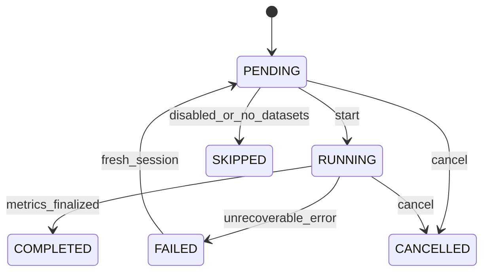
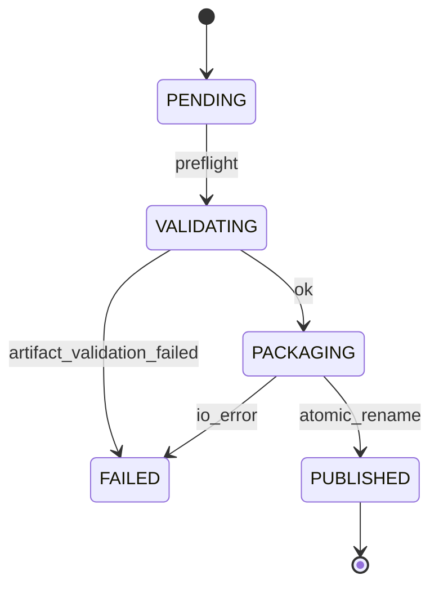
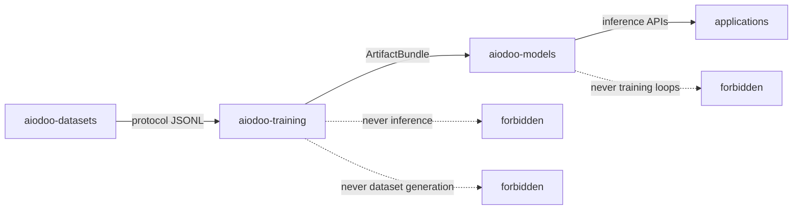
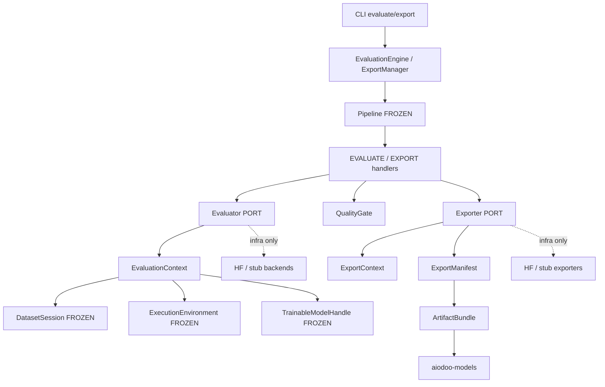
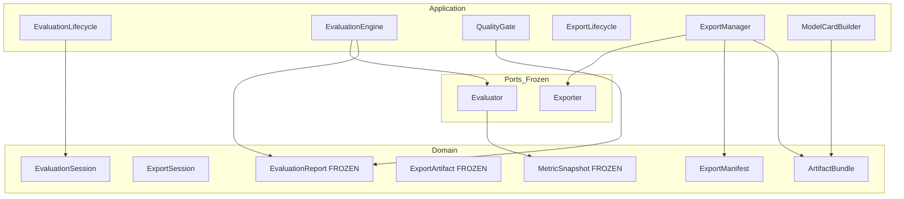
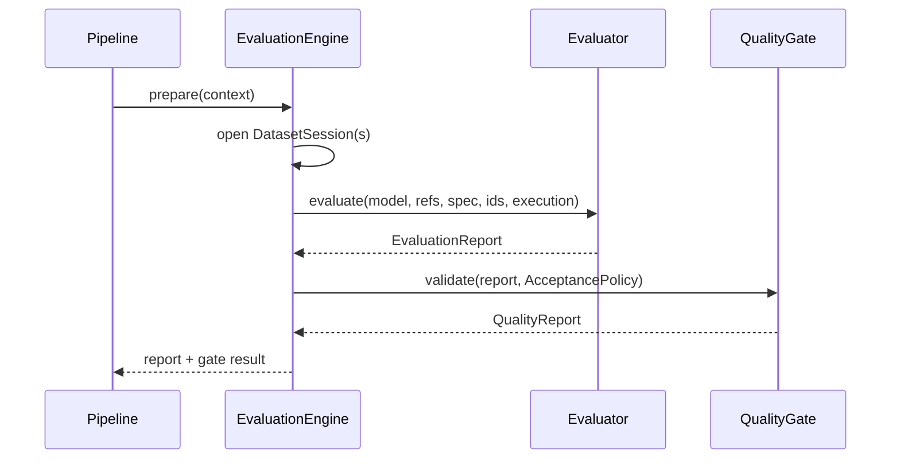
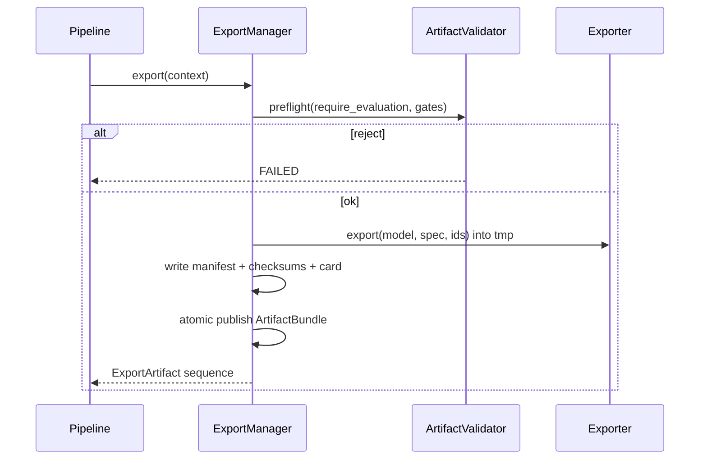

# Phase 4 — Evaluation & Export Architecture

**Status:** **Permanently frozen** (ADR-0015 Accepted; implementation complete)  
**Date:** 2026-07-14  
**Binding inputs:** [Frozen Public Contracts](frozen_public_contracts.md), ADRs 0001–0017  
**Related ADR:** [0015 (Accepted)](adr/0015-phase4-evaluation-export.md)  
**Lifecycle clarification:** [ADR-0022](adr/0022-package-surfaces-lifecycle-alignment.md) · [Lifecycle](lifecycle.md) · [Terminology](terminology.md)

> Phases **0–5** are **permanently frozen**. This document is the canonical Phase 4
> evaluation/export architecture. Do not redesign frozen surfaces for convenience.
> If any proposed change conflicts with a frozen contract, the frozen contract wins unless
> the Section 9 change process in `frozen_public_contracts.md` is completed.
>
> **ADR-0022 note:** Historical text below that says `ArtifactBundle` is the
> “only” handoff into `aiodoo-models` is superseded for **external** handoff
> authority. Capability Packages (`artifact.json` Drive trees) are authoritative
> for `aiodoo-validation` and `aiodoo-model` registry publish. `ArtifactBundle`
> remains the Phase 4 **export inventory** contract. Prefer the name
> `aiodoo-model` (singular).

---

## 0. Design goals and non-goals

### Goals (priority order)

1. **Correctness** — evaluation metrics and export packages reflect the trained artifact faithfully.
2. **Determinism & reproducibility** — same portable inputs + resolved `ExecutionEnvironment` → same reports, fingerprints, and bundles (CPU golden).
3. **Portable AIODOO Models handoff** — exported `ArtifactBundle` is the **only** supported interface into `aiodoo-models`.
4. **Clean architecture** — frozen `Evaluator` / `Exporter` ports remain public; frameworks stay in infrastructure.
5. **Extensibility** — HF and stub evaluators first; BLEU/ROUGE/benchmarks, GGUF/ONNX/TensorRT later by registration.

### Non-goals (this phase)

- Inference, serving, vLLM / SGLang runtime (belongs to `aiodoo-models`).
- Online / streaming evaluation during training steps (Phase 3 events may *hook*; productized mid-train eval is not required).
- Distributed evaluation / multi-node export (Phase 7).
- Human-in-the-loop labeling UIs (API hooks only).
- Performance optimization ahead of correctness.

### Frozen contracts consumed (do not redesign)

| Frozen surface | Phase 4 usage |
|----------------|---------------|
| `Evaluator.evaluate(...)` | Implement; bind rich context via factory/`bind()` |
| `Exporter.export(...)` | Implement; bind rich context via factory/`bind()` |
| `EvaluationReport`, `ExportArtifact`, `ExperimentManifest` | Emission / package identity |
| `EvaluationSpec`, `ExportSpec`, `ExportType` | Compose policies; additive fields via extras / fragments |
| `MetricSnapshot` | Shared metric emission type |
| `TrainableModelHandle`, `ExecutionEnvironment`, `DatasetSession` | Model, hardware, eval cursor |
| `Pipeline` / `PipelineStage.EVALUATE` / `EXPORT` | Handlers only — orchestrator unchanged |
| Invariant 8 | Evaluation **owns no** export logic |
| Invariant 7 / CheckpointManager | Export may *read* checkpoints; does not reinvent training checkpoint protocol |
| `training_protocol_version` | Consumed for compatibility; distinct `artifact_protocol_version` for export bundles |

---

## 1. Evaluation Lifecycle

### 1.1 Types

| Type | Layer | Role |
|------|-------|------|
| **EvaluationSession** | Domain (additive) | Immutable identity + cursor for one evaluation run |
| **EvaluationContext** | Application | Resolved bag: config, model handle, datasets, policies, collaborators |
| **EvaluationState** | Domain (additive) | Machine-readable lifecycle snapshot |
| **EvaluationProgress** | Domain (additive) | Step/example progress + interim metrics (mirrors TrainingProgress pattern) |
| **EvaluationLifecycle** | Application | Owner of allowed transitions; COW only |

### 1.2 EvaluationSession (proposed domain)

```text
EvaluationSession
  session_id: str
  experiment_id: ExperimentId
  run_id: RunId
  status: EvaluationStatus          # additive enum OR reuse StageStatus + TrainingStatus-like
  examples_seen: int
  examples_total: int | None
  dataset_session: DatasetSession | None
  split: DatasetSplitKind           # validation | test | benchmark | custom
  model_fingerprint: str
  adapter_fingerprint: str
  config_fingerprint: str
  execution_digest: str
  evaluation_fingerprint: str | None
  report_id: str | None
  created_at / updated_at
  metadata: Mapping[str, str]
```

Copy-on-write helpers: `with_status`, `advance`, `with_dataset_session`, `with_report`.

**Ownership:** Application `EvaluationLifecycle` owns transitions; domain remains immutable.

**Status enum (additive):** `PENDING | RUNNING | COMPLETED | FAILED | CANCELLED | SKIPPED`  
(`SKIPPED` when `EvaluationSpec.enabled == false`.)

### 1.3 EvaluationContext (application)

Resolved collaborators (never framework types):

- `ExperimentConfig` (+ Phase 4 evaluation fragments)
- `ExecutionEnvironment` (from frozen `ResourcePlanner`)
- `TrainableModelHandle` (or base+adapter restore from checkpoint)
- One or more `DatasetSession` + `DatasetRef` pairs by split
- `EvaluationSession`
- Ports: `Evaluator`, `RngController`, tracker (null ok)
- Policies: `EvaluationPolicy`, `AcceptancePolicy`, metric catalog keys
- Callbacks (optional; may reuse `TrainingCallback` or additive `EvaluationCallback`)

Built by `EvaluationContextBuilder`; bound into concrete evaluator via `bind()`.

### 1.4 State transitions



Recovery is application procedure: reload model + open DatasetSession → `RUNNING`.

### 1.5 Architecture review

| | |
|--|--|
| **Why** | Mirror TrainingSession so eval is a first-class, auditable run |
| **Deps** | Frozen DatasetSession, fingerprints, ExecutionEnvironment |
| **Layer** | Domain DTOs + application lifecycle |
| **Risks** | Duplicating TrainingSession fields — keep eval-specific; derive identities from ExperimentId |
| **Evolution** | Multi-split sessions as ordered sub-runs under one parent session id in metadata |

---

## 2. Evaluator Framework

### 2.1 Frozen port (consume as-is)

```text
Evaluator.evaluate(
  model, dataset_refs, spec, experiment_id, run_id, execution
) -> EvaluationReport
```

**Forbidden:** widening this signature. Rich session data reaches backends via
`EvaluationContext` binder / constructor (same pattern as Phase 3 trainers).

### 2.2 Supporting types (additive)

| Type | Role |
|------|------|
| **EvaluationBackend** | Alias / specialization marker for concrete `Evaluator` implementations |
| **EvaluationProfile** | Declarative registry metadata (metric set, max examples, dtype prefs) |
| **EvaluationRegistry** | `evaluator_registry` + `evaluation_profile_registry` (additive catalog) |
| **EvaluationBuilder** | Assembles profiles / metric sets into domain policies |
| **EvaluationFactory** | Existing `EvaluatorFactory` — implement `create(key)` |

### 2.3 Backend variants (registration-driven)

| Key | Package | Notes |
|-----|---------|-------|
| `stub` | `infrastructure/stub/evaluator.py` | Deterministic CPU metrics for CI golden |
| `hf_lm_eval` | `infrastructure/huggingface/evaluator.py` | Causal LM loss / perplexity / token accuracy |
| `custom` | `infrastructure/...` | Explicit loop over TokenBatch |
| `external_*` | future | HTTP / subprocess evaluators behind same port |

Factories resolve by key; pipeline unchanged.

### 2.4 Architecture review

| | |
|--|--|
| **Why** | Swap eval technology without touching application |
| **Risks** | Temptation to widen Evaluator — **forbidden**; use binders |
| **Evolution** | Benchmark harnesses as registered backends |

---

## 3. Evaluation Metrics

### 3.1 Types

| Type | Layer | Role |
|------|-------|------|
| **MetricDefinition** | Domain | Name, aggregation, higher_is_better, unit, tags |
| **MetricCollector** | Application | Receives per-example / batch observations → MetricSnapshot |
| **MetricAggregator** | Application | Window / full-pass aggregates |
| **MetricSnapshot** | Domain (**frozen**) | Point emission — **reuse**; do not fork |
| **MetricHistory** | Application | Append-only snapshots (+ optional JSONL) |
| **MetricReport** | Domain | Named section inside / alongside EvaluationReport |

Phase 3 already ships training-oriented `MetricCollector` under `training/`.  
Phase 4 either:

1. **Extract shared metrics helpers** to `aiodoo_training/metrics/` (additive package; move is optional at implementation — prefer extract *without* changing Phase 3 public behavior), or  
2. Instantiate parallel evaluation-scoped collectors that still emit frozen `MetricSnapshot`.

**Do not** change `MetricSnapshot` shape.

### 3.2 Initial metric catalog (registration-driven)

| Key | Status |
|-----|--------|
| `loss` | Phase 4 |
| `perplexity` | Phase 4 |
| `token_accuracy` | Phase 4 |
| `exact_match` | Phase 4+ |
| `bleu` / `rouge` | Later via registry |
| `human_score` | Later (external label ingest) |
| benchmark_* | Later (benchmark backend keys) |

### 3.3 Architecture review

| | |
|--|--|
| **Why** | Stable metric identity across train/eval/export manifests |
| **Risks** | Name chaos — mitigate with `metric_registry` + MetricDefinition |
| **Evolution** | New metrics register; AcceptancePolicy references by key |

---

## 4. Dataset Splits

### 4.1 Split kinds (additive domain enum)

```text
DatasetSplitKind: TRAIN | VALIDATION | TEST | BENCHMARK | CUSTOM
```

Training already owns TRAIN via Phase 1/3. Evaluation **consumes**:

- `EvaluationSpec.dataset_refs` (frozen) for held-out sets
- Additive config map `evaluation.splits.{validation,test,benchmark}` → `DatasetRef[]`

### 4.2 Compatibility with DatasetSession

Evaluation opens a **new** `DatasetSession` per split (new `session_id`), positioned at
epoch 0 / index 0 unless resuming an interrupted eval (optional Phase 4.1).

**Forbidden:** mutating frozen `DatasetSession` fields or inventing a parallel
session type that replaces it.

### 4.3 Architecture review

| | |
|--|--|
| **Why** | Clear held-out semantics without changing DatasetSession |
| **Risks** | Accidental train-set eval — validate split tags + separate refs |
| **Evolution** | Curriculum-aware split selection remains Phase 5 |

---

## 5. Evaluation Pipeline

### 5.1 Frozen stages — handlers only

Do **not** redesign `Pipeline`. Flesh handlers for existing stages and thin
helpers for evaluate-only CLI.

| Stage | Phase 4 responsibility |
|-------|------------------------|
| `VALIDATE_CONFIG` | Validate evaluation / quality-gate / export fragments |
| `RESOLVE_EXECUTION` | Existing planner |
| `LOAD_MODEL` / `APPLY_ADAPTATION` or restore from checkpoint | Existing + optional eval-from-checkpoint |
| `ASSEMBLE_DATASETS` | Open DatasetSession(s) for declared eval splits |
| `TOKENIZE` | Eval tokenization path (reuse Phase 1) |
| `EVALUATE` | `Evaluator.evaluate` → `EvaluationReport`; quality gates |
| `EXPORT` | `Exporter.export` **only after** gates (or skip if export disabled) |
| `FINALIZE` | Persist MetricHistory, attach report paths to tracker |

Recommended logical evaluate subflow (inside `EVALUATE` handler orchestration
services — not new Pipeline stages unless additive enum ADR):

```text
Prepare → Load → Evaluate → Aggregate → Validate(gates) → Report → (Export Results JSON)
```

Export of **model** artifacts remains the separate `EXPORT` stage (Invariant 8).

### 5.2 PipelineContext keys

Stable keys: `evaluation_session`, `evaluation_context`, `evaluation_report`,
`quality_report`, `export_session`, `export_bundle`, `artifact_index`.

### 5.3 Architecture review

| | |
|--|--|
| **Why** | Keep single orchestrator; avoid eval mega-pipeline |
| **Risks** | Fat EVALUATE stage — push logic into EvaluationEngine / QualityGate services |

---

## 6. Model Validation (Quality Gates)

### 6.1 Types

| Type | Role |
|------|------|
| **ModelValidator** | Application: runs AcceptancePolicy against EvaluationReport |
| **EvaluationPolicy** | Domain: which metrics, max examples, seed, backend key |
| **AcceptancePolicy** | Domain: list of QualityThreshold rules + combine mode (ALL / ANY) |
| **QualityGate** | Application: execute policy → QualityReport |
| **QualityThreshold** | Domain: metric_key, op (`>=`, `<=`, `==`), value, severity |
| **QualityReport** | Domain: passed, failures[], warnings[], report refs |

### 6.2 Enterprise extensibility

Custom rules register as `QualityRule` ports (additive) keyed in config:

```yaml
quality_gates:
  combine: all
  thresholds:
    - metric: loss
      op: "<="
      value: 2.5
    - metric: token_accuracy
      op: ">="
      value: 0.4
  rules: [enterprise_compliance]   # optional registry keys
```

Hard-fail vs warn is severity on each threshold. Export stage may refuse to run
when `gate_mode: require_pass` and `QualityReport.passed == false`.

### 6.3 Architecture review

| | |
|--|--|
| **Why** | Separate “measure” (Evaluator) from “decide” (gates) |
| **Risks** | Coupling gates into Evaluator — forbid; gate after report |
| **Evolution** | Multi-report ensemble gates without changing Evaluator |

---

## 7. Export Framework

### 7.1 Frozen port (consume as-is)

```text
Exporter.export(model, spec, experiment_id, run_id) -> Sequence[ExportArtifact]
```

Bind `ExportContext` via factory/`bind()`. **Never** put Torch types on the port.

### 7.2 Supporting types

| Type | Role |
|------|------|
| **ExportBackend** | Concrete `Exporter` implementations |
| **ExportProfile** | Declarative: which ExportTypes, layout template, card flags |
| **ExportRegistry** | `exporter_registry` + `export_profile_registry` |
| **ExportBuilder** / **ExportFactory** | Profile assembly + `ExporterFactory.create` |

### 7.3 Backend / format matrix

| Key / ExportType | Phase |
|------------------|-------|
| `peft_adapter` | Phase 4 |
| `merged_weights` | Phase 4 |
| `tokenizer` | Phase 4 |
| `manifest` | Phase 4 |
| `bundle` | Phase 4 (directory package + index) |
| `model_card` | Phase 4 (markdown/json sidecar) |
| `gguf` / `onnx` / `tensorrt` | Later — additive `ExportType` values + backends |

Existing frozen `ExportType` already includes PEFT_ADAPTER, MERGED_WEIGHTS,
TOKENIZER, MANIFEST, BUNDLE. Additive enum members require ADR but **not** port redesign.

### 7.4 Architecture review

| | |
|--|--|
| **Why** | One handoff surface for aiodoo-models |
| **Risks** | Export doing evaluation — **Invariant 8** forbids |
| **Evolution** | New formats register; Artifact Contract version bumps |

---

## 8. Export Lifecycle

### 8.1 Types

| Type | Layer | Role |
|------|-------|------|
| **ExportSession** | Domain | Identity + status for one export attempt |
| **ExportContext** | Application | Model, policies, evaluation report refs, output roots |
| **ExportState** | Domain | Lifecycle snapshot |
| **ExportManifest** | Domain | Per-bundle inventory: logical roles, relative paths, checksums, protocols |
| **ExportFingerprint** | Determinism | Digest of portable bundle identity |
| **ArtifactIndex** | Application | Cross-bundle locator under `output_dir` (paths + logical metadata) |
| **ArtifactIndexEntry** | Domain / app DTO | One published bundle row discoverable without reading every file tree |
| **ArtifactBundle** | Domain | Top-level package handed to aiodoo-models |

### 8.2 ExportManifest (conceptual)

```text
schema_version
artifact_protocol_version          # Training→Models handoff (initial "1")
training_protocol_version          # OPTIONAL provenance echo; never required by Models to load
experiment_id, run_id
model_fingerprint, adapter_fingerprint, config_fingerprint
evaluation_fingerprint             # optional but recommended if report attached
export_backend_key                 # diagnostic for Training; Models may ignore
export_types: tuple[str, ...]
artifacts: tuple[ArtifactDescriptor, ...]   # logical inventory (see §8.2.1)
required_artifacts: tuple[str, ...]         # relative paths that must exist
artifact_paths: tuple[str, ...]             # all relative file paths (compat alias / flat list)
created_at
software: python, aiodoo-training, optional lib versions   # diagnostic only
export_fingerprint
```

#### 8.2.1 ArtifactDescriptor (logical metadata inside the manifest)

Every materialized file **and** logical role is discoverable without walking the
filesystem ad hoc:

```text
ArtifactDescriptor
  role: ExportType | str     # peft_adapter | tokenizer | model_card | …
  relative_path: str         # posix path inside the bundle
  checksum: str              # sha256 hex
  content_type: str | None   # optional mime / kind hint
  required: bool
```

`ExportManifest.artifacts` is the **authoritative** per-bundle inventory.
`required_artifacts` / `artifact_paths` remain for fast rejects and checksums
lists; they must stay consistent with `artifacts`.

### 8.2.2 ArtifactIndex (cross-bundle discovery)

`ArtifactIndex` (e.g. `output_dir/artifacts.json`) does **not** replace
ExportManifest. It answers: “which bundles exist under this export root?”

```text
ArtifactIndexEntry
  bundle_path: str                 # relative to output_dir
  experiment_id, run_id
  export_fingerprint
  artifact_protocol_version
  export_types: tuple[str, ...]
  roles: tuple[str, ...]           # logical roles present (from manifest)
  created_at
  manifest_relpath: str            # default export_manifest.json
```

**Invariant:** every published bundle appears in ArtifactIndex; every artifact
role inside a bundle is listed in that bundle’s ExportManifest.artifacts.
Discovery for operators/CI uses Index → Manifest → files. Models loaders open a
**single** bundle and need only ExportManifest (+ files), not the Index.

ExportManager ownership is unchanged: Index update remains a post-publish step
after atomic rename (§8.3).

### 8.3 Atomic publish

```text
1. Write to output_dir/.tmp-export-<uuid>/
2. Materialize weight/tokenizer/card files via ExportBackend
3. Write ExportManifest + checksums
4. fsync
5. Atomic rename → bundle-<experiment_id>-<shortfp>/
6. Update ArtifactIndex
7. Emit ExportCompleted
```

On failure: delete tmp; leave prior bundles intact.

### 8.4 State machine



### 8.5 Architecture review

| | |
|--|--|
| **Why** | Durable, auditable model packages |
| **Ownership** | ExportManager (application) orchestrates; Exporter port writes opaque files |
| **Risks** | Partial publishes — atomic rename mandatory |

---

## 9. Artifact Validation & Compatibility

### 9.1 ArtifactValidationPolicy (producer integrity)

Dedicated enum (do **not** reuse training `ResumePolicy`):

```text
ArtifactValidationPolicy.STRICT | WARN | RELAXED
```

Applies when **Training** packages or re-validates a single ArtifactBundle:

| Check | STRICT | WARN | RELAXED |
|-------|--------|------|---------|
| Required files present | reject | reject | reject |
| Checksums match | reject | reject | warn |
| Fingerprints present / rematch | reject | warn | warn |
| `artifact_protocol_version` writable/known | reject | reject | reject |
| Quality gates when require_pass | reject | warn | ignore |
| Software package versions | ignore | warn | ignore |

### 9.2 ArtifactCompatibilityPolicy (consumer negotiation) — **introduced in hardening**

Long-lived Models evolution needs a distinct concern from package integrity:

| Policy | Answers |
|--------|---------|
| **ArtifactValidationPolicy** | Is this bundle **internally sound** (files, checksums, fingerprints)? |
| **ArtifactCompatibilityPolicy** | May this `artifact_protocol_version` (+ declared `export_types`) be **consumed** by a given Models runtime profile? |

```text
ArtifactCompatibilityPolicy
  # Domain / config abstraction only in Phase 4 design — not implemented here
  accepted_artifact_protocols: tuple[str, ...]   # e.g. ("1",)
  required_roles: tuple[str, ...]                # e.g. ("peft_adapter", "manifest")
  optional_roles: tuple[str, ...]
  reject_unknown_roles: bool                     # default false — forward compatible
```

**Ownership split (no interface widening):**

- **Training (ExportManager):** writes `artifact_protocol_version` and roles;
  optionally runs a *producer-side* compatibility preflight against a configured
  `target_models_profile` (warn if Training would emit a protocol Models N cannot
  read). Does not import aiodoo-models.
- **Models (loader):** owns the authoritative consumer compatibility matrix;
  rejects unsupported protocols without consulting Training code.

Training’s export path remains behind frozen `Exporter` + ExportManager. Models
never calls Training ports.

`ArtifactValidationPolicy` alone is **not** sufficient for multi-year protocol
negotiation across independent Model releases — hence the separate abstraction.
It remains sufficient for **single-bundle integrity** at produce time.

### 9.3 Pre-export / post-pack checks (Training)

| Check | Hard reject |
|-------|-------------|
| Required files from ExportProfile / descriptors | Yes |
| File checksums match manifest | Yes (STRICT) |
| Fingerprints rematch declared | Yes (STRICT) |
| `artifact_protocol_version` set & known to Training | Yes |
| Quality gates when `require_pass` | Yes (STRICT) |
| Producer compatibility preflight vs target profile | Optional / policy-scaled |

### 9.4 Architecture review

| | |
|--|--|
| **Why** | Integrity ≠ consumer compatibility |
| **Failure modes** | Missing files, checksum mismatch, gate fail, unsupported protocol for target |
| **Recovery** | Leave prior bundle; emit ExportFailed; operator re-runs export |
| **Non-goals** | No widening of `Exporter.export` signature |

---

## 10. Model Cards

### 10.1 Types

| Type | Role |
|------|------|
| **ModelCardBuilder** | Assembles card from ExperimentSummary + evaluations |
| **ModelMetadata** | Reuse Phase 2 model metadata fields where possible |
| **ExperimentSummary** | Portable experiment identity + config digest |
| **TrainingSummary** | Steps, backend key, adaptation, seeds |
| **EvaluationSummary** | Metrics + gate outcome (from EvaluationReport) |
| **Limitations / License** | Declared strings from config / policy |

Outputs: `model_card.md` + optional `model_card.json` (structured).

### 10.2 HuggingFace compatibility (extension)

Card schema includes an optional `hf_compatible: true` section mapped by
infrastructure when exporting HF-style layout — **never** required for core
AIODOO Models contract.

### 10.3 Architecture review

| | |
|--|--|
| **Why** | Human + machine readable provenance |
| **Risks** | Card becoming sole source of truth — **no**; ExportManifest wins |

---

## 11. Export Fingerprinting

### 11.1 Digests (deterministic, portable)

| Fingerprint | Inputs (portable only) |
|-------------|------------------------|
| Model | Existing Phase 2 model fingerprint |
| Adapter | Existing Phase 2 adapter fingerprint |
| Tokenizer | Phase 1 tokenization fingerprint / binding |
| Configuration | Portable composed experiment config hash |
| Evaluation | Metric set + dataset fingerprints + seed + backend key + report body hash |
| Model card | Canonical JSON of summary fields (exclude absolute paths) |
| Metadata | Selected ExportManifest fields excluding volatile paths |
| **Export bundle** | Ordered concatenation of the above + artifact content hashes |

Absolute `output_dir` paths **must not** feed fingerprints.

### 11.2 Architecture review

| | |
|--|--|
| **Why** | Reproducible artifact identity across machines |
| **Risks** | Non-canonical JSON — mandate sorted keys / stable serializers |

---

## 12. AIODOO Models Integration (critical)

### 12.1 Artifact Contract

The **only** supported training→models interface is an on-disk **ArtifactBundle**
validated against `artifact_protocol_version`.

```text
ArtifactBundle/
  export_manifest.json      # ExportManifest (Models-facing contract surface)
  artifacts/
    adapter/ | merged/ | tokenizer/ | ...
  model_card.md
  model_card.json           # optional structured
  evaluation/
    report.json             # optional JSON; portable DTO shape, not Training classes
    quality_report.json     # optional
  checksums.sha256
```

### 12.1.1 Independent evolution (hardening)

**Models must evolve without depending on Training internals or releases.**

| Bundle field / artifact | Models load requirement | Notes |
|-------------------------|-------------------------|-------|
| `artifact_protocol_version` | **Required** | Sole semantic version for layout / required roles |
| `schema_version` | Required to parse JSON | Manifest shape |
| `artifacts[]` / required files + checksums | **Required** | Integrity |
| model / adapter / config fingerprints | Required for FULL loads | Identity |
| `export_types` / roles | Required for discovery | Which loaders to invoke |
| `training_protocol_version` | **Ignored for load** | Provenance / diagnostics only |
| `export_backend_key` | **Ignored for load** | Training diagnostic |
| `software.*` | **Ignored for load** | Diagnostics |
| `evaluation/*` | Optional | May inform tags; must not require Training packages |
| ArtifactIndex | **Not required** | Training output_dir convenience only |

Removed / avoided couplings:

1. Models **must not** require understanding of Training resume protocol
   (`training_protocol_version` is echo-only).
2. Models **must not** import `aiodoo_training` modules or share Python types at
   runtime — only the on-disk JSON/file contract.
3. Evaluation / quality sidecars are **optional JSON documents** with stable
   field names documented in the Artifact Contract; they are not live
   `EvaluationSession` / QualityGate objects.
4. ArtifactIndex is a Training-side catalog; Models opens an explicit bundle path.

`aiodoo-models` **loads** this package. It must **never**:

- import `aiodoo_training` (domain, ports, or infrastructure)
- depend on TrainerBackend, CheckpointManager, or PEFT **training** types
- require live TrainingSession / EvaluationSession / ExportSession objects
- hard-fail solely because `training_protocol_version` is missing or unfamiliar

### 12.2 Versioning & compatibility

| Field | Owner | Purpose |
|-------|-------|---------|
| `artifact_protocol_version` | Training produce / Models consume | Semantic package layout + required roles |
| `training_protocol_version` | Training echo | Provenance only — **not** a Models load gate |
| `schema_version` | Manifest JSON | Parseability |
| `ArtifactCompatibilityPolicy` | Models authoritative; Training optional preflight | Which protocols/roles a consumer accepts |

Bump `artifact_protocol_version` when layout/required roles change breaking-wise.

**Migration:** aiodoo-models may support N,N-1 protocols via its own
`ArtifactCompatibilityPolicy`. Training always writes the current produce
version. Older-bundle adapters live in **Models**, not by rewriting frozen
Training contracts.

### 12.3 Validation at Models boundary

Models repo validates:

1. Manifest parse + **`artifact_protocol_version`** via ArtifactCompatibilityPolicy  
2. Required roles / files + checksums (integrity; may mirror Training’s
   ArtifactValidationPolicy semantics without sharing code)  
3. Fingerprint presence for identity  
4. Optional: evaluation JSON for “production-ready” tags  

Training’s ExportManager produces packages that *should* pass; Models must still
validate defensively and independently.

### 12.4 Architecture review

| | |
|--|--|
| **Why** | Hard repository boundary; independent release cadence (ADR-0006) |
| **Risks** | Leaking training paths / resume protocol into Models — forbidden by §12.1.1 |
| **Evolution** | New ExportTypes as optional roles behind same protocol or a bumped protocol |

---

## 13. Repository Boundaries



| Concern | AIODOO Training | AIODOO Models |
|---------|-----------------|---------------|
| Train / resume / checkpoint | ✓ | ✗ |
| Offline evaluation for training gates | ✓ | optional smoke only |
| Build ArtifactBundle | ✓ | ✗ (consumes) |
| Inference / serving / batch generate | ✗ | ✓ |
| Runtime quantization for serving | ✗ | ✓ |
| Training PEFT apply | ✓ | ✗ (may load exported adapter weights) |

---

## 14. Configuration

### 14.1 Additive YAML fragments

```yaml
evaluation:
  enabled: true
  backend: stub                 # stub | hf_lm_eval | custom
  profile: default
  splits:
    validation:
      - path: data/val.jsonl
        type: coding
    test: []
    benchmark: []
  metrics: [loss, perplexity, token_accuracy]
  max_examples: null
  seed: 42

quality_gates:
  combine: all
  require_pass_for_export: true
  thresholds:
    - { metric: loss, op: "<=", value: 3.0, severity: error }

export:
  enabled: true
  backend: stub                 # stub | hf_peft | merge
  profile: peft_default
  output_dir: artifacts/export
  types: [peft_adapter, tokenizer, manifest, model_card, bundle]
  require_evaluation: true
  validation_policy: strict     # ArtifactValidationPolicy: strict | warn | relaxed
  target_models_profile: null   # optional producer preflight → ArtifactCompatibilityPolicy stub
  # artifact_protocol_version is written by ExportManager (not freely overridden in prod)

model_card:
  license: Apache-2.0
  limitations: "CPU stub metrics only in CI configurations."
  include_training_summary: true
  include_evaluation_summary: true
```

Frozen `EvaluationSpec` / `ExportSpec` remain authoritative for existing fields;
new keys live in additive fragments mapped by config helpers (same Phase 3
pattern). Prefer **not** breaking ExperimentConfig immutability — store extras
in `metadata` or additive typed fragments resolved at builder time.

### 14.2 Validation

- Backend keys registered  
- Split refs exist / resolve  
- Threshold metrics ⊆ declared metrics  
- `require_evaluation` implies evaluation.enabled  
- Export types ⊆ ExportType (+ registered extensions)

---

## 15. Testing Strategy

| Layer | Focus |
|-------|-------|
| **Unit** | Lifecycle transitions; MetricDefinition catalog; QualityGate matrix; manifest serde |
| **Golden** | Stub evaluator fixed seed → stable EvaluationReport; stub export → stable ExportFingerprint |
| **Artifact validation** | Missing file, checksum tamper, protocol mismatch |
| **Export reproducibility** | Two exports same inputs → same fingerprints (CPU) |
| **Model card** | Canonical JSON stable under path relocation |
| **Contract** | Bundle layout against Artifact Contract fixture consumed by a mock Models loader (in-repo) |
| **Boundary** | No framework imports outside infrastructure |
| **CPU CI** | Default; no GPU |

Mandatory golden: **export equivalence** — identical portable inputs produce
identical `export_fingerprint` and checksum set (excluding volatile timestamps
fields that must be excluded from the digest inputs).

---

## 16. Future Extension Points

| Future | How Phase 4 prepares |
|--------|----------------------|
| GGUF / ONNX / TensorRT | Additive `ExportType` + exporter registry keys |
| vLLM / SGLang / OpenVINO | **Models** runtimes consume ArtifactBundle — no Training redesign |
| BLEU / ROUGE / EM / human | `metric_registry` + MetricDefinition |
| External benchmark harnesses | EvaluatorBackend keys |
| HF Hub push | Optional infra exporter wrapping same Bundle |
| Distributed eval | DatasetSession shard fields + ExecutionEnvironment |

---

## 17. Subsystem architecture review (summary)

| Subsystem | Why | Responsibilities | Dependencies | Ownership | Risks | Evolution |
|-----------|-----|------------------|--------------|-----------|-------|-----------|
| EvaluationSession / Lifecycle | Auditable eval runs | Status, COW cursor | DatasetSession, fingerprints | App lifecycle | Field drift vs TrainingSession | Sub-run metadata |
| Evaluator | Swap engines | evaluate → report | Frozen port | Infra + factory | Signature creep | Registry backends |
| Metrics | Stable numbers | Collect/aggregate | MetricSnapshot | App + domain defs | Name chaos | Catalog registry |
| Splits | Held-out clarity | Open sessions by kind | DatasetSession | App datasets stage | Train leakage | Phase 5 curriculum |
| Pipeline handlers | Ordered flow | Thin orchestration | Frozen Pipeline | App handlers | Fat stages | Keep thin |
| Quality gates | Ship/no-ship | Thresholds + rules | EvaluationReport | App validator | Gates inside Evaluator | Rule port |
| Exporter | Formats | Files on disk | Frozen port | Infra | Eval in export | New ExportTypes |
| ExportManager / Manifest | Atomic packages | Validate + publish | Store-like files | App | Partial dirs | Protocol bumps |
| Model cards | Provenance | Summaries | Reports + config | App builder | Card as SoT | HF optional |
| Fingerprints | Identity | Digests | Determinism svc | Determinism + app | Path noise | Canonical serde |
| Artifact Contract | Models handoff | Versioned bundle | All above | Cross-repo | Leakage | N,N-1 support |

---

## Engineering requirements (every subsystem)

Each subsystem above defines:

| Concern | Phase 4 approach |
|---------|------------------|
| Lifecycle | EvaluationSession / ExportSession + COW status |
| Ownership | Lifecycle/Manager vs Port vs Infrastructure backends |
| State transitions | Documented state diagrams |
| Extension points | Registries for backends, metrics, profiles, rules, ExportTypes |
| Failure modes | FAILED status + events; tmp cleanup; prior bundles intact |
| Recovery | Re-run evaluate/export; optional resume for long eval later |
| Public interfaces | Frozen Evaluator/Exporter; additive domain DTOs; Artifact Contract |
| Deterministic guarantees | CPU golden reports + export fingerprints |

---

## Repository additions (planned — not created until implementation approval)

```text
aiodoo_training/
  domain/
    evaluation_session.py
    evaluation_policies.py
    export_manifest.py
    quality.py
    metric_definition.py
  evaluation/                 # application (empty package today)
    lifecycle.py
    context.py
    engine.py
    quality_gate.py
  export/                     # application (empty package today)
    lifecycle.py
    context.py
    manager.py
    model_card.py
    fingerprints.py
  metrics/                    # optional shared extract
  ports/
    # evaluator/exporter FROZEN — implement only
    quality.py                # additive QualityRule (optional)
  infrastructure/
    stub/evaluator.py
    stub/exporter.py
    huggingface/evaluator.py
    huggingface/exporter.py
  config/
    evaluation_config.py
    export_config.py
docs/
  phase4-evaluation-export-architecture.md
  adr/0015-phase4-evaluation-export.md
  artifact_contract.md        # optional extract of §12 for Models consumers
tests/
  unit/evaluation/...
  unit/export/...
  golden/test_export_fingerprint.py
  contract/test_artifact_bundle.py
```

---

## Dependency graph



---

## Component diagram



---

## Evaluation lifecycle (sequence)



---

## Export lifecycle (sequence)



---

## Artifact lifecycle

```text
Train (Phase 3) → Checkpoint optional
       ↓
Evaluate → EvaluationReport → QualityReport
       ↓
Validate artifacts / gates
       ↓
Package (tmp) → Manifest + fingerprints
       ↓
Publish ArtifactBundle
       ↓
aiodoo-models validate & load
```

---

## Public interfaces (summary)

**Frozen (implement only):**

- `Evaluator.evaluate(...) -> EvaluationReport`
- `Exporter.export(...) -> Sequence[ExportArtifact]`

**Additive (design):**

- EvaluationSession / Lifecycle / Context / Progress  
- ExportSession / Lifecycle / Context / ExportManifest / ArtifactBundle  
- EvaluationPolicy / AcceptancePolicy / QualityGate / QualityReport  
- MetricDefinition (+ registries)  
- ModelCardBuilder  
- ArtifactValidationPolicy (integrity)  
- ArtifactCompatibilityPolicy (consumer negotiation abstraction)  
- ArtifactDescriptor / ArtifactIndexEntry  
- `artifact_protocol_version`  

**Cross-repo:**

- Artifact Contract (§12) — sole Training→Models interface

---

## Risk analysis

| Risk | Mitigation |
|------|------------|
| Widening Evaluator/Exporter signatures | Binders only; boundary reviews |
| Evaluation owns export | Separate stages + Invariant 8 tests |
| Absolute paths in fingerprints | Portable digests only |
| Partial export dirs | Atomic tmp→rename |
| Models depends on training internals | §12.1.1 decoupling + contract tests |
| training_protocol_version treated as load gate | Explicitly ignored by Models (§12.1.1) |
| Undiscoverable exported files | ArtifactDescriptor + ArtifactIndexEntry (§8.2) |
| Protocol skew across Models releases | ArtifactCompatibilityPolicy (§9.2) |
| Non-deterministic HF eval | Stub golden in CI; document GPU limits |
| Quality gates buried in backends | Gate after EvaluationReport only |
| ExportType explosion | Registry + additive enum ADR discipline |

---

## Future roadmap (post-Phase 4)

1. Implement Phase 4 against this ADR once Accepted  
2. Publish `docs/artifact_contract.md` for Models consumers  
3. Phase 5 packing/curriculum may feed better eval datasets — no eval redesign  
4. Phase 6 tracking attaches EvaluationReport / bundle URIs  
5. Phase 7 distributed eval uses DatasetSession placement fields  

---

## Approval gate

Phase 4 is **complete and permanently frozen**:

1. Reviewed ✓  
2. Hardened ✓  
3. Captured in ADR-0015 as **Accepted** ✓  
4. Referenced from frozen governance docs ✓  

---

## 18. Hardening completion — architecture status

### Review outcomes

| Question | Outcome |
|----------|---------|
| Can aiodoo-models evolve independently? | **Yes** — §12.1.1: load gates on `artifact_protocol_version` only; `training_protocol_version` / backend keys / software are diagnostic; no Python imports of Training; Index not required for Models |
| Is every exported artifact discoverable? | **Yes** — ExportManifest.`artifacts` (`ArtifactDescriptor`) is per-bundle logical inventory; ArtifactIndex + `ArtifactIndexEntry` lists published bundles with roles/fingerprints. ExportManager ownership unchanged |
| ArtifactCompatibilityPolicy vs ValidationPolicy? | **Both justified** — Validation = integrity of one package; Compatibility = consumer protocol/role negotiation across Models releases (§9.1–9.2). Abstraction only; not implemented |
| Further abstractions justified? | **No** |

### Verdict

**The Phase 4 Evaluation & Export architecture is complete and permanently frozen.**

Extend only through additive registrations, configuration, or new ADRs.

---

**END OF DESIGN — HARDENED — NO IMPLEMENTATION IN THIS CHANGE.**
