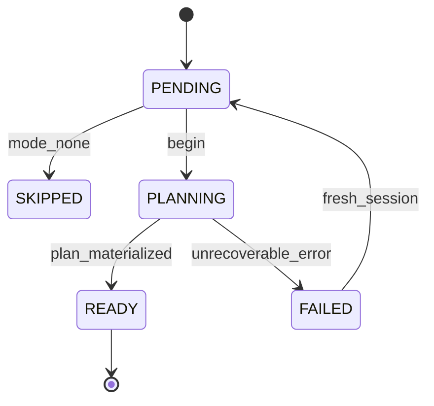
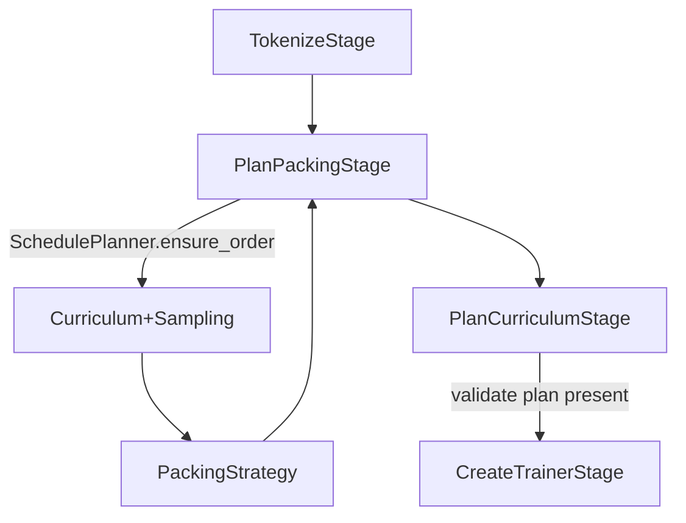
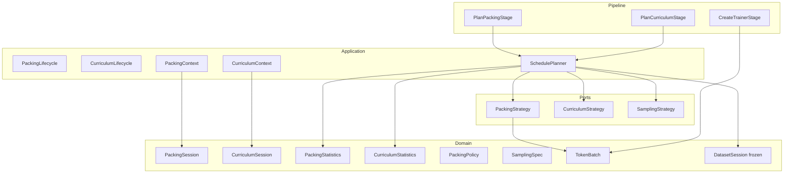
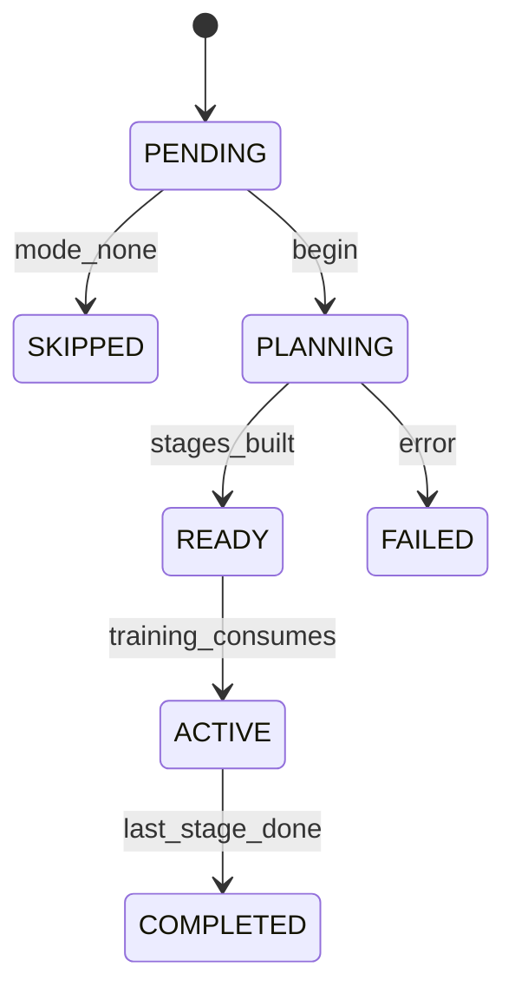
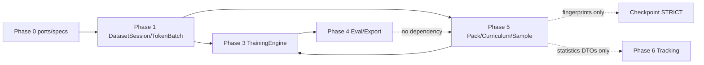

# Phase 5 — Packing & Curriculum Architecture

**Status:** **Permanently frozen** (implementation complete; ADR-0017)  
**Date:** 2026-07-14  
**Binding inputs:** [Frozen Public Contracts](frozen_public_contracts.md), ADRs 0001–0017, [Artifact Contract](artifact_contract.md)  
**Related ADR:** [0016 (Accepted)](adr/0016-phase5-packing-curriculum.md) · [0017 Phase 5 Freeze](adr/0017-phase5-freeze.md)

> Phases **0–5** are **permanently frozen** public contracts.
> This document is the canonical Phase 5 architecture specification.
> If any proposed change conflicts with a frozen contract, the frozen contract wins unless
> the Section 9 change process in `frozen_public_contracts.md` is completed.
>
> **Hardening (post-review):** immutable `PackingStatistics` /
> `CurriculumStatistics` as completed-plan summaries only; `SchedulePlanner`
> remains the sole Phase 5 orchestration owner. No redesign.

---

## 0. Design goals and non-goals

### Goals (priority order)

1. **Correctness** — packed batches and curricula produce valid `TokenBatch` /
   stage plans that the frozen training engine can consume without semantic loss
   of labels or attention masks.
2. **Determinism & reproducibility** — same portable inputs + seed +
   `ExecutionEnvironment` → same packed batches, curriculum stages, and
   sampling order (CPU golden).
3. **Training efficiency** — raise token utilization, reduce padding waste,
   improve GPU occupancy **without** changing the training engine’s frozen
   ports or checkpoint protocol.
4. **Clean architecture** — frozen `PackingStrategy` / `CurriculumStrategy`
   signatures remain public; rich session data arrives via binders (same
   Phase 3/4 pattern).
5. **Extensibility** — FlashAttention-aware packing, adaptive curriculum,
   RL / preference sampling later by registration.

### Non-goals (this phase)

- Redesigning `TrainerBackend`, `CheckpointManager`, `DatasetSession`,
  evaluation, or export.
- Implementing online RLHF / DPO training loops (extension points only).
- Distributed packing coordination (Phase 7 — rank-local packing + reserved
  metadata only).
- Changing `TokenBatch` rectangularity invariants.
- Performance micro-kernels or custom CUDA packing ops (infrastructure later).

### Frozen contracts consumed (do not redesign)

| Frozen surface | Phase 5 usage |
|----------------|---------------|
| `PackingStrategy.pack(examples, spec) -> Iterator[TokenBatch]` | Implement; bind rich context via `bind()` |
| `CurriculumStrategy.plan(examples, spec) -> Sequence[Sequence[TrainingExample]]` | Implement; bind rich context via `bind()` |
| `PackingSpec`, `CurriculumSpec`, `PackingMode`, `CurriculumMode` | Compose; additive enum / fragment fields only |
| `TokenBatch`, `TrainingExample` | Packing emits; curriculum reorders |
| `DatasetSession` | Consume / advance via existing COW helpers — **never mutate shape** |
| `TrainingContext` / `TrainerBackend` | Consume packed iterator via binder / `PipelineContext` values — **do not widen train()** |
| `Pipeline` / `PipelineStage.PLAN_PACKING` / `PLAN_CURRICULUM` | Handlers only — orchestrator unchanged |
| Checkpoint + `training_protocol_version` | Packing/curriculum fingerprints fold into config fingerprint / metadata; **no resume schema redesign** |
| ResourcePlanner / `ExecutionEnvironment` | Memory packing policies consult resolved environment |
| Invariant 10 | Every packing / curriculum / sampling backend registers |

### How Phase 5 improves efficiency without changing the training engine

```text
AssembleDatasets → Tokenize → [Phase 5: order + pack] → CreateTrainer → Train
                                      ↑
                         yields TokenBatch stream
                         TrainingEngine already accepts TokenBatch /
                         DatasetSession progress — no TrainerBackend change
```

Packing and curriculum sit **upstream** of the frozen train loop. They change
*what* batches are presented, not *how* the trainer optimizes.

---

## 1. Packing Lifecycle

### 1.1 Types

| Type | Layer | Role |
|------|-------|------|
| **PackingSession** | Domain (additive) | Immutable identity + cursor for one packing plan build |
| **PackingContext** | Application | Resolved bag: specs, streams, policies, collaborators |
| **PackingState** | Domain (additive) | Machine-readable lifecycle snapshot |
| **PackingProgress** | Domain (additive) | Transient planning counters while status is `PLANNING` |
| **PackingStatistics** | Domain (additive) | Immutable summary of a **completed** packing plan |
| **PackingLifecycle** | Application | Owner of allowed transitions; COW only |
| **PackingPlan** | Domain (additive) | Deterministic planned batch descriptors (optional artifact) |
| **PackedSpan** | Domain (additive) | Per-example span inside a packed sequence (starts/ends, example_id) |

### 1.2 PackingSession (proposed domain)

```text
PackingSession
  session_id: str
  experiment_id: ExperimentId
  run_id: RunId
  status: PackingStatus          # PENDING | PLANNING | READY | FAILED | SKIPPED
  examples_seen: int
  sequences_emitted: int
  tokens_packed: int
  tokens_padded: int
  packing_fingerprint: str | None
  model_fingerprint / adapter_fingerprint / config_fingerprint
  execution_digest: str
  created_at / updated_at
  metadata: Mapping[str, str]
```

Copy-on-write helpers: `with_status`, `advance`, `with_fingerprint`.

**Ownership:** Application `PackingLifecycle` owns transitions; domain remains immutable.

**SKIPPED:** when `PackingMode.NONE` / profile `"none"` — NoPacking remains the
default path (already registered).

### 1.2.1 PackingStatistics (hardening — abstraction only)

Introduce an immutable domain DTO that **summarizes a completed packing plan**.
It does **not** redesign `PackingSession` and is **not** a runtime tracker.

```text
PackingStatistics   # frozen dataclass; produced once when plan reaches READY
  packing_fingerprint: str
  backend_key: str
  examples_input: int
  examples_packed: int
  sequences_emitted: int
  tokens_content: int          # non-pad tokens
  tokens_padded: int
  pad_ratio: float             # tokens_padded / (tokens_content + tokens_padded)
  mean_examples_per_sequence: float
  max_sequence_length: int
  overflow_deferred: int
  overflow_truncated: int
  # No timestamps required for golden equality.
```

| Concern | Rule |
|---------|------|
| When produced | Exactly when packing transitions to `READY` (or `SKIPPED` with zeros / identity) |
| Who produces | `SchedulePlanner` (or packing planner helper it owns) — **not** a TrackingManager |
| Relation to PackingSession | Optional reference / attach on context; session stays the lifecycle cursor |
| Relation to PackingProgress | Progress = interim during `PLANNING`; Statistics = final snapshot |
| Runtime tracking | **Forbidden in Phase 5** — no live aggregation service, no Phase 6 tracker calls |
| Phase 6 hook | Tracker may later *emit* a copy of this DTO; Phase 5 only defines the shape |

**Why justified:** long-term debugging, padding-efficiency visualization, and
future Phase 6 experiment tracking need a stable summary surface without
embedding tracking into `PackingSession` or inventing a PackingManager.

### 1.3 PackingContext (application)

Resolved collaborators (never framework types):

- `ExperimentConfig` (+ Phase 5 packing / memory fragments)
- `ExecutionEnvironment`
- `DatasetSession` (frozen cursor — packing advances it via COW)
- Ordered `TrainingExample` / tokenized example stream (from curriculum + sampling)
- `PackingSession`
- `PackingStatistics | None` (set when plan is READY)
- Port: `PackingStrategy` (+ optional `SamplingStrategy` result already applied)
- Policies: `PackingPolicy`, `MemoryPackingPolicy`
- Fingerprints / seed / RNG controller handle

Built by `PackingContextBuilder`; bound into concrete packing via `bind()`.

### 1.4 State transitions



### 1.5 Architecture review

| | |
|--|--|
| **Why** | Mirror Training/Evaluation sessions so packing is auditable and resume-aware |
| **Deps** | Frozen DatasetSession, TokenBatch, PackingSpec |
| **Layer** | Domain DTOs + application lifecycle |
| **Risks** | Attempting to widen `PackingStrategy.pack` — **forbidden**; use binder |
| **Evolution** | Multi-rank packing metadata in session.metadata (Phase 7) |

---

## 2. Packing Strategies

### 2.1 Frozen port (consume as-is)

```text
PackingStrategy.pack(
  examples: Sequence[TrainingExample],
  spec: PackingSpec,
) -> Iterator[TokenBatch]
```

**Forbidden:** widening this signature. Tokenization may already have produced
per-example token rows; strategies that require token lengths obtain them via
`PackingContext` (pre-tokenized cache / length index), not by importing Torch.

### 2.2 Strategy catalog (Phase 5)

| Key / mode | Class | Behaviour |
|------------|-------|-----------|
| `none` | `NoPackingStrategy` (exists) | No packing; stage may skip or yield 1:1 batches already produced by tokenization |
| `concat` | `ConcatenationPacking` | Greedy concatenate examples until `max_sequence_length`; pad remainder |
| `best_fit` | `BestFitPacking` | Bin-pack by length into sequences maximizing occupancy |
| `length_aware` | `LengthAwarePacking` | Sort-by-length windows then best-fit / concat (reduces variance) |
| `flash_attn` *(future)* | `FlashAttentionAwarePacking` | Emits packed sequences + span metadata compatible with varlen / FA2 attention; **not required in Phase 5 implement** |

Additive `PackingMode` values (proposed):

```text
NONE | CONCAT | BEST_FIT | LENGTH_AWARE
# future (registration-first even if enum lags): FLASH_ATTN
```

Existing enum already has `NONE | CONCAT | BEST_FIT` — **LENGTH_AWARE** is
additive. FlashAttention stays a registry key until enum bump is accepted.

### 2.2.1 Algorithmic Complexity Expectations

`n` denotes the number of input examples in the packing call (token lengths
are assumed already available via `PackingContext`; obtaining lengths is
outside these bounds).

| Strategy | Expected time complexity | Notes |
|----------|--------------------------|-------|
| **None** (`none`) | **O(n)** | Passthrough / skip; at most a linear walk |
| **Concatenation** (`concat`) | **O(n)** | Single greedy pass filling sequences to `max_sequence_length` |
| **LengthAware** (`length_aware`) | **O(n log n)** | Dominated by sorting (or equivalent ordered bucketing); packing pass then O(n) |
| **BestFit** (`best_fit`) | **O(n log n)** | Intended: length-ordered placement with logarithmic open-bin / residual lookup (e.g. heap or ordered tree of residual capacities). **Not** a naïve O(n²) scan of all open bins per example |

Future / optional registry strategies (e.g. FlashAttention-aware packing) must
document their complexity in the same table when introduced.

**Stability rule:** future implementations of these built-in strategies **must
preserve** the complexity targets above unless an ADR explicitly changes them.
Correctness and determinism still outrank micro-optimizations; improving
constants is allowed, asymptotic regressions are not without an ADR.

### 2.3 Packed sequence semantics (correctness)

For concatenated / multi-example sequences inside one `TokenBatch` row:

1. `input_ids` / `labels` / `attention_mask` remain rectangular rows
   (`TokenBatch` invariant preserved).
2. Document boundaries encoded via:
   - optional separator token id (config), and/or
   - `PackedSpan` list stored in `TokenBatch.metadata["packed_spans"]`
3. Loss masking: labels of pads and (optionally) separators use `IGNORE_INDEX`.
4. Never silently drop examples: overflow policy is `truncate` | `defer` |
   `reject` via `PackingPolicy` (default `defer` to next sequence).

### 2.4 PackingPolicy (additive domain)

```text
PackingPolicy
  mode / backend_key
  max_sequence_length
  max_examples_per_sequence: int | None
  separator_token_id: int | None
  overflow: "defer" | "truncate" | "reject"
  drop_last: bool
  seed: int | None
  pad_to_multiple_of: int | None     # e.g. 8/64 for tensor cores later
```

Maps from frozen `PackingSpec` + Phase 5 config fragment extras.

### 2.5 Architecture review

| | |
|--|--|
| **Why** | Efficiency without trainer redesign |
| **Risks** | Incorrect label spans across boundaries — golden tests required |
| **Framework** | Any FlashAttention kernels stay in `infrastructure/` only |

---

## 3. Packing Registry / Builder / Factory

| Component | Role |
|-----------|------|
| `packing_registry` | Exists (frozen registry infrastructure); register concat / best_fit / length_aware |
| `PackingFactory` | `create(key) -> PackingStrategy` (may already alias registry lookup) |
| `PackingBuilder` | Assembles `PackingPolicy` / profile → domain specs |
| `PackingContextBuilder` | Assembles `PackingContext` |
| `PackingProfile` | Declarative registry metadata (mode, defaults, memory prefs) |

`NoPackingStrategy` remains the CI default.

---

## 4. Curriculum Framework

### 4.1 Types

| Type | Layer | Role |
|------|-------|------|
| **CurriculumSession** | Domain (additive) | Immutable identity + stage cursor |
| **CurriculumContext** | Application | Resolved stages, policies, dataset refs |
| **CurriculumState** / **CurriculumProgress** | Domain | Stage index, examples remaining, weights (interim) |
| **CurriculumStatistics** | Domain (additive) | Immutable summary of a **completed** curriculum plan |
| **CurriculumLifecycle** | Application | Transitions |
| **CurriculumStagePlan** | Domain | Named stage + example refs / weights / difficulty band |

### 4.2 Frozen port (consume as-is)

```text
CurriculumStrategy.plan(
  examples: Sequence[TrainingExample],
  spec: CurriculumSpec,
) -> Sequence[Sequence[TrainingExample]]
```

Rich stage metadata reaches backends via `CurriculumContext.bind()`.

### 4.3 CurriculumSession (proposed)

```text
CurriculumSession
  session_id, experiment_id, run_id
  status: PENDING | PLANNING | READY | ACTIVE | COMPLETED | FAILED | SKIPPED
  stage_index: int
  stage_count: int | None
  examples_in_stage: int
  curriculum_fingerprint: str | None
  … fingerprints / timestamps / metadata
```

### 4.3.1 CurriculumStatistics (hardening — abstraction only)

Immutable domain DTO summarizing a **completed** curriculum plan. Does **not**
redesign `CurriculumSession`. Not a runtime tracker.

```text
CurriculumStatistics   # frozen dataclass; produced when plan reaches READY
  curriculum_fingerprint: str
  backend_key: str
  stage_count: int
  examples_total: int
  examples_per_stage: tuple[int, ...]     # stable stage order
  stage_names: tuple[str, ...]            # empty if unnamed
  weight_per_stage: tuple[float, ...]     # empty / ones if N/A
  # No timestamps required for golden equality.
```

| Concern | Rule |
|---------|------|
| When produced | When curriculum plan is `READY` (or `SKIPPED` identity) |
| Who produces | `SchedulePlanner` — sole orchestration owner |
| Relation to CurriculumSession | Attach on context; session remains stage cursor |
| Runtime tracking | **Forbidden in Phase 5** |
| Phase 6 hook | Tracker may log / visualize this DTO without Phase 5 owning sinks |

### 4.4 Interaction with DatasetSession (frozen)

```text
Curriculum plan  →  ordered stages of TrainingExample
Sampling         →  order within / across stages (optional)
Packing          →  TokenBatch stream
DatasetSession   →  advances on *emitted* example consumption
                    (epoch / example_index / resume_token unchanged in meaning)
```

**DatasetSession is not redesigned.** Curriculum does not store stage state
inside DatasetSession fields. Stage cursor lives on `CurriculumSession`.
Resume recovers both: DatasetSession + CurriculumSession (+ packing session
fingerprint) via Training checkpoint metadata / config fingerprints.

### 4.5 Architecture review

| | |
|--|--|
| **Why** | Auditable multi-stage training without breaking data cursor |
| **Risks** | Putting stage index onto DatasetSession — **forbidden** |
| **Evolution** | Adaptive curriculum updates stage plan between epochs via new session |

---

## 5. Curriculum Strategies

| Key / mode | Behaviour |
|------------|-----------|
| `none` | Single stage = all examples (identity) |
| `sequential` | Stages follow `CurriculumSpec.stages` order (dataset/type/tag filters) |
| `weighted` / `weighted_mix` | Stage or mix weights from config |
| `difficulty` | Order by example difficulty score (metadata or length proxy) |
| `random` | Seeded shuffle of stage membership / order |
| `mixed` | Compose sequential blocks with weighted sampling inside |
| `adaptive` *(future)* | Re-plan mid-run from metrics — extension only |

Existing enum: `NONE | SEQUENTIAL | WEIGHTED_MIX`. Additive proposed:
`DIFFICULTY | RANDOM | MIXED` (+ future `ADAPTIVE` via registry first).

Difficulty scores:

- Prefer explicit `TrainingExample.metadata["difficulty"]`
- Fallback proxy: tokenized length (documented, deterministic)

---

## 6. Sampling Framework

### 6.1 New additive port (Phase 5)

Sampling is **not** a frozen Phase 0 port. Introduce:

```text
SamplingStrategy.sample(
  examples: Sequence[TrainingExample],
  spec: SamplingSpec,          # additive domain config
) -> Sequence[TrainingExample]
```

Optional binder: `SamplingContext`.

### 6.2 Strategies

| Key | Behaviour |
|-----|-----------|
| `identity` | Preserve input order |
| `weighted` | Sample / reorder by dataset or example weights (seeded) |
| `temperature` | Softmax over weights with temperature `τ` (seeded) |
| `balanced` | Round-robin / quota across strata (dataset_type, tag) |
| `rl` *(future)* | Preference / reward-weighted sampling — registration only |

### 6.3 Ordering pipeline (deterministic)

```text
raw mix
  → CurriculumStrategy.plan   # stages
  → per-stage SamplingStrategy.sample
  → flatten / schedule
  → PackingStrategy.pack
  → TokenBatch iterator for training
```

All RNGs seeded from experiment / packing / curriculum / sampling seeds via
frozen `RngController` (Phase 3).

---

## 7. Dataset Ordering & Determinism

### 7.1 DatasetSession remains frozen

Allowed:

- Read `epoch`, `example_index`, `shuffle_seed`, shard fields
- Advance with `advance` / `next_epoch` / `with_progress`

Forbidden:

- Adding packing/curriculum fields to `DatasetSession`
- Mutating in place
- Changing fingerprint semantics of dataset/mix fingerprints

### 7.2 Deterministic ordering inputs

```text
order_fingerprint = H(
  dataset_fingerprint,
  mix_fingerprint,
  curriculum_fingerprint,
  sampling_fingerprint,
  packing_fingerprint,
  seed,
  shard_id / world_size   # reserved for Phase 7
)
```

Identical portable config ⇒ identical example emission order and packed
batches (golden).

### 7.3 Resume

STRICT resume continues to require matching config/model/adapter fingerprints.
Phase 5 requires packing / curriculum / sampling fragments be part of the
**config fingerprint** material (additive hasher inputs — not a new checkpoint
protocol version by default). If a future change breaks resume semantics of
packed cursors, bump `training_protocol_version` **only** via Section 9 process.

---

## 8. Packing Pipeline

### 8.1 Frozen orchestrator

`Pipeline` / stage enum already include `PLAN_PACKING` and `PLAN_CURRICULUM`.
**Do not redesign** the orchestrator or stage graph order.

Current order (Phase 3/4 pipeline):

```text
… → AssembleDatasets → Tokenize → LoadModel → ApplyAdaptation
  → PlanPacking → PlanCurriculum → CreateTrainer → …
```

### 8.2 Recommended semantic order (handlers only)

Curriculum and sampling logically precede packing. The frozen stage enum order
is `PLAN_PACKING` before `PLAN_CURRICULUM`. **Do not reorder enum values**
(frozen). Handler strategy:

| Stage | Handler behaviour (Phase 5) |
|-------|----------------------------|
| `PlanCurriculumStage` | Build `CurriculumContext`, run strategy, stash `curriculum_plan` on `PipelineContext` |
| `PlanPackingStage` | If curriculum plan not yet present, invoke curriculum helper first **or** read plan produced earlier in TRAIN prep; then pack |

Preferred **without enum reordering:**  
`PlanCurriculumStage` writes the plan; `PlanPackingStage` no-ops packing until
plan exists and performs packing when curriculum stage already ran — **but**
pipeline order currently packs first.

**Hardening decision (design):** keep frozen stage order. Implement
`PlanPackingStage` as:

1. Ensure curriculum + sampling plans are resolved (call application
   orchestrator `SchedulePlanner` idempotently if missing).
2. Run packing against the resolved ordered stream.
3. Attach `packing_context` / batch provider to `PipelineContext`.
4. Attach immutable `CurriculumStatistics` / `PackingStatistics` produced by
   the planner when plans reach READY.

`PlanCurriculumStage` becomes a thin / validating stage that ensures the plan
exists (idempotent). This preserves enum order and semantic dependency without
redesigning `Pipeline`.

### 8.2.1 SchedulePlanner — sole orchestration owner (hardening)

`SchedulePlanner` is the **only** Phase 5 application orchestrator that owns
the cross-strategy plan sequence:

```text
ensure_order / plan:
  1. curriculum (idempotent)
  2. sampling (idempotent)
  3. packing (idempotent)
  4. emit CurriculumStatistics + PackingStatistics
```

| Allowed | Forbidden |
|---------|-----------|
| `SchedulePlanner` + session lifecycles | Additional Managers (`PackingManager`, `CurriculumManager`, `SamplingManager`, …) |
| Pipeline stage handlers invoking the planner | Handlers reinventing cross-strategy order |
| Strategy ports doing pure transform work | Strategies calling each other sideways |

Pipeline handlers and builders **delegate** to `SchedulePlanner`. They do not
become competing orchestrators. Phase 6 tracking may *consume* statistics DTOs;
it does not own planning.



### 8.3 Training handoff

`CreateTrainerStage` / `TrainingContextBuilder` receive:

- `batch_source` / packed iterator factory in `bind_extra` or typed optional
  collaborator fields **additive to TrainingContext** (application layer only)
- Frozen `TrainerBackend.train(...)` unchanged; stub/HF trainers read bound
  context for batches as they do today for DatasetSession

---

## 9. Memory Optimization

### 9.1 MemoryPackingPolicy (additive)

```text
MemoryPackingPolicy
  target_tokens_per_batch: int | None
  max_padding_ratio: float | None      # soft target for length_aware
  pad_to_multiple_of: int | None
  prefer_length_buckets: bool
  enable_packed_attention_hints: bool  # metadata only in Phase 5
```

Consults frozen `ExecutionEnvironment` / `MemoryPolicy` (Phase 1) for
device memory headroom — **never** ad-hoc CUDA queries in application code
(Invariant 12).

### 9.2 Padding reduction

| Technique | Phase 5 |
|-----------|---------|
| Concat / best-fit packing | Yes |
| Length-aware bucketing | Yes |
| Dynamic padding to longest-in-pack | Yes (TokenBatch row width = pack width) |
| FlashAttention varlen | Future — emit span metadata only |
| Sequence parallelism | Phase 7 |

### 9.3 Future packed attention

`TokenBatch.metadata` may include:

```text
packed_spans, cu_seqlens_hint, max_seqlen_hint
```

Infrastructure trainers that understand FlashAttention may consume hints.
Core contract remains rectangular `TokenBatch` — Models/Training correctness
does not require FA2.

---

## 10. Determinism Requirements

Invariant (Phase 5 golden):

```text
Same examples + same PackingPolicy + same CurriculumStrategy
  + same SamplingStrategy + same seed + same ExecutionEnvironment
⇒ identical:
  curriculum stage partitions (example_id sequences)
  sampling order (example_id sequences)
  packed TokenBatch.input_ids / labels / attention_mask
  packing_fingerprint / curriculum_fingerprint / sampling_fingerprint
  PackingStatistics field values (numeric + tuples)
  CurriculumStatistics field values (numeric + tuples)
```

Exclusions: wall-clock timestamps in session metadata (statistics DTOs omit
timestamps by design).

### 10.1 Deterministic statistics (hardening)

`PackingStatistics` and `CurriculumStatistics` **must always be
reproducible** from the same portable inputs that produce the completed plans.
They are pure projections of plan outputs + config, not observational side
channels.

```text
CurriculumStatistics = F_c(examples, CurriculumSpec/policy, sampling result, seed)
PackingStatistics    = F_p(ordered examples, PackingPolicy, TokenBatch plan, seed)
```

Golden tests assert statistics equality independently of session ids /
`created_at`. Re-running `SchedulePlanner` on identical inputs must yield
bit-equal statistics payloads (float fields use exact deterministic arithmetic
from integer counters, e.g. `pad_ratio = padded / (content + padded)`).

All strategies must:

- Use seeded RNG from `RngController` / explicit seeds — no `random` without seed
- Sort ties by stable keys (`example_id`)
- Avoid dict iteration order nondeterminism (use sorted keys)

---

## 11. Configuration

### 11.1 Additive fragments (pydantic → domain mapping)

```yaml
packing:
  backend: best_fit          # registry key
  mode: best_fit             # PackingMode
  max_sequence_length: 2048
  max_examples_per_sequence: 8
  overflow: defer
  seed: 42
  pad_to_multiple_of: 8

curriculum:
  backend: sequential
  mode: sequential
  stages: [easy, medium, hard]
  seed: 42

sampling:
  backend: weighted
  temperature: 1.0
  seed: 42
  strata_key: dataset_type

memory:
  packing:
    target_tokens_per_batch: 8192
    max_padding_ratio: 0.15
    prefer_length_buckets: true
```

### 11.2 Validation

- Unknown registry keys → `ConfigError`
- `max_sequence_length >= 1`
- Curriculum stages non-empty when mode requires stages
- Sampling temperature `> 0`
- Packing overflow enum membership

Frozen `PackingSpec` / `CurriculumSpec` remain the domain core; fragments map
into them + additive policies stored in `ExperimentConfig.metadata` or
application-resolved policy objects (same Phase 3/4 pattern).

---

## 12. Testing (CPU only)

| Suite | Intent |
|-------|--------|
| Unit | Lifecycles, policies, each strategy edges |
| Golden packing | Same inputs → identical TokenBatch tensors + PackingStatistics |
| Golden curriculum | Same inputs → identical stage example_id lists + CurriculumStatistics |
| Golden sampling | Same seed → identical orders |
| Determinism | Cross-process / repeated-run equality |
| Resume smoke | Config fingerprint includes packing/curriculum/sampling |
| Boundary | No torch/transformers outside infrastructure |
| Pipeline | PlanPacking / PlanCurriculum handlers idempotent |
| Contract | PackingStrategy / CurriculumStrategy ports unchanged |

CI remains CPU-only. FlashAttention tests gated optional / skipped without
extras.

---

## 13. Future Extensions (without redesign)

| Extension | Mechanism |
|-----------|-----------|
| Online curriculum | New `CurriculumStrategy` that re-plans between epochs using metric snapshots from TrainingEventBus |
| Adaptive curriculum | Registry key `adaptive`; consumes EvaluationReport summaries |
| RLHF / preference sampling | `SamplingStrategy` key `rl` / `preference` |
| DPO / preference learning | Separate trainer backend / loss later — packing still feeds TokenBatch pairs via metadata |
| FlashAttention packing | `flash_attn` packing key + infra trainer hints |
| Multimodal packing | New example types / descriptors — still TokenBatch or additive batch DTO in a later ADR |

---

## 14. Folder structure (proposed implementation layout)

Design only — not created until authorized:

```text
aiodoo_training/
  packing/
    __init__.py
    none.py                 # exists
    concat.py
    best_fit.py
    length_aware.py
    lifecycle.py
    context.py
    policy.py
    profiles.py
    planner.py              # SchedulePlanner (curriculum+sampling+pack)
  curriculum/
    __init__.py
    lifecycle.py
    context.py
    sequential.py
    weighted.py
    difficulty.py
    random.py
    mixed.py
    profiles.py
  sampling/
    __init__.py
    identity.py
    weighted.py
    temperature.py
    balanced.py
    context.py
  domain/
    packing_session.py      # additive
    curriculum_session.py   # additive
    sampling_spec.py        # additive
    packing_policies.py     # additive
  config/
    packing_config.py
    curriculum_config.py
    sampling_config.py
  builders/
    packing_builders.py
    curriculum_builders.py
  ports/
    packing.py              # frozen ABCs remain; optional SamplingStrategy additive file
  infrastructure/
    # FA2 / flash packing adapters later only
```

---

## 15. Component diagram



---

## 16. Lifecycle diagrams

### Packing

```mermaid
sequenceDiagram
  participant Pipe as PlanPackingStage
  participant Sch as SchedulePlanner
  participant Cur as CurriculumStrategy
  participant Sam as SamplingStrategy
  participant Pac as PackingStrategy
  participant Life as PackingLifecycle

  Pipe->>Sch: ensure_order(context)
  Sch->>Cur: plan(examples, spec)
  Sch->>Sam: sample(stage, spec)
  Sch-->>Sch: CurriculumStatistics
  Pipe->>Life: begin(session)
  Pipe->>Pac: bind(ctx); pack(examples, spec)
  Pac-->>Pipe: Iterator[TokenBatch]
  Sch-->>Sch: PackingStatistics
  Pipe->>Life: ready(session, fingerprint)
  Pipe-->>Pipe: stash packing_context + statistics
```

### Curriculum



---

## 17. Dependency graph



Phase 5 **does not** depend on evaluation/export. Phase 4 remains independent.
Phase 6 may consume statistics; Phase 5 does not implement tracking.

---

## 18. Extension points summary

| Hook | Extension style |
|------|-----------------|
| Packing backends | `packing_registry` |
| Curriculum backends | `curriculum_registry` |
| Sampling backends | `sampling_registry` (new) |
| Profiles | declarative registries |
| Memory policy | config fragment |
| FA2 / kernels | infrastructure only |
| Adaptive / RL | new registry keys |
| Tracking / dashboards | Phase 6 consumes PackingStatistics / CurriculumStatistics |

---

## 19. Risk analysis

| Risk | Severity | Mitigation |
|------|----------|------------|
| Widening frozen `pack` / `plan` signatures | High | Binder pattern only |
| Encroach on DatasetSession fields | High | Separate CurriculumSession / PackingSession |
| Label corruption across packed spans | High | PackedSpan metadata + golden label tests |
| Stage enum order vs semantic order | Medium | Idempotent `SchedulePlanner` in PlanPacking |
| Extra Managers competing with planner | High | Hardening: SchedulePlanner is sole orchestration owner |
| Resume miss on packing config | Medium | Include fragments in config fingerprint |
| Nondeterministic sorts / RNG | Medium | Stable keys + RngController |
| Nondeterministic statistics | Medium | Pure projection from plan; golden stats equality |
| FA2 premature complexity | Low | Future registry key; metadata hints only |
| Double-shuffle (mix + curriculum + sampling) | Medium | Document single RNG ownership; golden order tests |
| Memory policy bypassing ResourcePlanner | High | Invariant 12 — consult ExecutionEnvironment |
| Runtime tracking leak into Phase 5 | Medium | Statistics are immutable completed-plan DTOs only |

---

## 20. Architecture review checklist (for acceptance)

| Question | Expected answer |
|----------|-----------------|
| Does Phase 5 change TrainerBackend? | **No** |
| Does Phase 5 change DatasetSession? | **No** |
| Are PackingStrategy / CurriculumStrategy signatures preserved? | **Yes** |
| Is pipeline orchestrator redesigned? | **No** — handlers only |
| Is SchedulePlanner the sole Phase 5 orchestration owner? | **Yes** — no additional Managers |
| Are PackingSession / CurriculumSession redesigned by statistics? | **No** — additive DTOs only |
| Are PackingStatistics / CurriculumStatistics deterministic? | **Yes** — pure projections of completed plans |
| Is determinism golden-testable on CPU? | **Yes** |
| Can FlashAttention / RLHF / DPO arrive later? | **Yes** — registries |
| Efficiency without engine redesign? | **Yes** — upstream TokenBatch stream |

---

## 21. Hardening review verdict

| Review item | Verdict |
|-------------|---------|
| 1. PackingStatistics | **Introduced** — immutable completed-plan summary; no PackingSession redesign; no runtime tracking |
| 2. CurriculumStatistics | **Introduced** — immutable completed-plan summary; no CurriculumSession redesign |
| 3. SchedulePlanner sole owner | **Confirmed** — no additional Managers |
| 4. Deterministic statistics | **Confirmed** — same inputs ⇒ same statistics (golden) |
| 5. Further redesign justified? | **No** |

### Phase 5 architecture is complete and permanently frozen.

See [ADR-0017](adr/0017-phase5-freeze.md). Future phases extend Phase 5 only
through additive registrations, configuration, or new ADRs.

---

## 22. Deliverables (complete)

1. ADR-0016 Accepted  
2. Implementation authorized and complete  
3. CPU golden suites (including statistics equality)  
4. Phase 5 freeze ADR-0017 Accepted  

---

**FROZEN.** Phase 5 is permanently frozen under ADR-0017. Extend only via
additive registrations, configuration, or new ADRs. Do not redesign.
