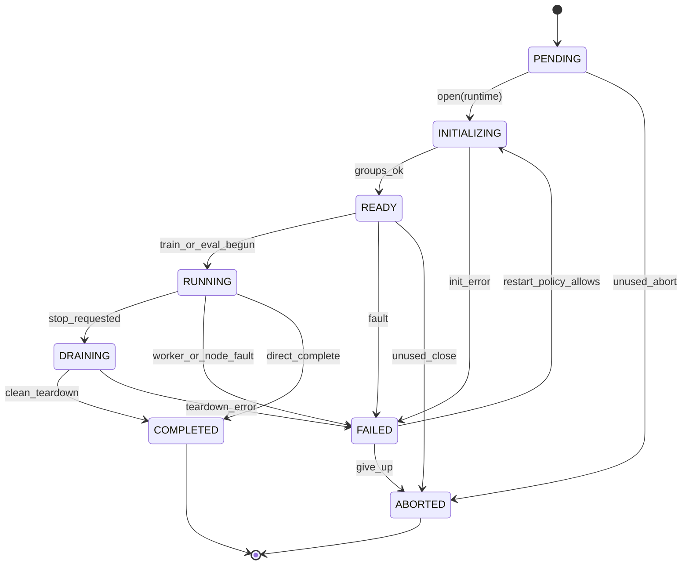
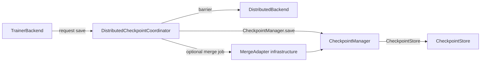
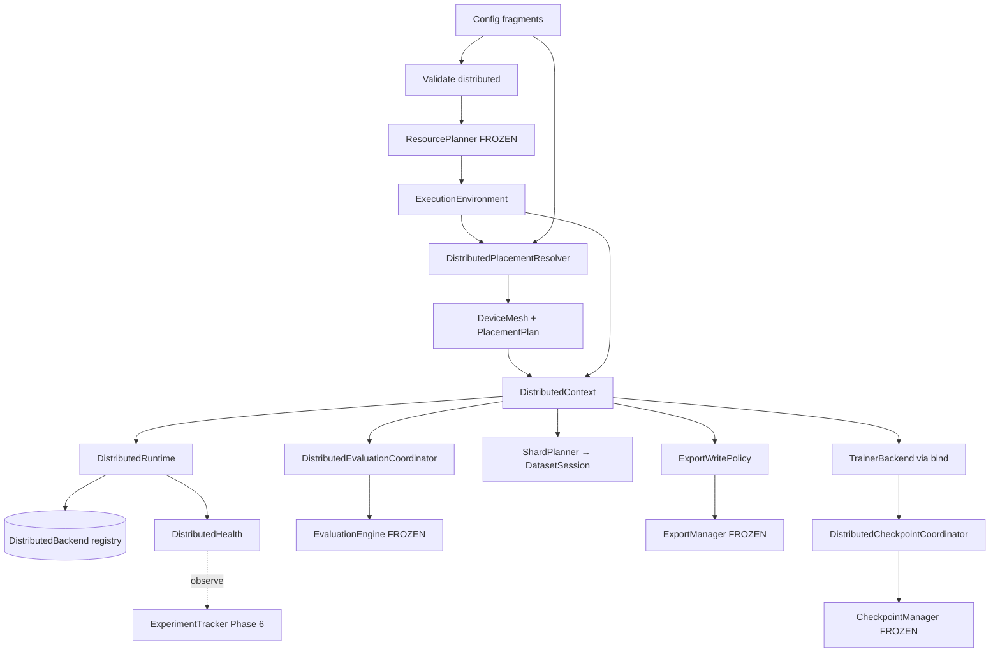
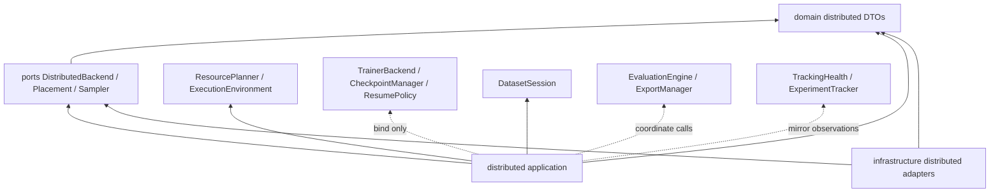
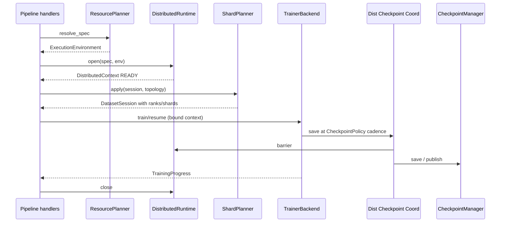
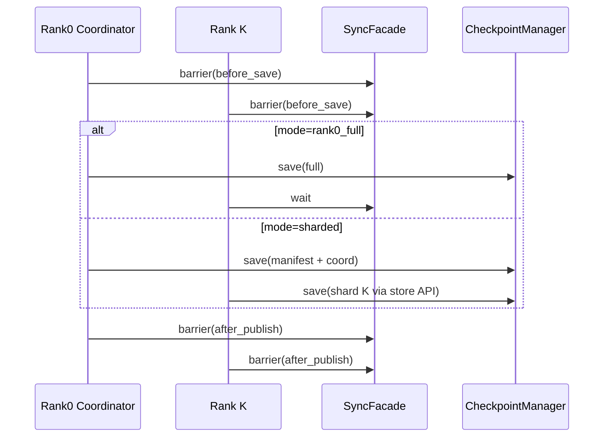
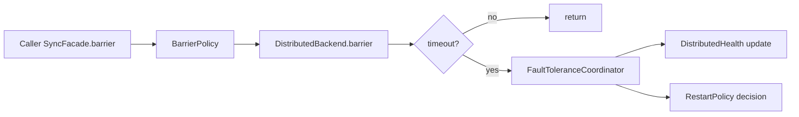

# Phase 7 — Distributed Readiness Architecture

**Status:** **Permanently frozen**  
([ADR-0019](adr/0019-phase7-distributed-readiness.md) architecture · [ADR-0021](adr/0021-phase7-freeze.md) freeze)  
**Date:** 2026-07-15  
**Binding inputs:** [Frozen Public Contracts](frozen_public_contracts.md), ADRs 0001–0021,
[Architecture Invariants](architecture_invariants.md), [Trainer Backend Contract](trainer_backend_contract.md),
[Artifact Contract](artifact_contract.md)  
**Related ADRs:** [0019 (Accepted)](adr/0019-phase7-distributed-readiness.md) · [0021 (Accepted)](adr/0021-phase7-freeze.md)  
**Lifecycle clarification:** [ADR-0022](adr/0022-package-surfaces-lifecycle-alignment.md) · [Terminology](terminology.md)

> Phases **0–7** are **permanently frozen** public contracts
> ([ADR-0021](adr/0021-phase7-freeze.md) for Phase 7).
> This document is the Phase 7 architecture specification — **permanently frozen**.
>
> If any change appears to require altering a frozen contract, **STOP**. The
> frozen contract wins unless the Section 9 change process in
> `frozen_public_contracts.md` is completed.
>
> **Naming:** Historical `aiodoo-models` means frozen `aiodoo-model`.
> Distributed readiness must not leak into sibling repositories.
>
> **Axiom:** Distributed readiness is a **placement / synchronization /
> recovery façade**. It never becomes authoritative over TrainingSession,
> CheckpointManager, ResumePolicy, SchedulePlanner, EvaluationEngine,
> ExportManager, Artifact Contract, or TrackingHealth.
>
> Naming for Planner / Coordinator / Manager / Runtime / Authority:
> [coordinator_conventions.md](coordinator_conventions.md).

---

## 0. Design goals and non-goals

### Goals (priority order)

1. **Multi-process readiness** — express ranks, nodes, process groups, and
   device meshes without rewriting the training engine.
2. **Framework independence** — Accelerate, DeepSpeed, FSDP, DDP, XLA, and
   future custom runtimes via **registries / factories / binders** only.
3. **Deterministic CPU simulation** — CI-friendly fake backends; no GPU required
   to validate topology, sharding, barriers, and checkpoint coordination.
4. **Additive composition** — reuse `DistributedSpec`, `DatasetSession`
   placement fields, `ExecutionEnvironment.accelerator`, and
   `AcceleratorKind` already reserved in Phases 0–1.
5. **Clean repository boundaries** — all distributed runtime stays inside
   `aiodoo-training`; nothing leaks to `aiodoo-models` / `aiodoo-core` /
   `aiodoo-datasets`.

### Non-goals (this phase)

- Redesigning `TrainerBackend`, `CheckpointManager`, `DatasetSession`,
  `SchedulePlanner`, Artifact Contract, Phase 6 tracking, EvaluationEngine,
  or ExportManager.
- Widening frozen `ResourcePlanner.probe` / `resolve` signatures.
- Becoming a cloud job scheduler / Kubernetes operator / Slurm controller
  (those are **launchers** outside the library; Phase 7 consumes env ranks).
- Replacing `ResumePolicy` with a distributed failure policy.
- Replacing `TrackingHealth` with cluster health.
- Bit-exact cross-SKU GPU numerics guarantees (document device-class limits).
- Changing pipeline stage enum order or orchestrator shape.
- Changing the root execution model (`python3 <script>.py` from repo root).

### Frozen contracts consumed (do not redesign)

| Frozen surface | Phase 7 usage |
|----------------|---------------|
| `ResourcePlanner` / `ExecutionEnvironment` | Consume resolved env; attach additive distributed plan **beside** it |
| `DistributedSpec` | Expand config fragments; keep identity fields fingerprint-stable |
| `DatasetSession` (`worker_id`, `world_size`, `global_rank`, `local_rank`, `shard_id`, `num_shards`) | Populate via ShardPlanner / COW helpers — **do not add fields** |
| `TrainerBackend.train` / `resume` | New backend keys via registry; context via `bind()` only |
| `CheckpointManager` + `CheckpointStore` + Phase 3 `CheckpointPolicy` | Single durability owner; Phase 7 coordinates who calls save / merge |
| `ResumePolicy` + `training_protocol_version` | Compatibility gates unchanged; distributed recovery **feeds** resume, never replaces it |
| `SchedulePlanner` + packing/curriculum ports | Plans remain process-local; ShardPlanner places cursor fields |
| `Evaluator` / `Exporter` / Artifact Contract | Rank-0 (or policy) writer; merge policies outside engines |
| `ExperimentTracker` / `TrackingHealth` | Record distributed observations; never redefine TrackingHealth |
| Pipeline stage enum / orchestrator | Handlers only |
| Framework quarantine | Torch.distributed / Accelerate / DeepSpeed / XLA **only** in `infrastructure/` |

### Authority matrix (non-negotiable)

| Concern | Authoritative owner | Phase 7 role |
|---------|---------------------|--------------|
| Train cursor / status | TrainingSession + TrainerBackend | Place ranks; synchronize steps if backend asks |
| Checkpoint durability | CheckpointManager + CheckpointStore | Coordinate rank roles (who saves / merges / replicas) |
| Resume compatibility | ResumePolicy + CheckpointManager | Supply topology-consistent DatasetSession + mesh digests |
| Dataset cursor | DatasetSession | Fill placement fields; never fork a second session type |
| Packing / curriculum plans | SchedulePlanner | Optional per-rank plan views; no planner redesign |
| Evaluation outcomes | EvaluationEngine | Coordinate shard eval + merge reports |
| Export packages | ExportManager | Enforce single-writer toward Artifact Contract |
| Tracking sink health | TrackingHealth (Phase 6) | Unrelated; DistributedHealth is runtime mesh health only |
| Hardware device/precision | ResourcePlanner | DistributedPlacementResolver consumes env — does not probe CUDA ad-hoc |

### Sufficiency check (frozen contracts)

| Question | Answer |
|----------|--------|
| Is `TrainerBackend` sufficient? | **Yes** — distributed backends register new keys; `bind(DistributedContext)` |
| Is `DatasetSession` sufficient? | **Yes** — placement fields already exist (ADR-0008 foresight) |
| Is `ExecutionEnvironment` sufficient? | **Yes with companion DTO** — do **not** redesign; attach `DistributedContext` / mesh digests via metadata or binder |
| Is `ResourcePlanner` sufficient? | **Yes** — keep probe/resolve; add **Downstream** `DistributedPlacementResolver` |
| Is Phase 3 `CheckpointPolicy` sufficient for sharding? | **Yes for cadence**; Phase 7 adds **orthogonal** shard/merge/replica policies that consult it |
| Is `ResumePolicy` sufficient for worker crash? | **Yes for checkpoint compatibility**; Phase 7 `RestartPolicy` decides *when* to invoke resume |
| Must Artifact Contract change? | **No** — final packages remain single-writer / role-contracted |

**Verdict:** No frozen contract is insufficient. Phase 7 proceeds additively.

---

## 1. DistributedExecutionContext

### 1.1 Components

| Type | Layer | Role |
|------|-------|------|
| **Rank** | Domain value | Integer global process identity `∈ [0, world_size)` |
| **LocalRank** | Domain value | Integer device-local identity on a node |
| **WorldSize** | Domain value | Total participating processes |
| **Node** | Domain DTO | Host identity + local rank set + optional device ids |
| **ProcessGroup** | Domain opaque handle | Named collective group (not a framework object) |
| **DistributedTopology** | Domain DTO | Immutable mesh of Nodes × Ranks + group map |
| **DistributedSession** | Domain DTO | Immutable lifecycle cursor for one distributed job |
| **DistributedContext** | Application binder | Topology + policies + resolved env + process groups |
| **DistributedRuntime** | Application | Owns PG lifecycle, barriers façade, health snapshots |
| **DistributedCoordinator** | Application | Rank role assignment for ckpt / eval / export |

### 1.2 Domain sketches (proposed — additive)

```text
Rank            # NewType / frozen wrapper around int (global)
LocalRank       # frozen wrapper around int
WorldSize       # frozen wrapper around int (>= 1)

Node
  node_id: str
  hostname: str | None
  local_ranks: tuple[LocalRank, ...]
  device_ids: tuple[int, ...]          # from ExecutionEnvironment / launcher
  metadata: Mapping[str, str]

ProcessGroupHandle
  group_id: str                        # e.g. "default", "dp", "mp"
  rank_set: tuple[Rank, ...]
  backend_key: str                     # "gloo" | "nccl" | "fake" | ...
  # NEVER stores torch.distributed.ProcessGroup
  # Future: companion capability object (à la TrackingCapability) may declare
  # backend features without changing this handle API.

DistributedTopology
  world_size: WorldSize
  nodes: tuple[Node, ...]
  global_rank: Rank                    # this process
  local_rank: LocalRank
  node_id: str
  groups: Mapping[str, ProcessGroupHandle]
  mesh_digest: str                     # portable topology fingerprint material

DistributedSession
  session_id: str
  experiment_id: ExperimentId | None
  run_id: RunId | None
  status: DistributedStatus            # PENDING | INITIALIZING | READY | RUNNING |
                                       # DRAINING | FAILED | COMPLETED | ABORTED
  topology: DistributedTopology
  runtime_backend_key: str             # "fake" | "ddp" | "fsdp" | "accelerate" | ...
  started_at / updated_at              # wall clocks — excluded from golden digests
  metadata: Mapping[str, str]
```

### 1.3 Ownership

| Object | Owner | Mutability |
|--------|-------|------------|
| DistributedSession | DistributedRuntime (COW) | Immutable DTO |
| DistributedTopology | Built once at init; refresh only on reconfigure | Immutable |
| ProcessGroupHandle | DistributedRuntime | Opaque; infra maps to framework PG |
| DistributedContext | Pipeline handler / TrainingContext binder | Immutable bag |

### 1.4 Lifecycle & state transitions

Legal `DistributedSession` transitions enforced by `DistributedRuntime`
(documentation mirrors runtime; enums unchanged):

| From | Allowed to |
|------|------------|
| `PENDING` | `INITIALIZING`, `ABORTED` |
| `INITIALIZING` | `READY`, `FAILED` |
| `READY` | `RUNNING`, `FAILED`, `ABORTED` |
| `RUNNING` | `DRAINING`, `FAILED`, `COMPLETED` |
| `DRAINING` | `COMPLETED`, `FAILED` |
| `FAILED` | `INITIALIZING`, `ABORTED` |
| `COMPLETED` | *(terminal)* |
| `ABORTED` | *(terminal)* |



Rules:

- `DistributedStatus` is **not** `TrainingStatus`. A train failure may
  project into both; Tracking may mirror either independently.
- Only **rank 0** (or configured coordinator rank) may transition catalog-facing
  experiment mirrors; every rank owns its local DistributedSession COW copy
  with identical `session_id` / topology digest.

### 1.5 Failure modes

| Mode | Detection | Effect | Recovery |
|------|-----------|--------|----------|
| Init timeout | Runtime watchdog | `FAILED` | RestartPolicy / exit non-zero |
| PG creation failure | Infra adapter | `FAILED` | Fail fast (non-retriable unless fake) |
| Rank desync | Barrier timeout | `FAILED` or `DRAINING` | RestartPolicy |
| Partial world | Health probe | `DEGRADED` health → session `FAILED` if Strict | See §7 |

### 1.6 Extension points

- Additional named process groups (`dp`, `mp`, `cp`, `pp`) without changing
  TrainerBackend.
- Custom topology builders (elastic / cloud) registered by key.
- TPU mesh layouts via XLA runtime registration (future).

### 1.7 Public interfaces (application)

```text
DistributedRuntime.open(spec, execution) -> DistributedContext
DistributedRuntime.close(context) -> None
DistributedRuntime.barrier(context, name="default", policy=...) -> None
DistributedCoordinator.role_for(context, concern) -> RankRole
```

Ports used underneath (additive):

```text
DistributedBackend   # infrastructure adapter port
  initialize(context) -> ProcessGroupMap
  barrier(group_id, timeout) -> None
  broadcast_bytes(group_id, payload, src_rank) -> bytes
  all_reduce_metrics(group_id, values, op) -> Mapping[str, float]
  finalize() -> None
```

**Never** import `torch.distributed` outside `infrastructure/`.

---

## 2. Distributed Resource Planning

### 2.1 Additive composition rule

```text
ExecutionSpec + DistributedSpec
        │
        ▼
 ResourcePlanner.resolve_spec  →  ExecutionEnvironment   (FROZEN)
        │
        ▼
 DistributedPlacementResolver.resolve(env, distributed_spec, launcher_env)
        │
        ▼
 DeviceMesh + PlacementPlan + CollectivePolicy + CommunicationBackend key
        │
        ▼
 DistributedContext (holds env + mesh + policies)
```

**Do not** redesign `ResourcePlanner`.  
**Do not** require new abstract methods on the frozen port.  
Optional: infrastructure planners may fill `ExecutionEnvironment.metadata` with
neutral keys (`device_count_visible`, `accelerator_requested`) — never framework
objects.

### 2.2 DeviceMesh (domain)

```text
DeviceMesh
  mesh_id: str
  axes: tuple[MeshAxis, ...]           # e.g. ("data", "model")
  shape: tuple[int, ...]               # product == world_size (or subgroup)
  device_kind: DeviceKind              # from ExecutionEnvironment.selected_device
  rank_to_coord: Mapping[int, tuple[int, ...]]
  digest: str
```

### 2.3 PlacementStrategy (port + registry)

```text
PlacementStrategy.place(env, topology, mesh_spec) -> PlacementPlan
```

Registered keys (initial):

| Key | Intent |
|-----|--------|
| `single` | world_size=1 identity (default CI) |
| `data_parallel` | 1-D data mesh |
| `fsdp_auto` | Declare FSDP wrap preferences (infra interprets) |
| `deepspeed_zero` | ZeRO stage preference as policy DTO |
| `custom` | User-registered |

`PlacementPlan` is immutable: rank → device id, shard role, optional memory budget.

### 2.4 CommunicationBackend & CollectivePolicy

```text
CommunicationBackendSpec
  key: str                             # gloo | nccl | mpi | xla | fake
  timeout_sec: float
  options: Mapping[str, str]           # portable only

CollectivePolicy
  default_group: str = "default"
  allow_async: bool = False
  require_deterministic_order: bool = True
  reduce_dtype_hint: str | None        # "fp32" etc. — not a torch.dtype
```

> **Future transports:** The registry architecture intentionally allows future
> communication transports (UCX, vendor-specific transports, etc.) to register
> as additional backend keys **without** requiring architectural changes. No
> separate transport registry is required.

### 2.5 Lifecycle / ownership / failures

| | |
|--|--|
| **Lifecycle** | Resolve once per process after `RESOLVE_EXECUTION`; rebuild only on restart |
| **Ownership** | PlacementResolver application service; strategies via registry |
| **Failures** | Incompatible mesh shape → config validation error before train |
| **Recovery** | Fix config / relaunch; no silent reshape mid-run |
| **Extension** | New PlacementStrategy keys; new CommunicationBackend adapters |

---

## 3. Backend Abstraction

### 3.1 Pattern (same as Phases 2–6)

```text
Config key / AcceleratorKind
    → registry lookup
    → Factory.create(key)
    → infrastructure adapter
    → bind(DistributedContext | TrainingContext)
```

No hardcoding of Accelerate / DeepSpeed / FSDP / XLA in application or pipeline.

### 3.2 Registries (additive)

| Registry | Contents |
|----------|----------|
| `distributed_backend_registry` | `fake`, `ddp`, `fsdp`, `deepspeed`, `accelerate`, `xla` |
| `placement_strategy_registry` | See §2.3 |
| `trainer_backend_registry` | Existing + `accelerate_trainer`, `fsdp_trainer`, `deepspeed_trainer`, … |
| `communication_backend_registry` | `fake`, `gloo`, `nccl`, `xla` |

Factories / builders:

- `DistributedBackendFactory`
- `DistributedContextBuilder`
- `PlacementStrategyFactory`

### 3.3 Mapping AcceleratorKind → runtime

Existing frozen enum:

`NONE | DDP | FSDP | DEEPSPEED | ACCELERATE`

Additive (enum growth allowed as non-breaking):

| Additive value | Notes |
|----------------|-------|
| `XLA` (proposed) | TPU / XLA path — infrastructure only |
| `CUSTOM` (optional) | Escape hatch for registered custom runtimes |

Resolution table (config-driven, not hardcoded in pipeline):

| `execution.accelerator` | Default distributed backend key | Default trainer key |
|-------------------------|----------------------------------|---------------------|
| `none` | `fake` if world_size>1 else noop | existing stub/hf |
| `ddp` | `ddp` | `ddp_trainer` or accelerate-wrapped |
| `fsdp` | `fsdp` | `fsdp_trainer` |
| `deepspeed` | `deepspeed` | `deepspeed_trainer` |
| `accelerate` | `accelerate` | `accelerate_trainer` |
| `xla` (future) | `xla` | `xla_trainer` |

### 3.4 Fake backend (mandatory for CI)

`FakeDistributedBackend` is the **architectural reference implementation** for
distributed collectives on the `DistributedBackend` port.

- In-process or multi-process via `multiprocessing` **optional**; default is
  **single-process simulation** of N logical ranks sequenced in deterministic
  order for unit tests.
- Implements barriers, broadcasts, and reductions with pure Python.
- Never requires CUDA.
- Future DDP / FSDP / DeepSpeed / Accelerate / XLA adapters should preserve the
  same observable behaviour while changing only infrastructure internals.

### 3.5 Lifecycle / interfaces

```text
DistributedBackend.initialize / barrier / broadcast_bytes /
  all_reduce_metrics / finalize
```

Framework primitives (`dist.barrier`, `accelerator.wait_for_everyone`) stay
inside adapters.

---

## 4. Distributed Checkpoint Strategy

### 4.1 Naming clarity (avoid collision)

| Name | Phase | Meaning |
|------|-------|---------|
| **`CheckpointPolicy`** | 3 (frozen) | `save_steps`, `save_total_limit`, `save_on_failure`, `validate_on_load` |
| **`DistributedCheckpointStrategy`** | 7 (new) | Who saves, how shards are written, how merges/replicas happen |

Phase 7 **does not** redesign `CheckpointPolicy` or `CheckpointManager`.

### 4.2 Additive policies

```text
DistributedCheckpointPolicy     # orchestration preferences
  mode: RANK0_FULL | SHARDED | HYBRID
  coordinator_rank: int = 0
  require_barrier_before_save: bool = True
  require_barrier_after_publish: bool = True

ShardPolicy
  enabled: bool
  shard_by: RANK | LAYER | AUTO
  filename_pattern: str               # portable template, infra expands

MergePolicy
  enabled: bool
  merge_on_export: bool = True        # consolidated weights for Artifact Contract
  merge_on_resume_load: bool = False  # prefer native sharded load when supported

ReplicaPolicy
  replica_count: int = 1              # additional filesystem replicas (not Nodes)
  replica_roots: tuple[str, ...]      # optional
```

### 4.3 Coordinator & ownership

```text
DistributedCheckpointCoordinator (application)
  owns: rank role decisions + barrier scheduling around saves
  calls: CheckpointManager.save / load_and_validate   # NEVER bypasses
  never: writes weight files itself
```

Relationship:



### 4.4 Rank roles

| Role | Responsibility |
|------|----------------|
| `COORDINATOR` | Invokes CheckpointManager; writes manifests |
| `SHARD_WRITER` | Writes local shard via CheckpointStore API / bound store |
| `REPLICA` | Mirrors published package when ReplicaPolicy requires |
| `IDLE` | Barriers only |

Under `RANK0_FULL`, only rank 0 is `COORDINATOR` + writer; others `IDLE`.

### 4.5 Lifecycle / failures / recovery

| | |
|--|--|
| **Lifecycle** | Align with TrainingSession steps + CheckpointPolicy cadence |
| **Failure** | Barrier timeout mid-save → mark incomplete; CheckpointManager retains atomic publish rules (tmp → publish) |
| **Recovery** | ResumePolicy validates published checkpoint; sharded layouts need matching world_size / mesh_digest in sidecars |
| **Extension** | New ShardPolicy modes via registry; DeepSpeed ZeRO ckpt adapters |

Sidecar additions (additive JSON under existing sidecar pattern — **not**
Artifact Contract):

- `distributed_topology.json` (mesh_digest, world_size, backend_key)
- Optional `shard_index.json`

`training_protocol_version` bumps **only** if resume semantics for sharded
layouts become breaking (Section 9 process). Initial Phase 7 should prefer
metadata that STRICT resume can ignore when `world_size==1`.

---

## 5. Distributed Dataset

### 5.1 Reuse DatasetSession (frozen)

Populate existing fields only:

```text
worker_id, world_size, global_rank, local_rank, shard_id, num_shards
```

via COW (`with_progress` / builder). **No new DatasetSession fields.**

### 5.2 Components

| Type | Layer | Role |
|------|-------|------|
| **ShardPlanner** | Application | Maps topology → DatasetSession placement |
| **DistributedSampler** | Port (additive) | Deterministic example order per rank |
| **WorkerAssignment** | Domain DTO | worker_id ↔ rank ↔ shard_id |
| **EpochCoordinator** | Application | Aligns epoch boundaries across ranks |

```text
DistributedSampler.sample_indices(
  total: int, session: DatasetSession, seed: int
) -> Sequence[int]

ShardPlanner.apply(session, topology) -> DatasetSession
  # sets world_size, ranks, shard_id=num_shards mapping
```

### 5.3 Epoch coordination

1. All ranks finish local epoch iterator (or hit shared max steps).
2. `EpochCoordinator` issues barrier (`BarrierPolicy`).
3. Each rank `DatasetSession.next_epoch()` independently with **identical**
   epoch integer after barrier.
4. Sampler reseeds with `seed + epoch` (portable rule).

SchedulePlanner remains the owner of packing/curriculum **content**; it may run
per-rank on the shard-local example stream. It is **not** redesigned to become
a distributed planner.

### 5.4 Lifecycle / failures

| | |
|--|--|
| **Ownership** | ShardPlanner application; sampler via registry |
| **Failure** | Rank finishes epoch early → wait at barrier (timeout → fault) |
| **Recovery** | Resume restores DatasetSession sidecar (already includes shard fields) |
| **Extension** | Streaming / elastic samplers registered later |

---

## 6. Synchronization

Framework collectives never appear in domain/application APIs.

### 6.1 Policies (domain)

```text
BarrierPolicy
  timeout_sec: float
  on_timeout: FAIL | WARN_CONTINUE   # WARN only for fake/dev profiles

BroadcastPolicy
  src_rank: int = 0
  max_bytes: int
  encoding: "utf-8" | "bytes"

ReductionPolicy
  op: SUM | MEAN | MAX | MIN
  dtype_hint: str | None

AggregationPolicy
  metric_keys: tuple[str, ...]
  reduction: ReductionPolicy
  broadcast_result: bool = True      # all ranks see same aggregated metrics
```

### 6.2 Façade

```text
SyncFacade (application)
  barrier(name, policy)
  broadcast_obj(obj, policy)          # serialize to bytes via portable codecs
  reduce_metrics(metrics, policy) -> Mapping[str, float]
```

Implemented by calling `DistributedBackend` only.

### 6.3 Lifecycle / ownership

Owned by DistributedRuntime. Trainers **may** call SyncFacade through bound
context; they must not call NCCL directly.

---

## 7. Fault Tolerance

### 7.1 Separation from ResumePolicy

| Policy | Question answered |
|--------|-------------------|
| **ResumePolicy** (frozen) | Is this **checkpoint** semantically compatible? |
| **RestartPolicy** (Phase 7) | After a **worker/node/coordinator** fault, may we relaunch and call resume? |

RestartPolicy never softens STRICT resume checks.

### 7.2 Types

```text
RestartPolicy
  max_restarts: int = 0
  backoff_sec: float = 0
  restart_from: LAST_CKPT | SCRATCH
  require_same_world_size: bool = True
  require_same_mesh_digest: bool = True

WorkerFailure / NodeFailure / CoordinatorFailure
  # immutable incident DTOs for health + logging
  rank: int | None
  node_id: str | None
  reason: str
  at: datetime                       # excluded from fingerprints
```

### 7.3 Recovery ownership

```text
FaultToleranceCoordinator (application)
  observes: DistributedHealth transitions / runtime exceptions
  decides: RestartPolicy application
  invokes: pipeline resume path → ResumeCoordinator → CheckpointManager
  never: invents alternate checkpoint formats
```

### 7.4 Failure modes

| Fault | Typical action |
|-------|----------------|
| WorkerFailure | Abort job unless elastic extension registered (future); default fail |
| NodeFailure | Same as multi-worker loss under fixed world_size |
| CoordinatorFailure | If coordinator_rank dies mid-save → incomplete ckpt discarded by atomic rules; restart from last published |

Elastic / auto-scaling world sizes are **out of scope** for initial Phase 7
(extension point only).

---

## 8. Monitoring (runtime observations)

### 8.1 Types (orthogonal to TrackingHealth)

```text
WorkerStatus   # UNKNOWN | HEALTHY | STALLED | LOST | DRAINING
NodeStatus     # UNKNOWN | HEALTHY | DEGRADED | LOST
ClusterStatus  # UNKNOWN | HEALTHY | DEGRADED | FAILED | ORPHANED

DistributedHealth
  cluster: ClusterStatus
  workers: Mapping[int, WorkerStatus]
  nodes: Mapping[str, NodeStatus]
  message: str | None
  consecutive_barrier_timeouts: int
```

### 8.2 Rules

- **Never** replace or subtype `TrackingHealth`.
- DistributedHealth may be **mirrored** into tracking as metrics/params
  (`cluster_status=...`) via ExperimentTracker — observational only.
- Doctor / CLI may print both TrackingHealth (sink) and DistributedHealth
  (mesh) as separate sections.

### 8.3 Lifecycle

Produced by DistributedRuntime probes; immutable snapshots; no authority over
train stop except via FaultToleranceCoordinator policy hooks.

---

## 9. Distributed Metrics

### 9.1 Ownership

| Stage | Owner |
|-------|-------|
| Local metric emit | TrainerBackend / MetricCollector (frozen) |
| Cross-rank reduce | SyncFacade + AggregationPolicy |
| Persistence | ExperimentTracker / MetricStore (Phase 6) |

### 9.2 Flow

```text
local MetricSnapshot(s)
  → AggregationPolicy filter
  → ReductionPolicy via DistributedBackend.all_reduce_metrics
  → identical aggregated snapshots on all ranks (if broadcast_result)
  → rank0 (or all) log via ExperimentTracker
```

Default: **rank 0 logs** aggregated metrics to avoid N× duplicates; other ranks
may skip tracker emission when `CLIProfile` / tracking policy says so.

### 9.3 Determinism

Under `fake` backend + identical local metrics, reduced values must be
bit-identical across golden runs. Real NCCL reductions may be documented as
device-class non-bit-exact for some ops — aggregation in fp32 recommended.

---

## 10. Distributed Evaluation

### 10.1 Coordination (no EvaluationEngine redesign)

```text
DistributedEvaluationCoordinator
  1. Shard eval dataset via ShardPlanner → DatasetSession fields
  2. Each rank: EvaluationEngine.evaluate(...) locally
  3. Barrier
  4. Merge EvaluationReport partials via EvaluationMergePolicy
  5. Rank coordinator publishes merged report
```

```text
EvaluationMergePolicy
  metric_ops: Mapping[str, ReductionPolicy.op]   # e.g. loss→MEAN, count→SUM
  require_all_ranks: bool = True
```

### 10.2 Ownership

EvaluationEngine remains authoritative for **per-rank** scoring.  
Merge policy owns **global** report assembly only.

---

## 11. Distributed Export

### 11.1 Single-writer policy

```text
ExportWritePolicy
  writer_rank: int = 0
  require_barrier_before_export: bool = True
  require_merged_weights_if_sharded: bool = True
```

### 11.2 Flow

1. Barrier after train/eval.
2. If sharded: DistributedCheckpointCoordinator + MergePolicy produce a
   consolidatable checkpoint / handle.
3. **Only** `writer_rank` calls ExportManager / Exporter.
4. Other ranks barrier-wait; may no-op.
5. Artifact Contract packages unchanged — Models never see ranks.

### 11.3 Ownership

ExportManager + Artifact Contract remain sole package authorities.

---

## 12. Configuration

### 12.1 Proposed YAML shape (additive fragments)

```yaml
distributed:
  enabled: false
  backend: fake          # fake | ddp | fsdp | deepspeed | accelerate | xla
  world_size: 1          # may be overridden by launcher env
  num_nodes: 1
  # global_rank / local_rank normally from env (RANK, LOCAL_RANK, WORLD_SIZE)

execution:
  # existing ExecutionSpec — accelerator selects family
  accelerator: none      # none | ddp | fsdp | deepspeed | accelerate | xla

communication:
  backend: fake          # fake | gloo | nccl | xla
  timeout_sec: 1800
  collective:
    require_deterministic_order: true

checkpoint:              # Phase 7 distributed checkpoint *strategy* fragment
  # NOTE: cadence remains under training.checkpointing (Phase 3 CheckpointPolicy)
  mode: rank0_full       # rank0_full | sharded | hybrid
  coordinator_rank: 0
  shard:
    enabled: false
    shard_by: rank
  merge:
    enabled: false
    merge_on_export: true
  replica:
    replica_count: 1

fault_tolerance:
  max_restarts: 0
  restart_from: last_ckpt
  require_same_world_size: true
  require_same_mesh_digest: true

topology:
  placement: single      # single | data_parallel | fsdp_auto | deepspeed_zero
  mesh:
    axes: ["data"]
    shape: [1]
```

Existing `DistributedSpec` remains the **domain** projection for fingerprintable
portable fields (`enabled`, `world_size`, `num_nodes`, ranks when declared).
Launcher-injected ranks are treated as **runtime** overlays and must not churn
ExperimentId when the portable config intends elastic launch (fingerprint uses
`world_size` / placement / accelerator / backend keys — not hostname).

### 12.2 Validation

- `enabled=false` ⇒ force world_size=1, backend noop/fake, ignore mesh shape≠1.
- `world_size` must equal `product(mesh.shape)` when mesh provided.
- `accelerator` vs `distributed.backend` compatibility matrix validated in
  config layer.
- Sharded checkpoint mode requires `world_size>1` or reject.
- Export single-writer rank must be `< world_size`.

### 12.3 Composition & fingerprints

Portable identity material (enter fingerprints / ExperimentId):

- `distributed.enabled`, `world_size`, `num_nodes`
- `execution.accelerator`
- `distributed.backend`, `topology.placement`, mesh axes/shape
- communication backend **key** (not timeouts)
- checkpoint strategy **mode** (not replica paths)

Excluded from fingerprints:

- hostname, CUBLAS versions, wall clocks, local CUDA device UUID
- launcher-assigned rank when not declared in portable YAML
- Absolute paths

---

## 13. Pipeline

Pipeline remains **frozen**. Handlers only; **no stage enum changes**.

Recommended handler wiring (existing stages):

| Stage | Phase 7 handler behavior |
|-------|--------------------------|
| `VALIDATE_CONFIG` | Validate distributed fragments / compatibility matrix |
| `RESOLVE_EXECUTION` | Existing ResourcePlanner; then PlacementResolver → put `DistributedContext` on run bag |
| Create / train stages | Ensure DistributedRuntime.open; bind context into trainer factory |
| Evaluate / export | DistributedEvaluationCoordinator / ExportWritePolicy |
| Finalize | DistributedRuntime.close; emit DistributedHealth snapshot to tracking |

No new stage names required for v1. If a future Section 9 review wants
`INIT_DISTRIBUTED`, that is a **separate** Section 9 proposal — **not** part of
this design’s mandatory scope.

---

## 14. Determinism

### 14.1 Guarantees (CI / fake backend)

Given the same portable config, seed, dataset fingerprints, model/adapter
fingerprints, trainer key, resolved `ExecutionEnvironment` device class, and
identical `DistributedTopology.mesh_digest` with `FakeDistributedBackend`:

> Aggregated metrics, DatasetSession cursors after N steps, and rank-0
> checkpoint manifests (excluding wall clocks) are identical across golden
> replays.

### 14.1.1 `mesh_digest` portability (clarification)

`mesh_digest` **MUST** be computed only from **portable topology identity**.

It **MUST NOT** include:

- hostname
- IP address
- MAC address
- process id
- launcher-generated ids
- timestamps
- runtime-generated UUIDs
- filesystem paths
- environment-specific identifiers (device UUIDs, hostnames from env, etc.)

Only portable topology material may contribute (for example: world size, mesh
axes/shape, placement strategy key, communication backend **key**, accelerator
family, stable rank↔coord maps derived from those portable inputs). This keeps
ExperimentId / fingerprint surfaces stable across hosts and launchers.

### 14.2 Seed propagation

```text
root_seed
  → RngController (frozen)
  → per-rank seed derived as hash(root_seed, global_rank)   # portable
  → DistributedSampler uses hash(root_seed, epoch, global_rank)
```

Derivation algorithm is fixed in determinism helpers (application) and covered
by golden tests.

### 14.3 Rank ordering

- Reductions with `require_deterministic_order=true` sort keys before reduce.
- Fake broadcast is ordered by ascending rank simulation.
- Log lines that include rank are not golden-compared.

### 14.4 Checkpoint reproducibility

- Rank-0 full mode: identical to single-process when world_size simulated as 1.
- Sharded mode goldens compare shard index + digest list, not necessarily
  merged raw tensors in CI.

### 14.5 Non-guarantees

- Cross-GPU-SKU bit-exact loss under NCCL.
- Third-party DeepSpeed nondeterministic kernels unless their deterministic
  flags are set in infrastructure adapters.

---

## 15. Repository Boundaries

| Allowed inside `aiodoo-training` | Forbidden leakage |
|----------------------------------|-------------------|
| DistributedRuntime, meshes, fake PG | Export ranks into Artifact Contract |
| infrastructure Accelerate/DeepSpeed/XLA | Import those libs from domain/app/pipeline |
| Rank-aware DatasetSession population | Change `aiodoo-datasets` schemas for shards |
| Tracking mirrors of DistributedHealth | Require `aiodoo-models` to understand meshes |
| | Teach `aiodoo-core` agents to own process groups |

Launchers (torchrun, Accelerate launch, Kubernetes Jobs, Slurm) are **external**.
Phase 7 reads standard env vars (`RANK`, `WORLD_SIZE`, `LOCAL_RANK`,
`MASTER_ADDR`, …) inside infrastructure adapters only.

---

## 16. Testing Strategy

| Layer | What | GPU? |
|-------|------|------|
| Unit | Topology builders, ShardPlanner field mapping, policy validation, FakeBackend collectives | No |
| Fake distributed | Multi-logical-rank single-process simulation of barriers/metrics/ckpt roles | No |
| Optional mp | `multiprocessing` spawn N=2 fake ranks behind gate | No |
| Golden | mesh_digest, sampler indices, aggregated metrics, rank0 manifest digests | No |
| Boundary | AST: no torch.distributed / deepspeed / accelerate outside `infrastructure/` | No |
| Determinism | Seed×rank derivation; epoch barrier cursor equality | No |
| Failure simulation | Inject barrier timeout / worker lost → RestartPolicy decisions | No |
| Contract | TrainerBackend still fulfills trainer contract under bind(DistributedContext) | No |

CI default: `distributed.enabled=false` or `backend=fake` with `world_size=1`.

---

## 17. Folder structure (proposed)

```text
aiodoo_training/
  domain/
    distributed_session.py       # DistributedSession, Topology, Node, ranks
    distributed_policies.py      # Barrier/Broadcast/Reduction/Aggregation,
                                 # RestartPolicy, DistributedCheckpointPolicy,
                                 # Shard/Merge/Replica, ExportWritePolicy, ...
    distributed_health.py        # DistributedHealth, Worker/Node/ClusterStatus
    device_mesh.py               # DeviceMesh, MeshAxis, PlacementPlan
  ports/
    distributed.py               # DistributedBackend, PlacementStrategy,
                                 # DistributedSampler
  distributed/                   # application
    runtime.py                   # DistributedRuntime
    coordinator.py               # DistributedCoordinator / ckpt / eval / export
    placement.py                 # DistributedPlacementResolver
    shard_planner.py
    epoch.py
    sync.py                      # SyncFacade
    fault_tolerance.py
    context.py                   # DistributedContext binder bag
  builders/
    distributed_builders.py
  factories/
    # DistributedBackendFactory, PlacementStrategyFactory, ...
  registries/
    # distributed_backend_registry, placement_strategy_registry, ...
  config/
    distributed_config.py        # fragments + validation + to_*_policy
  pipeline/
    # handlers only — INIT wiring inside RESOLVE_EXECUTION / train handlers
  infrastructure/
    distributed/
      fake.py
      ddp.py                     # optional soft-import torch.distributed
      fsdp.py
      deepspeed.py
      accelerate_runtime.py
      xla.py                     # future
    # existing trainers gain bind(DistributedContext) paths
  tracking/                      # optional mirrors only — no TrackingHealth merge
tests/
  unit/test_phase7_distributed.py
  golden/test_golden_distributed_determinism.py
  boundary/ (extend forbidden imports)
```

---

## 18. Component diagram



---

## 19. Dependency graph



Dependencies never invert: domain does not import infrastructure; pipeline does
not own collectives.

---

## 20. Distributed lifecycle (end-to-end)



---

## 21. Checkpoint flow



Resume: all ranks load via CheckpointManager validation; ResumePolicy unchanged;
mesh_digest compared when RestartPolicy.require_same_mesh_digest.

---

## 22. Synchronization flow



Metrics:

```text
MetricCollector → AggregationPolicy → all_reduce_metrics → rank0 ExperimentTracker
```

---

## 23. Configuration additions (summary table)

| Fragment | Purpose | Fingerprinted? |
|----------|---------|----------------|
| `distributed.*` | Enable + backend + world | Yes (portable fields) |
| `execution.accelerator` | Family selection | Yes |
| `communication.*` | Collective transport | Key yes; timeouts no |
| `checkpoint.*` (Phase 7 strategy) | Shard/merge/replica | Mode/flags yes; paths no |
| `fault_tolerance.*` | Restarts | Policy flags yes |
| `topology.*` | Mesh / placement | Yes |

Phase 3 `training.checkpointing` cadence stays the frozen CheckpointPolicy path.

---

## 24. Risk analysis

| Risk | Severity | Mitigation |
|------|----------|------------|
| Accidental redesign of CheckpointManager | High | Coordinator-only pattern; boundary tests |
| TrackingHealth / DistributedHealth confusion | Medium | Separate types + doctor UX separation |
| ExperimentId churn from host ranks | High | Fingerprint portable topology only |
| Silent NCCL nondeterminism | Medium | Document limits; fp32 reduce; fake goldens |
| Elastic world size scope creep | High | Explicitly out of v1; extension registry later |
| Pipeline stage pressure | Low | Handlers-only; no enum change in v1 |
| DeepSpeed/XLA import leaks | High | AST boundary tests |
| Dual session cursors | High | Only DatasetSession placement fields |
| Sharded ckpt incompatible with Models | Medium | Merge-on-export before Artifact Contract |
| RestartPolicy weakens ResumePolicy | High | Forbid; tests assert STRICT still gates |

---

## 25. Future roadmap (post–Phase 7)

1. Elastic / torchelastic membership changes.
2. Pipeline/model parallelism meshes beyond data-parallel.
3. Native TPU pod topologies (XLA registration mature).
4. Multi-controller cloud fabric (still outside Artifact Contract).
5. Optional `INIT_DISTRIBUTED` stage via formal Section 9 freeze amendment.
6. Cross-job rendezvous services (not in-repo).

---

## 26. Lifecycle checklist (every subsystem)

| Subsystem | Lifecycle | Ownership | Failures | Recovery | Extension | Public API |
|-----------|-----------|-----------|----------|----------|-----------|------------|
| DistributedSession | §1.4 | DistributedRuntime | init/desync | RestartPolicy | groups/topology builders | COW session DTO |
| Placement / DeviceMesh | resolve-once | PlacementResolver | invalid mesh | relaunch | PlacementStrategy registry | `resolve(...)` |
| DistributedBackend | init→finalize | Runtime + infra | PG errors | fail/restart | registry keys | port methods |
| Dist Checkpoint | per save | DistCheckpointCoordinator | barrier/partial write | last published + ResumePolicy | Shard/Merge modes | coordinator methods |
| Dataset sharding | per epoch | ShardPlanner + EpochCoordinator | early rank finish | barrier/timeout fault | Sampler registry | `apply` / `sample_indices` |
| SyncFacade | per call | DistributedRuntime | timeout | FaultToleranceCoordinator | policies | barrier/broadcast/reduce |
| Fault tolerance | incident | FaultToleranceCoordinator | exhaustion of restarts | exit | elastic future | RestartPolicy |
| DistributedHealth | snapshot | Runtime | stale probes | observational | more statuses | immutable DTO |
| Dist metrics | per log | Aggregation + Tracker | reduce fail | degrade/skip log | AggregationPolicy | SyncFacade |
| Dist eval | per eval | DistEvaluationCoordinator | merge miss | fail eval stage | merge ops | coordinator |
| Dist export | per export | ExportWritePolicy + ExportManager | non-writer race | barrier + single writer | writer_rank | policy + ExportManager |

---

## 27. Completeness

After design review of sections 1–26:

- Frozen contracts are **sufficient** without redesign.
- Accelerate / DeepSpeed / FSDP / DDP / XLA land via registries.
- CI remains CPU-friendly via `FakeDistributedBackend`.
- Checkpoint / Resume / Eval / Export / Tracking authorities preserved.

**Phase 7 is permanently frozen** ([ADR-0019](adr/0019-phase7-distributed-readiness.md) ·
[ADR-0021](adr/0021-phase7-freeze.md)).

**AIODOO Training v1 architecture is complete.**

Future distributed implementations (DDP / FSDP / DeepSpeed / XLA / etc.) **MUST**
register through existing extension points. They **MUST NOT** redesign this
architecture.

---

## 28. Stop conditions

- No Phase 8 architectural work in this repository.
- No redesign of frozen Phase 0–7 contracts.
- Extend only via registration, infrastructure adapters, or a new ADR + Section 9.
